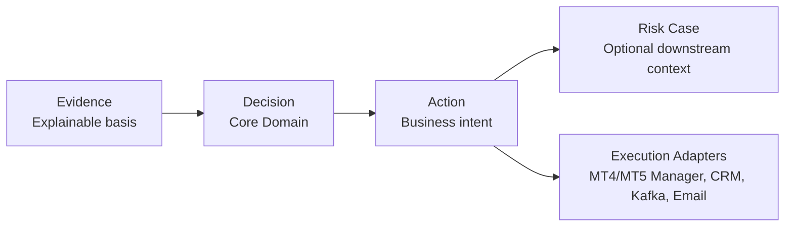
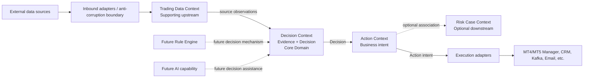

# Q-007 BrokerOS Domain Foundation

## Status

Approved Design Baseline

- Requirement: Q-007 — PASS
- Architecture: PASS
- Design review: PASS
- Design approved: PASS
- Implementation: Deferred
- Authoritative decision: ADR-009

## Authority and Purpose

[ADR-009](../adr/ADR-009-brokeros-risk-core-domain-model.md) is the single
authoritative source for the BrokerOS Risk core-domain decision. This document
does not redefine that decision. It provides the synchronized ubiquitous
language, context map, lifecycle boundary, and guidance needed by future
Requirements.

## Synchronized Domain View

The canonical model shown above must remain identical to ADR-009. The Execution
branch is not part of the canonical domain chain; it shows where fulfillment of
an Action leaves the Core Domain.

## Ubiquitous Language

| Term | Architectural meaning | Boundary |
| --- | --- | --- |
| Evidence | Traceable information supporting or refuting a risk conclusion | Must retain source provenance; is not itself a Decision |
| Decision | Explainable risk conclusion derived from Evidence | Core Domain; does not execute an external operation |
| Action | Business response intent resulting from a Decision | Is not an execution request, attempt, or outcome |
| Risk Case | Optional downstream association for investigation/collaboration | Does not own Evidence, Decision, Action, or decisioning |
| Trading Data | Current broker-neutral upstream observation language | Supporting input; Q-007 does not rename it |
| Rule | Version-identifiable policy used by decisioning | Not a case condition or adapter command |
| Rule Engine | Future mechanism that evaluates Evidence under Rules to produce Decisions | Decision capability only; not implemented by Q-007 |
| Execution | Fulfillment attempt/outcome through a downstream adapter | Outside Decision and distinct from Action intent |

## Core Domain Definition

Decision is the BrokerOS Risk Core Domain. It is where Evidence receives
business meaning as an explainable risk conclusion. Evidence is foundational
because a Decision without traceable support cannot be explained, reviewed, or
reliably extended by future AI capabilities.

Action and Risk Case are downstream supporting capabilities. Trading Data is an
upstream supporting context. Rule Engine is a future decision mechanism rather
than a separate core domain or an authorization to implement runtime behavior.

## Logical Bounded Contexts

These are logical boundaries inside the existing Phase 1 feature-first modular
monolith. They do not prescribe services, packages, databases, topics, APIs, or
deployables.

### Trading Data Context — Supporting Upstream

Supplies broker-neutral trading observations and provenance through adapters.
It does not own Evidence meaning, Decisions, Actions, Risk Cases, or execution.
Its name remains Trading Data until a future ADR explicitly decides otherwise.

### Decision Context — Core Domain

Owns the semantics of Evidence and Decision. A future Rule Engine may evaluate
versioned Rules and Evidence inside this capability, but Q-007 creates no
engine, rule runtime, implementation contract, or storage model.

### Action Context — Supporting Downstream

Owns business Action intent originating from Decision. External attempts and
outcomes are delegated to downstream adapters and cannot be treated as the
Action itself or rewrite the originating Decision.

### Risk Case Context — Optional Downstream

Associates selected Evidence, Decisions, and Actions for later investigation or
collaboration. It is not required for every Decision or Action and cannot drive
or own decisioning.

## Context Map

The dotted Rule Engine and AI connections are future considerations, not
approved implementations. External systems remain outside BrokerOS ownership
and are reached only through adapters or approved integration contracts.

## Domain Lifecycle

1. Trading Data supplies an upstream factual source with provenance.
2. Evidence is formed as the traceable basis for risk reasoning.
3. Decision records an explainable conclusion from Evidence.
4. Zero or more Actions may express approved business response intent.
5. Downstream adapters may later attempt Execution under separate Requirements.
6. A Risk Case may optionally associate relevant Evidence, Decisions, and
   Actions for investigation or collaboration.

This is a dependency/language lifecycle, not a workflow, state machine, Rule
Engine design, execution retry policy, or Risk Case implementation.

## Invariants for Future Requirements

- No Decision without attributable Evidence.
- No Action without an originating Decision.
- Action is not proof of Execution.
- Execution outcome cannot rewrite Decision history.
- Risk Case association cannot transfer upstream ownership.
- Rule Engine and AI capabilities must preserve Evidence provenance and
  explainability at the Decision layer.
- Any change to the canonical model requires a new approved Requirement and ADR.

## Explicit Non-Implementation

Q-007 adds no business source, Rule Engine, Workflow, Audit, Risk Case, AI,
schema, API, Redis key, Kafka topic/event, adapter implementation, package,
dependency, configuration, CI, Docker, or Kubernetes change. Implementation
remains Deferred.
