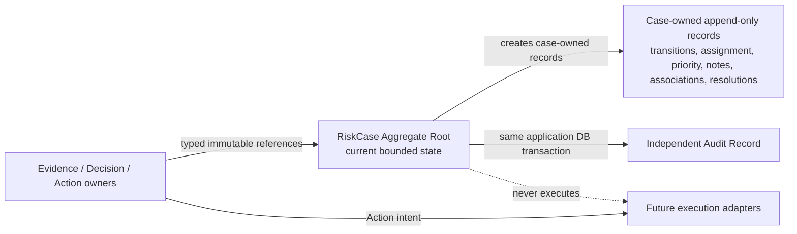

# Q-008 Risk Case Foundation — Implementation Design

## Status

Design Complete — Ready for Architect Design Review

| Gate | Result |
| --- | --- |
| Requirement | PASS / APPROVED |
| Architecture | PASS / APPROVED |
| ADR-010 | ACCEPTED |
| Implementation Design Artifact | COMPLETE |
| Design Review | READY FOR ARCHITECT REVIEW — NOT APPROVED |
| Implementation | NOT STARTED |
| Implementation Allowed | NO |

This document resolves the two Implementation Design deferrals authorized by
Q-008 and ADR-010: the concrete CaseNumber strategy and the relational shape
for immutable Resolution History. It designs the remaining minimum Phase 1
implementation without creating code, SQL, migrations, APIs, tests, runtime
configuration, or integrations.

## 1. Authority and Design Boundary

The following sources are authoritative, in order:

1. root `AGENTS.md` and durable development standards;
2. approved `docs/requirements/Q-008-Requirement.md`;
3. Accepted ADR-009 and ADR-010;
4. synchronized Q-007 architecture and Core Domain Skill; and
5. Q-008 V1, V2, and V3 Review evidence.

This design does not reopen these approved decisions:

- Decision is the BrokerOS Risk Core Domain.
- RiskCase is the Aggregate Root only for case-owned invariants and records.
- Evidence and Decision lifecycles remain upstream.
- Action is business intent; execution remains downstream.
- Audit has independent ownership.
- Intake sources are `MANUAL` and `DECISION_DRIVEN`.
- Initial subject type is only `TRADING_ACCOUNT`.
- Lifecycle states and legal transition directions are fixed by Q-008.
- Resolution History is immutable and supports ordered cycles.
- Related/cross-case Decision association and team/queue ownership stay
  deferred.

## 2. Design Outcome Summary

| Area | Design decision |
| --- | --- |
| Module | One `com.brokeros.risk.riskcase` capability inside the existing backend modular monolith |
| Persistence | Existing Spring JDBC and application-owned MySQL; no JPA or new dependency |
| CaseNumber | `RC-` plus canonical lowercase UUIDv4, generated before persistence |
| Concurrency | Aggregate-root optimistic version; every material command uses compare-and-set and increments once |
| History ordering | Successful command result version is the case-local ordering key |
| Resolution | Immutable header per cycle plus normalized Evidence/Action reference snapshots |
| Associations | Append-only Evidence/Action events and immutable Decision associations; upstream objects are never copied |
| Audit | Independent append-only `audit_record`; same Spring database transaction as material case mutation |
| API | Named command endpoints; no generic status setter or delete endpoint |
| Idempotency | Required creation idempotency key plus request fingerprint; optimistic version protects repeated mutations |
| Security | Authenticated Actor/authorization ports required; role model remains outside Q-008 |
| Messaging/cache | No Kafka topic/event and no Redis key |

No new ADR is required. UUIDv4 selection and normalized history tables resolve
details that ADR-010 explicitly delegated to Implementation Design. They do not
change system boundaries, dependencies, deployment, ownership, or the accepted
consistency model.

## 3. Phase 1 Module and Package Design

The implementation belongs in the existing backend deployable under:

```text
com.brokeros.risk.riskcase
├── controller
├── service
├── repository
├── domain
├── dto
└── mapper
```

The package segment is `riskcase`, not `case`, because `case` is a Java keyword.
No separate service, database, repository, workflow framework, or deployment is
introduced.

Minimum responsibilities:

- `controller`: HTTP translation, `@Valid`, ActorContext lookup, one use-case
  call, and `ApiResponse`/HTTP translation only;
- `service`: named transactional application use cases, authorization calls,
  upstream reference checks, aggregate loading, persistence coordination, and
  Audit Record append;
- `repository`: Risk Case persistence ports plus Spring JDBC implementations;
- `domain`: Aggregate Root, Value Objects, stable enums, operations, invariants,
  and immutable case-owned records;
- `dto`: action-specific requests and responses, never entities;
- `mapper`: explicit DTO/domain/persistence mapping where mapping is nontrivial.

Audit remains independently owned. The minimum implementation requires an
`AuditRecord` model and `AuditRecordWriter`/JDBC repository in an independent
`com.brokeros.risk.audit` boundary. It has no controller, query API, workflow,
Kafka publication, retention engine, or general administration. Risk Case
depends on the Audit writer; Audit never depends on Risk Case domain classes.

## 4. Aggregate Boundary



### 4.1 RiskCase current state

The Aggregate Root keeps only state needed to validate the next command:

- internal `RiskCaseId`;
- immutable `CaseNumber`;
- immutable `TradingAccountSubjectRef`;
- immutable `CaseIntakeSource` and intake summary;
- `RiskCaseStatus`;
- `RiskCasePriority`;
- current individual `Assignment`, if any;
- current case-relevant `DecisionRef`, if any;
- current `ResolutionCycleNumber`;
- creation provenance and UTC timestamps;
- optimistic `version`;
- no full Evidence, Decision, Action, Resolution, note, or Audit collections.

The repository loads the root snapshot plus only targeted facts needed by one
command. Append-only histories are queried separately and are not loaded as an
unbounded aggregate graph.

### 4.2 Domain types

| Type | Kind | Purpose/invariant |
| --- | --- | --- |
| `RiskCase` | Aggregate Root | Owns legal current-state changes and creates immutable case-owned records |
| `RiskCaseId` | Internal Value Object | Wraps application-owned `BIGINT id`; never appears in public API |
| `CaseNumber` | Value Object | Canonical `RC-<UUIDv4>` business identifier |
| `CaseNumberGenerator` | Domain contract | Generates a new CaseNumber without database-ID coupling |
| `RiskCaseStatus` | Enum | `OPEN`, `IN_REVIEW`, `ACTION_REQUIRED`, `RESOLVED`, `CLOSED`, `CANCELLED` |
| `RiskCasePriority` | Enum | `LOW`, `NORMAL`, `HIGH`, `CRITICAL` |
| `CaseIntakeSource` | Enum | `MANUAL`, `DECISION_DRIVEN` |
| `TradingAccountSubjectRef` | Value Object | `TRADING_ACCOUNT` plus opaque owning-context reference |
| `ActorRef` | Value Object | Authenticated actor identity reference; never accepted from command body |
| `Assignment` | Value Object | assignee, assignedBy, assignedAt; all-or-none |
| `EvidenceRef` | Value Object | Opaque upstream reference only |
| `DecisionRef` | Value Object | Opaque Core Domain reference only |
| `ActionRef` / `ActionOutcomeRef` | Value Objects | Action intent and separate execution-outcome references |
| `ResolutionCycleNumber` | Value Object | Positive, case-local ordered cycle starting at 1 |
| `ResolutionOutcome` | Enum | Stable substantive outcome code defined below |
| `ResolutionRecord` | Immutable entity | One substantive resolution header per cycle |
| `TransitionRecord` | Immutable entity | Creation/status/reopen/close/cancel business history |
| `EvidenceAssociationEvent` | Immutable entity | Attach, supersede, invalidate, or withdraw reference history |
| `EvidenceAssociationEventRef` | Value Object | Opaque UUIDv4 API reference; never exposes history-row `BIGINT id` |
| `DecisionAssociation` | Immutable entity | Primary case association for one Decision |
| `DecisionSelectionRecord` | Immutable entity | Audits current Decision pointer selection/clearing without rewriting association |
| `ActionAssociationEvent` | Immutable entity | Action intent association/outcome-reference history |
| `InvestigationNote` | Immutable entity | Append-only note or correction linked to prior note |
| `InvestigationNoteRef` | Value Object | Opaque UUIDv4 API reference; never exposes note-row `BIGINT id` |
| `AuditRecord` | Independent entity | Compliance/operational fact outside RiskCase ownership |

### 4.3 Resolution outcomes

The minimum stable codes are:

- `RISK_CONFIRMED_ACTION_COMPLETED`;
- `NO_RISK`;
- `FALSE_POSITIVE`;
- `MONITORING_ONLY`;
- `NO_ACTION_REQUIRED`.

These are resolution outcomes, not lifecycle states, priorities, Actions, or
Decision risk levels. Adding an outcome is a business-contract change requiring
Requirement review.

## 5. Domain Operations and Lifecycle

No public `setStatus` exists. Every status change is produced by one named
Aggregate operation.

| From | To | Domain operation | Mandatory invariants and produced records |
| --- | --- | --- | --- |
| none | `OPEN` | `openManual` | Valid CaseNumber, subject, summary, actor/time, priority; no fabricated upstream reference; creation transition |
| none | `OPEN` | `openDecisionDriven` | Manual invariants plus validated DecisionRef; immutable Decision association and current pointer |
| `OPEN` | `IN_REVIEW` | `beginReview` | Assignment present; actor/time; transition record |
| `OPEN` | `CANCELLED` | `cancel` | Nonblank reason; duplicate case number when applicable; terminal transition |
| `IN_REVIEW` | `ACTION_REQUIRED` | `markActionRequired` | Current associated Decision and at least one Action associated to that Decision |
| `IN_REVIEW` | `RESOLVED` | `resolve` | Current associated Decision; immutable cycle resolution; no remaining Action required |
| `IN_REVIEW` | `CANCELLED` | `cancel` | Invalid/duplicate/out-of-scope reason; terminal transition |
| `ACTION_REQUIRED` | `IN_REVIEW` | `returnToReview` | Reason identifying new Evidence/changed circumstances; same cycle continues |
| `ACTION_REQUIRED` | `RESOLVED` | `resolve` | Current Decision; every required Action has an outcome reference; immutable cycle resolution |
| `ACTION_REQUIRED` | `CANCELLED` | `cancel` | Exceptional invalid/duplicate reason; terminal transition |
| `RESOLVED` | `CLOSED` | `close` | Nonblank administrative close reason; actor/time; resolution remains immutable |
| `RESOLVED` | `IN_REVIEW` | `resumeResolvedCase` | Reason/actor/time; increment cycle; clear current Decision pointer with history preserved |
| `CLOSED` | `IN_REVIEW` | `reopenClosedCase` | Reason/actor/time; assignment present; increment cycle; clear current Decision pointer; Audit required |

No transition leaves `CANCELLED`. `CLOSED` accepts only
`reopenClosedCase`. A closed/resolved case cannot be edited first and reopened
afterward; reopen is the first material mutation.

### 5.1 Non-transition operations

| Operation | Allowed status | Core invariants |
| --- | --- | --- |
| `assign` / `reassign` | `OPEN`, `IN_REVIEW`, `ACTION_REQUIRED` | Authenticated assignee/assigner refs; reason; no team semantics |
| `unassign` | `OPEN` only | Active review states may not lose required assignee |
| `changePriority` | `OPEN`, `IN_REVIEW`, `ACTION_REQUIRED`, `RESOLVED` | New value differs; reason required; history and audit appended |
| `associateEvidence` | `OPEN`, `IN_REVIEW`, `ACTION_REQUIRED` | Upstream Evidence exists; no effective duplicate |
| `changeEvidenceDisposition` | `OPEN`, `IN_REVIEW`, `ACTION_REQUIRED` | Prior association exists; append event; never update/delete prior event |
| `associateDecision` | `OPEN`, `IN_REVIEW`, `ACTION_REQUIRED` | Core Domain Decision exists; global Primary association available; append association and selection records |
| `selectCurrentDecision` | `OPEN`, `IN_REVIEW`, `ACTION_REQUIRED` | Decision is already associated to this case; append selection record; never rewrite association |
| `associateAction` | `IN_REVIEW`, `ACTION_REQUIRED` | Action exists, originates from an associated Decision, and is not execution |
| `recordActionOutcomeReference` | `ACTION_REQUIRED` | Outcome exists outside Q-008; append reference event only |
| `addInvestigationNote` | `OPEN`, `IN_REVIEW`, `ACTION_REQUIRED`, `RESOLVED` | Controlled access; nonblank bounded text; append-only |
| `correctInvestigationNote` | same as add | New note supersedes prior note; prior content remains protected and auditable |

Every material operation increments the root version exactly once, appends its
case-owned business record where applicable, and appends one required Audit
Record in the same transaction.

### 5.2 Reopen design

`reopenClosedCase(reason, actor, occurredAt, expectedVersion)` performs one
atomic command:

1. require current state `CLOSED`;
2. require nonblank reason and authenticated ActorRef;
3. require a current assignee or an assignee supplied with the command;
4. increment `currentCycleNo` by one;
5. set state to `IN_REVIEW`;
6. clear the current Decision pointer so the new cycle must deliberately select
   or associate the Decision supporting its later resolution;
7. retain every prior Decision association, Evidence/Action event, resolution,
   closure transition, note, and audit record;
8. append a `REOPEN_CLOSED` transition containing prior/new cycle, actor,
   reason, UTC timestamp, and resulting case version; and
9. append the independent Audit Record before the transaction can commit.

The operation does not restore `OPEN`, mutate the previous Resolution Record,
or interpret reopening as reversal of an upstream Decision.

## 6. CaseNumber Implementation Design Decision

### 6.1 Selected strategy

Use canonical lowercase UUIDv4 with a stable namespace prefix:

```text
RC-xxxxxxxx-xxxx-4xxx-yxxx-xxxxxxxxxxxx
```

Example shape only:

```text
RC-3f65bda7-8847-4d64-9e55-f2b67bb975b1
```

The example is not a reserved production value.

Contract:

- generator uses Java's standard random UUID facility;
- output is normalized to lowercase and validated by `CaseNumber`;
- UUID version/variant bits are validated;
- 122 random bits provide a globally collision-resistant opaque identifier;
- no timestamp, node identifier, database sequence, or case-count signal is
  encoded;
- database column is `CHAR(39)` using an ASCII binary collation;
- a unique constraint is the final collision guard;
- a CaseNumber unique violation triggers at most three bounded regeneration
  attempts, but never an unbounded retry loop;
- the internal `BIGINT id` never enters URLs, DTOs, logs, or audit target refs.

### 6.2 Alternatives

| Alternative | Result | Reason |
| --- | --- | --- |
| UUIDv4 | Selected | Standard Java support, no new dependency, random/opaque, no time or volume leakage |
| UUIDv7 | Rejected for Q-008 | Sortable but embeds creation time/order that the business identifier does not need |
| ULID | Rejected for Q-008 | Embeds time, may expose ordering, and needs non-JDK codec/dependency or custom implementation |
| Snowflake-style | Rejected | Encodes time/node/sequence, leaks ordering/throughput, and requires worker coordination |
| Database sequence | Rejected | Exposes volume/order and couples public identity generation to one database allocator |
| Random Base32 | Not selected | Can be compliant but adds custom encoding/canonicalization without benefit over UUIDv4 |

The database primary key remains `BIGINT`; UUIDv4 is only the external business
identifier. This decision does not amend ADR-010 because the ADR explicitly
delegated the concrete encoding to Implementation Design.

## 7. Resolution History and Cycle Design

### 7.1 Cycle rules

- New case starts at cycle 1.
- A cycle may produce at most one Resolution Record.
- `RESOLVED → CLOSED` remains in the same cycle.
- `RESOLVED → IN_REVIEW` and `CLOSED → IN_REVIEW` increment the cycle number.
- Each completed cycle is immutable even after later reopen.
- Current case state is not a replacement for history.
- `caseVersion` orders every case command; `cycleNo` groups investigation and
  resolution semantics.

### 7.2 Resolution record

One immutable Resolution Record contains:

- case and cycle identity;
- resulting case version;
- `ResolutionOutcome`;
- mandatory DecisionRef supporting the outcome;
- mandatory bounded resolution summary;
- resolver ActorRef and UTC time;
- an immutable snapshot of case-associated EvidenceRefs selected for that
  resolution, possibly empty when provenance remains solely on the Decision;
- an immutable snapshot of associated ActionRefs and their outcome refs;
- no mutable `currentResolution` payload on RiskCase.

When resolving from `ACTION_REQUIRED`, every required ActionRef must have an
outcome reference. Q-008 records that reference but neither validates vendor
success semantics nor owns execution.

### 7.3 Closure and reopen history

Administrative closure and reopen are immutable Transition Records rather than
fields overwritten on the root. A case may therefore have multiple close and
reopen facts across ordered cycles. The current root holds only status and
cycle number needed for the next invariant.

### 7.4 Deterministic ordering

The root starts with `version = 1`. Each successful material command changes
`N → N+1`; every record created by that command stores `case_version = N+1`.
History ordering is:

1. `case_version` ascending;
2. stable event-type rank for multiple snapshot rows belonging to one command;
3. internal record `id` as final database-only tie breaker.

No wall-clock timestamp is used as the sole ordering key.

## 8. Persistence Design

### 8.1 Persistence technology

- Use existing Spring JDBC (`NamedParameterJdbcTemplate` or equivalent) and the
  existing Spring transaction manager.
- Do not add JPA/Hibernate or another ORM.
- Future schema is delivered only through a new immutable Flyway migration
  following `V<number>__<description>.sql` convention.
- This design creates no migration or SQL file.
- MySQL is the durable source of truth; Redis is not used.

All `DATETIME(6)` values are persisted as UTC. Stable codes are strings, never
enum ordinals. Internal primary keys are `BIGINT` named `id`; every foreign key
to case-owned data uses `ON DELETE RESTRICT` and no cascade delete.

### 8.2 Table catalog

#### `risk_case`

| Column | Type | Null | Rule |
| --- | --- | --- | --- |
| `id` | `BIGINT` | NO | Internal auto-increment primary key |
| `case_number` | `CHAR(39)` ASCII binary | NO | Canonical `RC-<UUIDv4>`; unique |
| `subject_type` | `VARCHAR(32)` | NO | `TRADING_ACCOUNT` only |
| `subject_ref` | `VARCHAR(128)` | NO | Opaque owning-context reference |
| `intake_source` | `VARCHAR(32)` | NO | `MANUAL` or `DECISION_DRIVEN` |
| `intake_summary` | `VARCHAR(1000)` | NO | Investigation reason; not Evidence/Decision |
| `status` | `VARCHAR(32)` | NO | Approved lifecycle code |
| `priority` | `VARCHAR(16)` | NO | Approved operational priority |
| `current_assignee_ref` | `VARCHAR(128)` | YES | Individual assignment only |
| `assigned_by_ref` | `VARCHAR(128)` | YES | Present iff assignee present |
| `assigned_at` | `DATETIME(6)` | YES | UTC; present iff assignee present |
| `current_decision_ref` | `VARCHAR(128)` | YES | Mutable pointer; immutable association history is separate |
| `current_cycle_no` | `INT` | NO | Starts at 1; positive |
| `creation_idempotency_key_hash` | `BINARY(32)` | NO | SHA-256 of normalized create key |
| `creation_request_hash` | `BINARY(32)` | NO | Detects same key with different payload |
| `created_by_ref` | `VARCHAR(128)` | NO | Authenticated actor |
| `created_at` | `DATETIME(6)` | NO | UTC |
| `updated_by_ref` | `VARCHAR(128)` | NO | Last successful command actor |
| `updated_at` | `DATETIME(6)` | NO | UTC |
| `version` | `BIGINT` | NO | Starts at 1; optimistic lock |

Constraints/indexes:

- primary key `id`;
- unique `case_number`;
- unique `(created_by_ref, creation_idempotency_key_hash)`;
- index `(subject_type, subject_ref, created_at)` for account-linked lookup;
- check stable status/intake/priority/subject codes;
- check `current_cycle_no >= 1`, `version >= 1`;
- check assignment fields are all null or all non-null;
- check `IN_REVIEW` and `ACTION_REQUIRED` have an assignee;
- check `ACTION_REQUIRED`, `RESOLVED`, and `CLOSED` have a current Decision,
  except reopen clears it only after state changes to `IN_REVIEW`.

#### `risk_case_transition_history`

Columns: `id BIGINT` PK, `case_id BIGINT` FK, `case_version BIGINT`,
`cycle_no INT`, `operation_code VARCHAR(32)`, nullable
`from_status VARCHAR(32)`, `to_status VARCHAR(32)`, `reason VARCHAR(1000)`,
`actor_ref VARCHAR(128)`, `occurred_at DATETIME(6)`.

Constraints/indexes: unique `(case_id, case_version)`, index
`(case_id, case_version)`, FK to `risk_case` with restrict delete, stable
operation/status codes, positive cycle/version.

Creation uses operation `CREATE` with null `from_status` and `OPEN` target.
Close, cancel, resume, and reopen reasons are preserved here.

#### `risk_case_assignment_history`

Columns: `id`, `case_id`, `case_version`, nullable `previous_assignee_ref`,
nullable `new_assignee_ref`, `assigned_by_ref`, `reason`, `occurred_at`.

Unique `(case_id, case_version)`; index `(case_id, case_version)`; at least one
of previous/new assignee must be present. Rows are append-only.

#### `risk_case_priority_history`

Columns: `id`, `case_id`, `case_version`, `previous_priority`, `new_priority`,
`changed_by_ref`, `reason`, `occurred_at`.

Unique `(case_id, case_version)`; stable priority checks; previous and new must
differ. Rows are append-only.

#### `risk_case_evidence_association_history`

Columns: `id`, unique `event_ref CHAR(36)`, `case_id`, `case_version`,
`event_type`, `evidence_ref`, nullable `prior_event_id`, nullable
`replacement_evidence_ref`, `reason`, `source`, `actor_ref`, `occurred_at`.

Event codes: `ATTACHED`, `SUPERSEDED`, `INVALIDATED`, `WITHDRAWN`. The first
event has no prior row; disposition events reference the earlier event and are
new rows. Prior rows are never updated. Unique `(case_id, case_version)`, index
`(case_id, evidence_ref, case_version)`, and self-FK `prior_event_id` with
restrict delete.

#### `risk_case_decision_association`

Columns: `id`, `case_id`, `case_version`, `decision_ref`, `associated_by_ref`,
`reason`, `associated_at`.

The row is immutable. Unique `decision_ref` enforces at most one Primary Risk
Case per Decision across Q-008. Unique `(case_id, case_version)` and index
`(case_id, case_version)` preserve case history. Related association type is
not modeled.

#### `risk_case_decision_selection_history`

Columns: `id`, `case_id`, `case_version`, nullable `previous_decision_ref`,
nullable `new_decision_ref`, `selected_by_ref`, `reason`, `selected_at`.

Unique `(case_id, case_version)` and index `(case_id, case_version)`. A normal
selection requires `new_decision_ref` to exist in this case's immutable
association table. Reopen/resume may set it null while recording the previous
reference. Association rows are never updated.

#### `risk_case_action_association_history`

Columns: `id`, `case_id`, `case_version`, `event_type`, `action_ref`,
`decision_ref`, nullable `outcome_ref`, nullable `prior_event_id`, `reason`,
`actor_ref`, `occurred_at`.

Event codes: `ACTION_ASSOCIATED`, `OUTCOME_REFERENCED`, `WITHDRAWN`. An outcome
event points to the existing action association and stores only the opaque
execution-outcome reference. Unique `(case_id, case_version)`, index
`(case_id, action_ref, case_version)`, and self-FK restrict deletion.

#### `risk_case_resolution_history`

Columns: `id`, `case_id`, `cycle_no`, `case_version`, `outcome_code`,
`decision_ref`, `resolution_summary VARCHAR(2000)`, `resolved_by_ref`,
`resolved_at`.

Unique `(case_id, cycle_no)` enforces one resolution per cycle. Unique
`(case_id, case_version)` and index `(case_id, cycle_no)` support deterministic
history. Rows are never updated or deleted.

#### `risk_case_resolution_evidence_reference`

Columns: `id`, `resolution_id`, `evidence_ref`, `source_association_event_id`.

Unique `(resolution_id, evidence_ref)`. Both foreign keys restrict deletion.
The table is an immutable snapshot of effective case-associated Evidence used
for the resolution; it does not own Evidence.

#### `risk_case_resolution_action_reference`

Columns: `id`, `resolution_id`, `action_ref`, nullable `outcome_ref`,
`source_action_event_id`.

Unique `(resolution_id, action_ref)`. Both foreign keys restrict deletion.
When resolving from `ACTION_REQUIRED`, `outcome_ref` is mandatory for every
required Action; otherwise no Action row is required.

#### `risk_case_note`

Columns: `id`, unique `note_ref CHAR(36)`, `case_id`, `case_version`,
`content VARCHAR(4000)`, nullable `supersedes_note_id`, `created_by_ref`,
`created_at`.

Unique `(case_id, case_version)`, index `(case_id, case_version)`, self-FK with
restrict delete. A correction appends a new note and references the prior note;
there is no update or delete operation.

#### `audit_record`

Columns: `id BIGINT` PK, `audit_id CHAR(36)` unique, `target_type VARCHAR(32)`,
`target_id BIGINT`, `target_business_ref VARCHAR(128)`, nullable
`case_version BIGINT`, `operation_code VARCHAR(64)`, nullable
`affected_ref_type VARCHAR(32)`, nullable `affected_ref VARCHAR(128)`,
`actor_ref VARCHAR(128)`, `occurred_at DATETIME(6)`, `reason VARCHAR(1000)`,
`source VARCHAR(64)`, nullable `request_id VARCHAR(128)`, nullable
`trace_id VARCHAR(128)`, nullable `before_state JSON`, nullable
`after_state JSON`.

Indexes: unique `audit_id`, `(target_type, target_id, occurred_at, id)`, and
`(actor_ref, occurred_at)`. Audit has no cascade relationship to Risk Case.
Before/after JSON contains only bounded safe state codes, identifiers, and
content hashes—not note text, intake summary, credentials, or upstream payloads.
Audit rows are insert-only.

### 8.3 Reference integrity

EvidenceRef, DecisionRef, ActionRef, outcome refs, subject refs, and ActorRefs
are not foreign keys to external/vendor tables. Application ports validate
references against owning BrokerOS capabilities. Vendor primary keys/DTOs never
enter this schema.

The current repository has no implemented Evidence/Decision/Action capability.
Therefore these validation ports have no honest production provider yet; this
is an implementation-authorization blocker recorded in Section 17.

## 9. Transaction and Audit Design

### 9.1 Transaction owner

Each named application service method is the transaction owner. It uses the
single application-owned MySQL DataSource and Spring transaction manager. The
controller never owns a transaction, and repositories never start
`REQUIRES_NEW` transactions.

### 9.2 Material mutation sequence

For an existing case:

1. obtain authenticated ActorContext and authorize the named operation;
2. load current RiskCase snapshot by CaseNumber;
3. validate required upstream references through owning-capability ports;
4. invoke the named domain operation with `expectedVersion`;
5. compare-and-set the root using
   `UPDATE risk_case ... WHERE id = ? AND version = ?`;
6. require exactly one updated row; otherwise throw version conflict;
7. append case-owned transition/association/history records using the resulting
   case version;
8. append one independent Audit Record with bounded before/after facts;
9. commit once; and
10. map the committed aggregate snapshot to the response.

The root update occurs before history inserts so the successful writer reserves
the next case version. All later writes still belong to the same transaction.

### 9.3 Failure behavior

- domain invariant failure writes nothing;
- optimistic update count zero rolls back all command work and returns conflict;
- case history write failure rolls back root update and audit;
- Audit Record write failure rolls back root and case history;
- commit failure returns no success response;
- no Kafka publication is required for durability;
- no caught exception may continue a rollback-only transaction;
- unique-constraint retry/replay handling occurs outside the failed transaction;
- no distributed transaction, 2PC, Saga, or Event Sourcing is introduced.

### 9.4 Create transaction

Create inserts root version 1, creation Transition Record, optional primary
Decision association, and Audit Record in one transaction. The normalized
idempotency-key hash and request hash are persisted on the root.

If the same actor retries the same key and request hash, the service returns the
existing case. The same key with a different request hash returns
`RISK_CASE_IDEMPOTENCY_CONFLICT`. Concurrent decision-driven creation is also
guarded by unique `decision_ref`; after rollback, the caller may retrieve the
existing primary case or receive a deterministic conflict.

### 9.5 Read audit

Case detail and history contain sensitive investigation context. The query use
case authorizes access and appends a `RISK_CASE_VIEWED` Audit Record before
returning content. If access-audit persistence fails, no sensitive response is
returned. Read audit does not increment RiskCase version because it is not a
case mutation.

## 10. Application Use Cases

All ActorRefs come from authenticated ActorContext, never request bodies.
Every existing-case command includes `expectedVersion`.

| Use case | Input | Authorization boundary | Domain/persistence | Audit | Output | Major failures |
| --- | --- | --- | --- | --- | --- | --- |
| Create Risk Case | source, subject ref, summary, priority, optional DecisionRef, idempotency key | create-manual or create-decision-driven permission | generate number; validate conditional Decision; insert root/history/association | `RISK_CASE_CREATED` | case detail, version 1 | invalid request, reference unavailable/not found, duplicate key/Decision, number collision |
| Assign/reassign | case number, assignee ref, reason, expected version | assignment permission | `assign`/`reassign`; CAS root; append assignment history | `RISK_CASE_ASSIGNED` | updated case | not found, invalid state, actor/assignee invalid, version conflict |
| Begin review | case number, reason, expected version | review permission | `beginReview`; requires assignee; append transition | `RISK_CASE_REVIEW_STARTED` | updated case | invalid state, missing assignee, conflict |
| Associate Evidence | case number, EvidenceRef, reason/source, expected version | association permission | validate upstream; `associateEvidence`; append event | `RISK_CASE_EVIDENCE_ASSOCIATED` | association + version | provider missing, reference not found, duplicate, conflict |
| Change Evidence disposition | case number, prior event ref, disposition, replacement ref/reason, expected version | association permission | validate prior/replacement; append supersede/invalidate/withdraw event | disposition-specific record | event + version | illegal disposition, missing replacement, conflict |
| Associate Decision | case number, DecisionRef, reason, expected version | decision-association permission | validate Core Domain Decision; append unique primary association and selection | `RISK_CASE_DECISION_ASSOCIATED` | association + version | Decision missing/already primary, conflict |
| Select current Decision | case number, associated DecisionRef, reason, expected version | decision-association permission | validate existing association; append selection history; update pointer | `RISK_CASE_DECISION_SELECTED` | updated case | association missing, same selection, conflict |
| Associate Action | case number, ActionRef, DecisionRef, reason, expected version | action-association permission | validate Action and originating associated Decision; append event | `RISK_CASE_ACTION_ASSOCIATED` | event + version | invalid origin, execution payload supplied, conflict |
| Record Action outcome ref | case number, ActionRef, outcome ref, reason, expected version | action-association permission | validate external outcome reference; append event only | `RISK_CASE_ACTION_OUTCOME_REFERENCED` | event + version | not action-required, missing association/outcome, conflict |
| Mark action required | case number, reason, expected version | review permission | require current Decision/action; transition | `RISK_CASE_ACTION_REQUIRED` | updated case | invariant or version conflict |
| Return to review | case number, reason, expected version | review permission | `returnToReview`; same cycle; transition | `RISK_CASE_RETURNED_TO_REVIEW` | updated case | invalid state/reason/conflict |
| Change priority | case number, priority, reason, expected version | priority-change permission | update root; append priority history | `RISK_CASE_PRIORITY_CHANGED` | updated case | same priority, invalid state, conflict |
| Add/correct note | case number, content, optional prior note ref, expected version | note permission | append note or correction; never update prior | note-added/corrected record without plaintext content | note metadata + version | invalid state, size/content, prior missing, conflict |
| Resolve | case number, outcome, summary, selected Evidence/Action refs, expected version | resolution permission | validate current Decision/actions; append resolution + snapshots; transition | `RISK_CASE_RESOLVED` | resolution + updated case | invalid state/outcome, missing Decision/outcome ref, conflict |
| Close | case number, reason, expected version | closure permission | `close`; append transition | `RISK_CASE_CLOSED` | updated case | not resolved, conflict |
| Cancel | case number, reason, optional duplicate case number, expected version | cancellation permission | `cancel`; append terminal transition | `RISK_CASE_CANCELLED` | updated case | invalid state/reason/duplicate ref, conflict |
| Resume resolved | case number, reason, optional assignee, expected version | reopen permission | increment cycle; clear current Decision; transition | `RISK_CASE_RESOLUTION_REOPENED` | updated case | invalid state/assignment/conflict |
| Reopen closed | case number, reason, optional assignee, expected version | reopen permission | strict reopen design in 5.2 | `RISK_CASE_CLOSED_REOPENED` | updated case | invalid state/assignment/conflict |
| Get Risk Case | case number | read permission | query bounded detail; append access audit | `RISK_CASE_VIEWED` | detail response | not found, forbidden, audit failure |
| Get case history | case number, cursor, limit | history-read permission | query merged case-owned history page; append access audit | `RISK_CASE_HISTORY_VIEWED` | ordered page | invalid cursor/limit, forbidden, audit failure |

No generic workflow service or giant `RiskService` is designed. Use-case
classes/services should be cohesive—for example creation, case command,
association, resolution, and query services—without moving invariants out of
RiskCase.

## 11. API Contract Design

### 11.1 Common rules

- All application endpoints return existing `ApiResponse<T>`.
- Requests use `@Valid`; entities/domain models are never returned.
- CaseNumber, never internal `id`, appears in URLs and responses.
- Mutation DTOs for existing cases require nonnegative `expectedVersion`.
- Create requires `Idempotency-Key` header of 16–128 visible ASCII characters;
  only SHA-256 is persisted.
- String refs are trimmed, nonblank, and at most 128 characters.
- reasons/summaries are bounded as specified by persistence design.
- Actor identity and timestamp are server-supplied.
- No endpoint accepts arbitrary target status.
- No DELETE endpoint exists.
- Controllers do not access repositories, Audit, Kafka, Redis, or adapters.

### 11.2 Endpoints

| Method and path | Request DTO | Response DTO | Success | Notes |
| --- | --- | --- | --- | --- |
| `POST /api/risk-cases` | `CreateRiskCaseRequest` | `RiskCaseDetailResponse` | 201 | Conditional intake validation; Idempotency-Key required |
| `GET /api/risk-cases/{caseNumber}` | none | `RiskCaseDetailResponse` | 200 | Authorized and access-audited |
| `GET /api/risk-cases/{caseNumber}/history` | cursor, limit | `RiskCaseHistoryPageResponse` | 200 | Limit 1–100; stable opaque cursor |
| `POST /api/risk-cases/{caseNumber}/assignments` | `ChangeRiskCaseAssignmentRequest` | `RiskCaseDetailResponse` | 200 | Individual only |
| `POST /api/risk-cases/{caseNumber}/review-start` | `BeginRiskCaseReviewRequest` | detail | 200 | `OPEN → IN_REVIEW` only |
| `POST /api/risk-cases/{caseNumber}/evidence-associations` | `AssociateRiskCaseEvidenceRequest` | association response | 201 | Reference only |
| `POST /api/risk-cases/{caseNumber}/evidence-associations/{associationEventRef}/dispositions` | `ChangeEvidenceAssociationDispositionRequest` | association response | 201 | Append event, no internal ID |
| `POST /api/risk-cases/{caseNumber}/decision-associations` | `AssociateRiskCaseDecisionRequest` | association response | 201 | Primary association only |
| `POST /api/risk-cases/{caseNumber}/decision-selection` | `SelectRiskCaseDecisionRequest` | detail | 200 | Selects an existing association; appends history |
| `POST /api/risk-cases/{caseNumber}/action-associations` | `AssociateRiskCaseActionRequest` | association response | 201 | Intent reference only |
| `POST /api/risk-cases/{caseNumber}/action-associations/{actionRef}/outcomes` | `ReferenceActionOutcomeRequest` | association response | 201 | Never executes Action |
| `POST /api/risk-cases/{caseNumber}/action-required` | `MarkRiskCaseActionRequiredRequest` | detail | 200 | Named transition |
| `POST /api/risk-cases/{caseNumber}/review-return` | `ReturnRiskCaseToReviewRequest` | detail | 200 | `ACTION_REQUIRED → IN_REVIEW` |
| `POST /api/risk-cases/{caseNumber}/priority-changes` | `ChangeRiskCasePriorityRequest` | detail | 200 | Audited reason |
| `POST /api/risk-cases/{caseNumber}/notes` | `AddRiskCaseNoteRequest` | note metadata | 201 | Controlled sensitive content |
| `POST /api/risk-cases/{caseNumber}/notes/{noteRef}/corrections` | `CorrectRiskCaseNoteRequest` | note metadata | 201 | Prior note remains; no internal ID |
| `POST /api/risk-cases/{caseNumber}/resolutions` | `ResolveRiskCaseRequest` | `RiskCaseResolutionResponse` | 201 | Immutable cycle record |
| `POST /api/risk-cases/{caseNumber}/closure` | `CloseRiskCaseRequest` | detail | 200 | `RESOLVED → CLOSED` |
| `POST /api/risk-cases/{caseNumber}/cancellation` | `CancelRiskCaseRequest` | detail | 200 | Not a NO_RISK outcome |
| `POST /api/risk-cases/{caseNumber}/resume` | `ResumeResolvedRiskCaseRequest` | detail | 200 | `RESOLVED → IN_REVIEW`; new cycle |
| `POST /api/risk-cases/{caseNumber}/reopen` | `ReopenClosedRiskCaseRequest` | detail | 200 | `CLOSED → IN_REVIEW`; strict audit |

### 11.3 DTO boundary

`CreateRiskCaseRequest` contains `intakeSource`, `subjectType`, `subjectRef`,
`intakeSummary`, `priority`, and optional `decisionRef`. Conditional rules:

- subject type must be exactly `TRADING_ACCOUNT`;
- manual request must omit Decision/Evidence/Rule Hit/Alert fields;
- decision-driven request requires DecisionRef;
- no request accepts `createdBy`, `createdAt`, CaseNumber, internal id, status,
  risk level, severity, team, or execution command.

Every mutation response contains resulting `version`. Detail response contains
CaseNumber, typed subject, intake metadata, current status/priority/assignment,
current DecisionRef, cycle number, safe creation/update metadata, and links or
bounded summaries—not persistence entities or upstream payloads.

### 11.4 ResultCodes

The current symbolic ResultCode representation remains unchanged. The future
implementation may add only these Q-008 codes because they map to real designed
failures:

| Code | HTTP | Meaning |
| --- | --- | --- |
| `RISK_CASE_NOT_FOUND` | 404 | CaseNumber does not exist or is not visible |
| `RISK_CASE_INVALID_TRANSITION` | 422 | Named operation is illegal from current state |
| `RISK_CASE_INVARIANT_VIOLATION` | 422 | Required assignment/Decision/Action/resolution fact is missing |
| `RISK_CASE_VERSION_CONFLICT` | 409 | Expected version is stale |
| `RISK_CASE_IDEMPOTENCY_CONFLICT` | 409 | Create key was reused with different payload |
| `RISK_CASE_PRIMARY_DECISION_CONFLICT` | 409 | Decision already has a Primary Risk Case |
| `RISK_CASE_REFERENCE_NOT_FOUND` | 422 | Owning capability rejects an upstream reference |
| `RISK_CASE_REFERENCE_PROVIDER_UNAVAILABLE` | 503 | Required owning-capability provider is unavailable |

Existing `VALIDATION_ERROR` and `MALFORMED_REQUEST` handle DTO failures.
Expected domain failures use `BusinessException`; unexpected failures remain
`INTERNAL_ERROR` through `GlobalExceptionHandler`. Authentication/authorization
codes belong to the future platform security contract and are not invented by
Q-008.

## 12. Security Boundary

### 12.1 Minimum required boundary

- Every use case receives an authenticated, non-spoofable ActorContext.
- ActorRef is derived from that context, never a request header/body chosen by
  the caller.
- An authorization decision is made before case data is loaded or mutated.
- Operations are expressed as capabilities (create, read, assign, associate,
  review, resolve, close, cancel, reopen, note), not roles or organization
  hierarchy.
- Query responses expose only bounded Q-008 data; upstream payloads and vendor
  DTOs are never expanded.
- Access and change are auditable.
- There is no destructive delete or silent note/evidence replacement.
- Logs contain CaseNumber and safe reference identifiers only; note/intake text,
  credentials, and sensitive upstream content are excluded.

### 12.2 Explicit deferrals

Q-008 does not define users, roles, teams, queues, membership, permission
matrices, authentication protocol, legal hold, retention duration, regulatory
retention, or exceptional redaction workflow.

The repository currently has no authentication/authorization provider. A real
ActorContext and authorization decision provider must be approved and available
before Q-008 HTTP controllers can be enabled. A caller-supplied actor header is
not an acceptable substitute. This is an implementation blocker, not a reason
to invent IAM/RBAC in this design.

## 13. Concurrency and Duplicate Handling

### Two reviewers update the same case

Both load version N. Only one root compare-and-set to N+1 succeeds. The loser
gets `RISK_CASE_VERSION_CONFLICT`; its history and audit writes roll back.

### Concurrent assignment

Assignment uses the same root version. No last-write-wins behavior exists.
Client reloads current assignment and deliberately retries with the new
version.

### Resolve versus close/reopen

- close is legal only after a committed resolution;
- reopen is legal only from committed `CLOSED`;
- concurrent resolve/close/reopen commands race on one root version, so only
  one can commit;
- resolution unique `(case_id, cycle_no)` independently prevents two
  resolutions for one cycle.

### Duplicate Decision-driven creation

Global unique `risk_case_decision_association.decision_ref` permits at most one
Primary Risk Case. Concurrent losers roll back completely. Same idempotency key
and request replays the existing result; another key for the same Decision
returns the existing primary case or a deterministic conflict without creating
a second case.

### Duplicate Evidence/Action association

The application performs a targeted effective-association check, then reserves
the next root version. Concurrent duplicate commands cannot both commit because
only one root version update succeeds. Exact repeated requests may return the
existing association; conflicting repeats return a version/invariant conflict.

### Repeated API requests

- create: durable idempotency key and payload hash;
- existing-case mutation: expectedVersion plus operation-specific duplicate
  check; no silent second write;
- database unique violations are translated only after the failed transaction
  rolls back;
- retries are caller-driven and bounded; the server does not retry all
  exceptions.

## 14. Reference Provider Contracts and Current Dependency Gap

Minimum read-only contracts are required for:

- `TradingAccountReferenceQuery` — confirms a broker-neutral subject reference
  is recognized without exposing CRM/MT schema;
- `EvidenceReferenceQuery` — confirms Evidence exists and returns safe
  provenance metadata only;
- `DecisionReferenceQuery` — confirms Decision exists and remains attributable
  to Evidence;
- `ActionReferenceQuery` — confirms Action intent exists and its originating
  DecisionRef;
- `ActionOutcomeReferenceQuery` — confirms an outcome reference exists without
  interpreting vendor execution inside Risk Case.

These ports are read-only and do not create or mutate upstream objects. No
network protocol, Kafka contract, vendor adapter, or fake in-memory production
provider is designed.

Q-007 intentionally created no Evidence/Decision/Action implementation, and the
current repository contains none. A complete Q-008 implementation therefore
requires approved real providers or must keep dependent commands disabled. It
must never accept an unchecked string as proof that a Decision/Evidence/Action
exists. This is the second implementation blocker.

## 15. Query and History Design

The detail query loads only the root plus current bounded association summaries.
It does not join every history row or Audit Record.

History query returns a case-owned timeline built from transition, assignment,
priority, Evidence, Decision, Action, note, and resolution tables. It uses an
opaque cursor encoding `(caseVersion, eventTypeRank, recordId)` and a limit of
1–100. The repository performs bounded indexed queries or a bounded `UNION ALL`;
it never loads all history to validate a mutation.

Audit Records are not returned by the case-history API merely because they
target a case. A future Audit query contract and separate authorization are
required.

## 16. Verification Strategy for the Future Implementation

### Domain unit tests

- both creation paths and conditional intake invariants;
- every legal lifecycle transition;
- every illegal/repeated transition;
- assignment prerequisites and unassign restrictions;
- action-required Decision/Action prerequisites;
- cancellation terminal behavior and distinction from `NO_RISK`;
- reopen/resume cycle increment, current Decision clearing, and history
  preservation;
- priority and association operation status restrictions;
- ResolutionOutcome rules and immutable records;
- CaseNumber parsing/canonicalization and rejected malformed/version values.

### Application tests

- authorization before data access/mutation;
- ActorRef/timestamp sourced from trusted context/clock;
- upstream reference port validation;
- one transactional orchestration per command;
- BusinessException/ResultCode mapping;
- idempotent create replay and conflicting-key behavior;
- provider unavailable behavior without fake fallback.

### Repository/MySQL integration tests

- execute new Flyway migration against disposable MySQL 8.4 using repository
  infrastructure, not H2-specific behavior;
- verify all PK/FK/unique/check/index contracts;
- verify UUID CaseNumber uniqueness/canonical storage;
- verify append-only history and restrict-delete behavior;
- verify unique Decision primary association;
- verify query pagination/order by case version;
- verify optimistic update affects exactly one row.

### Transaction and audit atomicity tests

- case root failure leaves no history/audit;
- each case-history insert failure rolls back root/audit;
- Audit Record failure rolls back root/case history;
- commit failure returns no success;
- concurrent optimistic loser writes no history/audit;
- no `REQUIRES_NEW` or asynchronous audit path exists.

### API tests

- Bean Validation for lengths, enums, refs, summary/reason, expectedVersion,
  idempotency key, and cursor/limit;
- manual request rejects fabricated upstream fields;
- decision-driven request requires DecisionRef;
- every response uses `ApiResponse` and no entity/internal id leaks;
- 404/409/422/503 ResultCode mapping;
- named endpoints reject generic/arbitrary status mutation;
- unauthorized access returns no case-existence or sensitive detail.

### Concurrency tests

- simultaneous assignment;
- simultaneous Evidence association;
- resolve versus resolve;
- resolve versus close;
- close versus reopen;
- duplicate decision-driven create with same/different idempotency keys;
- repeated mutation request with stale version.

### Immutable-history tests

- note correction retains prior note;
- Evidence supersede/invalidate/withdraw retains every event;
- Decision reassessment retains prior association;
- action outcome reference does not rewrite Action;
- close/reopen/resolve across multiple cycles retains exact prior resolution and
  snapshot rows.

Compilation, tests, MySQL/Flyway, Docker, Kubernetes, Kafka, and Redis runtime
commands are not executed in this Design phase because no executable artifact
changes.

## 17. Design Review Blockers and Gate

### Design artifact status

The design artifact is complete and resolves the two approved Implementation
Design deferrals:

- CaseNumber: canonical lowercase UUIDv4 selected;
- Resolution History: normalized immutable cycle/header/reference snapshots and
  case-version ordering selected.

### Implementation-authorization blockers

1. **Upstream reference providers are absent.** Evidence, Decision, Action, and
   outcome contracts have no implemented owning capability. The Architect must
   decide sequencing: implement/approve those providers first, or approve a
   deliberately reduced Q-008 implementation with dependent commands disabled.
   Fabricated or unchecked references are prohibited.
2. **Authenticated Actor/authorization provider is absent.** Controlled access,
   trustworthy ActorRef, and auditable access cannot be satisfied by a
   caller-supplied header. A separate approved security boundary/provider is
   required before HTTP exposure.
3. **External Architect Design approval is not yet recorded.** This document
   and V4 Review are evidence for that review, not self-approval.

Design Gate: **READY FOR ARCHITECT REVIEW — NOT APPROVED**

Implementation Allowed: **NO**

## 18. Explicit Deferred Scope

The following remain outside Q-008:

- related/cross-case Decision associations;
- team ownership, queues, assignment routing, SLA, and escalation;
- IAM/RBAC implementation and organization hierarchy;
- MT4/MT5, Bridge, LP, leverage, forced-close, restriction, or other execution;
- Rule Engine, Flink, Python/ML, AI decisioning;
- universal Entity/Subject framework and additional subject types;
- Kafka topics/events and Redis keys/cache;
- detailed retention, legal hold, regulatory retention, and exceptional
  redaction implementation;
- search/reporting/dashboard, notifications, bulk operations, merge/split, and
  automated duplicate-case detection.

## 19. Implementation Sequence After Separate Approval

If and only if the Design Gate and blockers are explicitly resolved by a later
Architect decision, the smallest coherent implementation sequence is:

1. add the new immutable Flyway migration for approved tables/constraints;
2. implement CaseNumber and domain enums/Value Objects;
3. implement RiskCase operations and domain unit tests;
4. implement Spring JDBC repositories and MySQL integration tests;
5. implement independent Audit writer and atomicity tests;
6. integrate real Actor/authorization and reference providers;
7. implement named application use cases;
8. add DTOs/mappers/controllers and API contract tests;
9. run Maven, MySQL/Flyway, static, Docker/Kubernetes, and Review Package gates;
10. update Skill/Lessons only from actual verified implementation experience.

This sequence is a future plan, not authorization to start work.

## 20. References

- `AGENTS.md`
- `docs/requirements/Q-008-Requirement.md`
- `docs/adr/ADR-009-brokeros-risk-core-domain-model.md`
- `docs/adr/ADR-010-risk-case-foundation.md`
- `docs/architecture/q-007-brokeros-domain-foundation-design.md`
- `docs/skills/development-standards.md`
- `docs/skills/brokeros-risk-core-domain.md`
- `docs/lessons/2026-08-23-q-007-brokeros-domain-foundation.md`
- Q-008 V1 Requirement, V2 Architecture, and V3 Architecture Approved Reviews
