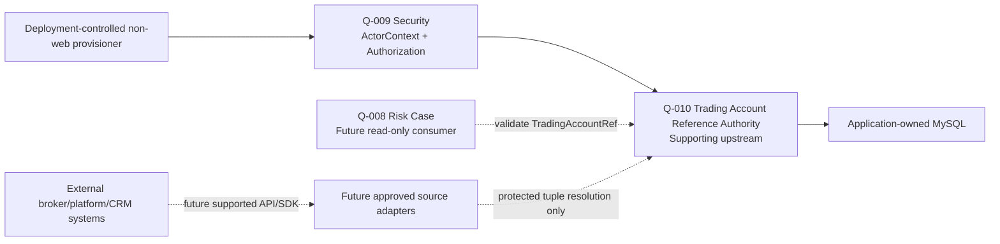

# Q-010 Trading Account Reference Authority Foundation Architecture

## Document Status

- Requirement: Q-010 — APPROVED V1
- Architecture submission: V1
- Review phase: Q-010 V4 — Architecture + ADR-012 Approval Recording
- Architecture status: **APPROVED — EXTERNAL ARCHITECT DECISION RECORDED**
- Architect approval date: 2026-08-27
- Approval origin: Explicit external Architect Review decision
- ADR: ADR-012 — **ACCEPTED**
- Implementation Design: **APPROVED V1 — EXTERNAL ARCHITECT — 2026-08-27**
- Implementation: APPROVED — V7 — EXTERNAL ARCHITECT — 2026-08-27
- Final Closure: PASS / CLOSED — V8 — 2026-08-28
- Ready for Git Commit: YES — closure assessment; final Architect review required
- Implementation Allowed: YES — explicit V7 authorization executed
- Date: 2026-08-27

This document turns the approved Q-010 Requirement boundary into the approved
Architecture V1 baseline. Approval and ADR-012 acceptance originate from the
explicit external Architect decision recorded by Q-010 V4, not Codex
self-approval. Q-010 V5 submitted the separate Implementation Design V1 at
`docs/architecture/q-010-trading-account-reference-authority-implementation-design.md`,
and the external Architect approved that exact Design on 2026-08-27. Q-010 V6
records the decision; Codex does not self-approve. Approval creates no
Java/SQL/API/configuration, does not authorize Q-010 implementation, and does
not unblock Q-008.

## 1. Authority and Fixed Boundary

The following are authoritative, in order:

1. repository `AGENTS.md` and development standards;
2. approved Q-010 Requirement V1, especially Section 2.1;
3. accepted ADR-009, ADR-010, and ADR-011;
4. approved Q-007/Q-008/Q-009 architecture and gate records; and
5. the Q-010 V1 candidate and V2 Requirement Review evidence.

This architecture does not reopen the approved identity tuple, one-to-one
cardinality, no reassignment/deletion/reuse rule, lifecycle/history boundary,
non-web registration authority, Q-008 disclosure boundary, exact Q-010
capabilities, durable mutation provenance, or fail-closed behavior.

## 2. Architecture Decision Summary

| Area | Approved architecture decision |
| --- | --- |
| Owning capability | Trading Account Reference Authority, a supporting upstream capability inside the Phase 1 modular monolith |
| Future package boundary | `com.brokeros.risk.tradingaccount`; no package or code is created in V3 or V4 |
| TradingAccountRef | server-generated `ta-<canonical-lowercase-UUIDv4>` |
| AccountAuthorityScopeRef | server-generated `aas-<canonical-lowercase-UUIDv4>` owned by a bounded local authority-scope registry |
| SourceNamespace | immutable structured value: source family, governed instance, server, environment |
| ExternalAccountKey | exact bounded UTF-8 value; no generic trim, numeric parsing, case folding, or Unicode normalization |
| Cardinality | one immutable tuple row owns one TradingAccountRef; both directions uniquely constrained |
| Lifecycle | `ACTIVE`, `INACTIVE`, `RETIRED`; controlled reactivation only from `INACTIVE` to the same mapping |
| Durable authority | application-owned MySQL/InnoDB through Spring JDBC and Flyway |
| Mutation consistency | current state, operation/idempotency outcome, and immutable history commit atomically |
| Registration | explicit non-web command using a fresh Q-009 SERVICE ActorContext and approved manifest attestation |
| Q-008 contract | protected read-only eligibility validation by TradingAccountRef only |
| External tuple resolution | separate protected internal contract; never Q-008/public and never auto-registration |
| Messaging/cache | no Kafka topic/event and no Redis cache/key |
| Dependencies | no new library, framework, deployable, or external runtime dependency |

## 3. Context and Ownership Map



### 3.1 Q-010 ownership

Q-010 owns:

- stable `TradingAccountRef` identity;
- bounded `AccountAuthorityScopeRef` registry and lifecycle;
- canonical scoped external identity values;
- immutable one-to-one association between that tuple and TradingAccountRef;
- Trading Account reference lifecycle and historical resolution;
- non-web registration/lifecycle use cases;
- protected read-only validation and internal tuple resolution;
- operation idempotency and immutable mutation history; and
- the Q-010 capability catalog.

This is a reference authority, not a Trading Account master. It owns no
customer, KYC, balance, equity, margin, leverage, currency, order, deal,
position, transaction, risk score, trading permission, broker profile, or
vendor payload.

### 3.2 Other ownership

- Q-007/ADR-009 keeps Decision as Core Domain and Trading Data as supporting
  upstream context. Q-010 owns no Evidence, Decision, Action, or execution.
- Q-009/ADR-011 owns authentication, ActorRef mapping, ActorContext,
  capability decisions, and purpose-specific service context creation.
- Q-008/ADR-010 owns Risk Case. It may consume only the Q-010 read contract and
  cannot create, mutate, or inspect external account identities.
- Future adapters translate an actually supported source contract into the
  canonical tuple. They cannot auto-register, become the durable authority, or
  leak vendor DTOs into Q-010.
- External systems remain independently owned and are never read or modified
  through direct database access.

## 4. Domain Concepts and Invariants

### 4.1 TradingAccountRef

`TradingAccountRef` is the immutable BrokerOS business identity for one
authoritatively registered Trading Account reference. It is separate from the
internal `BIGINT id` and every external identifier. It never changes, is never
reused, and remains resolvable in all lifecycle states.

### 4.2 AccountAuthorityScopeRef

`AccountAuthorityScopeRef` identifies the locally governed broker/deployment
authority context within which a source namespace and external account key are
meaningful. It is not a broker name or Broker/Tenant/Organization entity. Q-010
stores only the opaque scope identity, lifecycle/version, and bounded
provisioning provenance needed to enforce reference integrity.

Unknown scopes fail closed. Only an active scope can accept new Trading
Account registrations or make an active account eligible for new use. Inactive
or retired scopes remain historically resolvable and are never deleted.

### 4.3 SourceNamespace

`SourceNamespace` is one immutable structured value with four governed
components:

1. **source family** — stable source/protocol family code, not a fixed MT4/MT5
   enum;
2. **source instance** — deployment-governed identity for one concrete source
   installation/connection authority;
3. **server** — governed identity of the server/cluster partition in which the
   external account key is unique; and
4. **environment** — governed environment partition such as production/demo,
   without hard-coding a closed value list.

The components are identity codes, not mutable display names. An external
rename does not rename the namespace. If the authoritative technical identity
actually changes, it is a different namespace and the Foundation cannot merge
or migrate it without a future Requirement.

### 4.4 ExternalAccountKey

`ExternalAccountKey` is the exact canonical key asserted by the approved
source-owner record. It is a string, not a number: leading zeros, exact case,
and exact internal characters are meaningful. It is never exposed to Q-008,
used as TradingAccountRef, or logged in plaintext.

### 4.5 Authoritative external identity

The identity is exactly:

```text
AccountAuthorityScopeRef
  + SourceNamespace(sourceFamily, sourceInstance, server, environment)
  + ExternalAccountKey
```

Every component is required. The tuple is immutable after registration and
must uniquely identify exactly one TradingAccountRef. Each TradingAccountRef
must be associated with exactly one tuple.

### 4.6 Lifecycle, version, and provenance

- Lifecycle controls eligibility, never identity meaning.
- An optimistic nonnegative version changes exactly once for each successful
  lifecycle mutation and orders history for that authority record.
- Registration and every lifecycle mutation have one immutable operation/
  history record containing the trusted actor, UTC time, operation, target,
  source attestation, reason, before/after state, and resulting version.
- Authority provenance is a bounded reference to the broker/source-owner-
  approved record. It is not the source payload, a credential, or proof derived
  from the invoker's capability grant.

## 5. Opaque Reference Strategies

### 5.1 TradingAccountRef selection

Select server-generated:

```text
ta-<canonical-lowercase-UUIDv4>
```

Validation accepts only the exact lowercase canonical form and exact `ta-`
prefix. It does not trim or case-fold. Generation occurs inside Q-010 before
persistence; a database unique constraint is still authoritative for collision
detection. The prefix encodes only the stable reference type, never broker,
source, server, time, sequence, or customer information.

This choice is globally safe for independent broker deployments, does not leak
database IDs or volume, requires no allocator or new dependency, and supports
offline generation plus immutable history. A bounded UUID collision retry may
be defined in Implementation Design; a collision never overwrites an existing
record.

### 5.2 AccountAuthorityScopeRef selection

Select the same strategy with a distinct type prefix:

```text
aas-<canonical-lowercase-UUIDv4>
```

Q-010 generates it during controlled scope registration. A later account
manifest must reference an existing active scope. Raw broker/company names,
CRM IDs, deployment labels, and database IDs cannot substitute for it.

### 5.3 Alternatives

- Exposed auto-increment database IDs are rejected because they couple domain
  authority to persistence and leak ordering/volume.
- Raw UUID without a type namespace is viable but rejected because cross-type
  confusion is avoidable with a short non-semantic prefix.
- UUIDv7/time-based or sequential identifiers are rejected because ordering is
  not required and would reveal creation chronology.
- Source-derived or semantic identifiers are rejected because broker/source
  migrations or renames would make identity unstable.

## 6. Canonicalization and Comparison

### 6.1 SourceNamespace rules

All four SourceNamespace components are canonical lowercase ASCII and compared
with binary equality. Noncanonical input is rejected; Q-010 never silently
trims, lowercases, or rewrites it.

Architecture bounds are:

| Component | Canonical rule |
| --- | --- |
| source family | 1–63 chars; starts with a letter; lowercase letters, digits, hyphen |
| source instance | 1–63 chars; starts with a letter; lowercase letters, digits, hyphen |
| server | 1–128 chars; starts with letter/digit; lowercase letters, digits, `.`, `_`, `-` |
| environment | 1–32 chars; starts with a letter; lowercase letters, digits, hyphen |

These codes must distinguish source/platform family, concrete instance,
server/cluster, and environment whenever those dimensions can collide. They
are not a free-form string and Q-010 does not interpret them as vendor types.
`ascii_bin` or an equivalent exact binary representation is required later.

### 6.2 ExternalAccountKey rules

- Accept 1–128 Unicode scalar values and at most 512 UTF-8 bytes.
- Preserve leading zeros, exact case, internal spaces, punctuation, and exact
  Unicode sequence.
- Reject NUL/control characters and leading/trailing Unicode whitespace rather
  than trimming them.
- Perform no generic numeric conversion, case folding, Unicode normalization,
  locale transformation, or lossy transliteration.
- Compare canonical UTF-8 bytes exactly. Implementation Design must select a
  verified binary storage/comparison form; a case-insensitive collation is
  prohibited.
- If a real source defines additional canonicalization, its separately
  approved adapter must supply an already-canonical value and prove the source
  contract. Q-010 never guesses that rule.

The full external key and tuple are prohibited from normal logs, error
messages, metrics labels, Review evidence, and Audit-like history display.
Before a TradingAccountRef exists, safe operational logs contain no reversible
key fingerprint unless a future approved key-management design authorizes one.

## 7. Bounded Authority-Scope Registry

Q-010 owns a minimal local scope registry because no separate Broker/Tenant
authority exists and the approved identity tuple requires an authoritative
scope. Scope registration is a separate controlled non-web operation protected
by `trading-account-reference:register`.

A scope registry record contains only:

- server-generated AccountAuthorityScopeRef;
- current lifecycle state and optimistic version;
- immutable registration provenance and UTC time; and
- current lifecycle provenance/history.

It contains no legal entity, broker profile, customer, CRM schema, credentials,
source payload, or external database relationship. A future organization or
multi-tenant authority may reference the scope only through a separately
approved Requirement; Q-010 does not anticipate its model.

Scope lifecycle uses the same eligibility principles as account references.
An inactive/retired scope makes every contained account ineligible for new
associations without rewriting each account's lifecycle. Historical lookup by
TradingAccountRef remains available. Reactivating an inactive scope restores
eligibility only for contained accounts that are themselves active.

## 8. Durable Source of Truth and Relational Boundary

Application-owned MySQL/InnoDB is the authoritative store. The coherent
relational concepts are:

1. **authority scope current state** — opaque scope identity, lifecycle,
   version, bounded provenance;
2. **Trading Account reference current state** — one row containing the
   immutable TradingAccountRef, immutable full external identity, lifecycle,
   version, and registration provenance; and
3. **append-only authority operation/history** — idempotency identity,
   semantic fingerprint, operation outcome, target, actor/authorization
   provenance, reason/attestation, before/after state, UTC time, and resulting
   version.

Keeping the reference and tuple in one current-state record makes both
cardinality directions explicit and avoids a general alias/mapping table. The
later schema must enforce at least:

- unique TradingAccountRef;
- unique complete external identity tuple;
- foreign-key/restrict relationship from account reference to authority scope;
- immutable identity columns by application update contract;
- allowed stable lifecycle codes and nonnegative versions;
- unique operation/idempotency identity;
- append-only history with restrict-delete relationships; and
- exact binary comparison for every identity component.

No physical delete or cascade delete is permitted. Current lifecycle state is
mutable only through named operations; identity columns never participate in
an update. Exact table/column names and DDL remain Implementation Design work.

Redis is not authoritative and is not selected. Kafka cannot make state,
idempotency, uniqueness, and required history atomic, so no topic/event is
selected. Reads use the primary authoritative database; a stale cache or
replica cannot declare a reference eligible.

## 9. Controlled Non-Web Provisioning

### 9.1 Trusted invoker

The provisioner is a purpose-specific Q-010 SERVICE identity registered in
code and pre-provisioned through Q-009. A non-web command obtains a fresh
ActorContext through the existing Q-009 `ServiceActorContextFactory`, which
requires both the code-owned descriptor instance and an active authoritative
SERVICE mapping. It then invokes Q-009 authorization for the exact requested
Q-010 capability before Q-010 data access.

The service actor must receive only the required direct grants. There is no
generic `SYSTEM`, caller ActorRef, fabricated bearer token, inherited human
context, or profile-based bypass. Deployment permission to launch the command
is an additional operational control, not a substitute for Q-009 identity and
authorization.

### 9.2 Manifest categories

The external manifest supplies only bounded command facts:

- manifest/schema version;
- globally unique operation/idempotency ID in canonical UUIDv4 form;
- named operation;
- existing AccountAuthorityScopeRef for account operations;
- structured SourceNamespace and ExternalAccountKey for registration;
- broker/source-owner attestation source and bounded provenance record ref;
- bounded reason/change-ticket ref;
- expected current version for lifecycle changes; and
- no unknown fields, credentials, tokens, vendor payload, customer data, or
  proposed TradingAccountRef.

Server-side behavior derives:

- fresh ActorContext and ActorRef;
- authorization decision/provenance;
- TradingAccountRef or AccountAuthorityScopeRef generation;
- UTC time;
- current/before state and resulting version;
- canonical semantic fingerprint of the validated manifest; and
- success/unchanged outcome recorded for replay.

The manifest's attestation reference identifies the broker/source-owner-
approved record that vouches for the mapping. The `register` capability proves
only that the actor may invoke registration; it does not prove the tuple is
true. Deployment governance must approve both the actor/grant and the external
attestation record. If the record cannot be established, registration stops.

There is no HTTP registration or lifecycle controller in the Foundation.

## 10. Idempotency, Duplicate, Collision, and Retry

| Scenario | Required behavior |
| --- | --- |
| Same operation ID and same semantic fingerprint after success | Return the durable recorded result; no state/history/version change |
| Same operation ID with different semantic fingerprint | Integrity conflict; no mutation |
| New operation ID, same tuple, same immutable registration provenance | Return existing TradingAccountRef as `UNCHANGED`; never generate a second mapping |
| Same tuple with materially different provenance or proposed identity | Conflict; preserve original mapping |
| Caller supplies a proposed TradingAccountRef | Reject manifest; references are server-generated |
| Same TradingAccountRef with another tuple | Impossible through valid command; unique constraint/integrity guard rejects any corrupt attempt |
| Concurrent registration for the same tuple | Database tuple uniqueness elects one commit; loser re-reads and returns unchanged only for exact compatible registration, otherwise conflict |
| Concurrent generated-reference collision | Business-reference uniqueness rejects the loser; only a bounded fresh generation retry may occur |
| Concurrent lifecycle changes | Compare-and-set expected version allows one; stale request fails without history/state change |
| Lost response after commit | Retry the same operation ID/fingerprint and return the recorded outcome |
| Transient failure before commit | No state/history/idempotency outcome exists; exact retry may execute again safely |
| Durable cardinality corruption/manual damage | Return integrity-unavailable/conflict, emit bounded operational evidence, choose no winner, and block mutation pending separately controlled repair |

No logical conflict is automatically retried. No retry may change the
operation ID after an uncertain outcome. Q-010 never resolves ambiguity by
row order, latest timestamp, lowest ID, or first result.

## 11. Lifecycle Model

Both scopes and Trading Account references use stable readable concepts:

- `ACTIVE` — historically resolvable and eligible for new associations when
  both scope and account are active;
- `INACTIVE` — historically resolvable, temporarily ineligible; and
- `RETIRED` — historically resolvable, permanently ineligible and terminal.

Named transitions are:

| Operation | From | To | Capability | Rule |
| --- | --- | --- | --- | --- |
| register | absent | ACTIVE | `trading-account-reference:register` | complete attested manifest; server-generated ref |
| deactivate | ACTIVE | INACTIVE | `trading-account-reference:change-lifecycle` | expected version, reason, provenance |
| reactivate | INACTIVE | ACTIVE | `trading-account-reference:change-lifecycle` | same immutable identity only; expected version |
| retire | ACTIVE or INACTIVE | RETIRED | `trading-account-reference:change-lifecycle` | expected version; terminal result |

`ACTIVE→ACTIVE`, `INACTIVE→INACTIVE`, `RETIRED→*`, direct identity replacement,
and physical deletion are forbidden. Only an exact replay of the same
successful operation is idempotently unchanged; a new same-state lifecycle
request is an invalid transition. Each successful transition increments the
target version exactly once and writes one immutable history record atomically.

Reactivation is included in the approved Architecture because the approved
Requirement permits restoration of the same immutable mapping and no new
identity semantics are needed. Reactivation never revives a retired target.

## 12. Protected Read Contracts

### 12.1 Q-008 eligibility validation

The published application contract is conceptually:

```text
validateForNewRiskCaseAssociation(
    ActorContext,
    TradingAccountRef
) -> TradingAccountReferenceEligibility
```

The use case first requires
`trading-account-reference:read`, then queries authoritative MySQL. Its small
immutable result contains only:

- the supplied canonical TradingAccountRef when recognized;
- recognized/not-found outcome;
- eligible/not-eligible-for-new-association outcome;
- an opaque bounded authority snapshot version covering account and scope
  versions; and
- an opaque bounded registration/lifecycle provenance ref only when an
  approved consumer needs it.

Eligibility is true only when both the reference and its scope are active.
Unknown references are not found. Inactive/retired references or scopes remain
recognized but ineligible. Q-008 may retain only its approved subject ref and
any separately compatible bounded validation evidence; this architecture does
not modify Q-008 persistence.

The result exposes no ExternalAccountKey, SourceNamespace, scope metadata,
internal database ID, vendor DTO/payload, customer identity, balance, position,
or lifecycle administration detail.

### 12.2 Protected external-identity resolution

Q-010 also defines a separate internal application contract that resolves a
complete canonical tuple to TradingAccountRef. It uses
`trading-account-reference:read`, authorizes before lookup, and returns the same
bounded reference/eligibility view.

Its only intended consumers are Q-010 registration duplicate handling and a
future separately approved inbound source adapter. It is not available to
Q-008, public HTTP, search/reporting, unknown internal callers, or auto-
registration. No adapter is created by V3.

## 13. Q-009 Security Integration

| Q-010 use case | Required exact capability |
| --- | --- |
| validate by TradingAccountRef | `trading-account-reference:read` |
| resolve complete external identity | `trading-account-reference:read` |
| register authority scope/account reference | `trading-account-reference:register` |
| deactivate/reactivate/retire scope or account | `trading-account-reference:change-lifecycle` |

Every protected path receives a trusted Q-009 ActorContext and invokes the
existing authorization boundary before Q-010 repository access. Only explicit
ALLOW proceeds. Roles, scopes, claims, headers, account IDs, source fields,
ownership assertions, and manifest actor values cannot grant permission.

Authorization and actor/grant state are read from Q-009 authoritative MySQL on
each use-case invocation. ActorContext contains no capability cache. Q-010 adds
no Redis authorization cache or stale-allow fallback. A security dependency
failure stops the use case before target lookup, preventing existence
disclosure.

The Q-009 authorization decision snapshot may be retained in Q-010 history as
bounded actor, capability, decision version, and evaluation time. Raw external
principal keys, credentials, full claims, issuer/subject, or policy internals
are prohibited.

## 14. Mutation History and Atomicity

Q-010 owns a bounded append-only authority-operation history, not the general
Audit module. Each successful registration or lifecycle change records:

- unique operation/idempotency ID and semantic fingerprint;
- operation and outcome;
- immutable scope/account target ref;
- trusted ActorRef from ActorContext;
- exact capability and bounded authorization decision provenance;
- broker/source-owner attestation source/ref and bounded reason/change ref;
- UTC occurred-at time generated server-side;
- absent/current before state and after state;
- prior and resulting optimistic version; and
- safe correlation IDs separately from identity when present.

Current state, the durable operation outcome, and immutable history use the
same application-owned MySQL DataSource and local transaction. If validation,
state compare-and-set, operation record, or history write fails, the complete
mutation rolls back. There is no `REQUIRES_NEW`, Kafka publication, best-effort
audit, two-phase commit, Saga, or event sourcing.

History is append-only and queryable separately; it is not loaded as an
unbounded aggregate collection. No history retention deletion is approved.
Legal hold, redaction, general audit search, and regulatory retention require a
future Requirement.

## 15. Transaction and Concurrency Model

For registration/lifecycle mutation:

1. acquire fresh trusted ActorContext;
2. authorize the exact capability before Q-010 data access;
3. parse and validate the complete manifest without lossy normalization;
4. begin one local MySQL transaction;
5. resolve operation ID/fingerprint and replay if exactly completed;
6. load/validate scope and current reference state;
7. enforce unique identity or expected-version compare-and-set;
8. write current state plus operation/history atomically; and
9. commit before reporting success.

The database unique constraints are the final authority for registration
races. Application pre-checks improve diagnostics but never replace them.
Lifecycle changes use optimistic versioning; stale versions are rejected and
not automatically retried. Locking/isolation syntax and bounded collision
retry counts belong to Implementation Design, but any selected mechanism must
preserve these outcomes.

Q-009 authorization occurs immediately before the Q-010 transaction. The
short local operation proceeds on that explicit decision snapshot, consistent
with Q-009. Long-running/external work is absent.

## 16. Database and Collation Architecture

**Decision: application-owned MySQL/InnoDB is the Q-010 durable source of
truth.**

The repository already uses Spring JDBC, Flyway, MySQL Connector/J, and a
single application DataSource. Q-009 V10 verified the committed baseline on
disposable MySQL 8.4.11. Q-010 requires no new database, ORM, library, or
framework.

Later Implementation Design/Flyway must provide:

- additive forward-only migration after existing V1/V2;
- `BIGINT id` internal primary keys, never exposed as business identity;
- ASCII binary storage for controlled refs, lifecycle codes, namespace codes,
  operation IDs, and bounded provenance codes;
- exact binary UTF-8 representation for ExternalAccountKey;
- unique indexes for TradingAccountRef, full tuple, and operation ID;
- foreign keys with delete restricted;
- nonnegative optimistic versions and enforced lifecycle/reference checks;
- indexes supporting ref validation, tuple resolution, state/version updates,
  and ordered history without unbounded scans;
- UTC `DATETIME(6)` or repository-approved equivalent; and
- disposable MySQL 8.4 migration, collation, constraint, concurrency, restart,
  and query-plan verification with no mandatory skip.

The current Flyway advisory that 8.4 is newer than its tested 8.1 line is a
known non-blocking baseline item; Q-009 proved actual 8.4.11 behavior. Q-010
must repeat its own real-runtime proof later and must not infer correctness
from SQL inspection.

Direct reads/writes to MT4, MT5, CRM, broker, or vendor databases remain
prohibited. No Redis key/cache, Kafka topic/event, read replica, external
search index, or second data store is needed for the Foundation.

## 17. Failure Model

| Condition | Architecture outcome | Disclosure/mutation rule |
| --- | --- | --- |
| No trusted ActorContext | unauthenticated/actor access denied under Q-009 | no Q-010 lookup or existence disclosure |
| Missing/revoked capability | authorization denied | authorize before lookup; no existence disclosure |
| Security authority unavailable | security dependency unavailable | no Q-010 access/mutation |
| Malformed TradingAccountRef | safe invalid input | no lookup; never reinterpret/case-fold |
| Authorized unknown TradingAccountRef | not found | no tuple/source detail |
| Recognized inactive/retired account or scope | recognized, not eligible | historical resolution preserved |
| Unknown/inactive scope during registration | not found/not eligible | no account creation |
| Invalid SourceNamespace | validation failure | reject whole manifest; no normalization |
| Invalid ExternalAccountKey | validation failure | reject whole manifest; do not echo key |
| Exact completed replay | recorded success/unchanged result | no new version/history/state mutation |
| Compatible duplicate tuple | unchanged existing ref | never generate second mapping |
| Conflicting tuple/ref/provenance | integrity conflict | preserve original; select no winner |
| Stale expected version | concurrency conflict | no state/history change |
| Ambiguous/corrupted durable state | integrity unavailable/conflict | no winner; block read-as-success and mutation |
| MySQL unavailable | dependency unavailable | no cache/replica/stale-success fallback |
| Missing/invalid attestation or reason | validation/authority failure | no mutation |
| History/operation write fails | complete transaction rollback | authority state cannot commit alone |

Concrete exceptions, ResultCodes, CLI exit codes, and HTTP mapping are
Implementation Design decisions. V3 creates no public API contract.

## 18. Threat Analysis

| Threat | Architectural control |
| --- | --- |
| Raw login/account spoofing | only complete attested tuple can register; consumers use TradingAccountRef |
| Same account number on two servers | immutable SourceNamespace includes governed instance/server/environment |
| Production/demo collision | environment is a required exact namespace component |
| External account-number reassignment | tuple/ref never reassigned or deleted; new external reuse conflicts and requires future policy |
| Unauthorized registration | fresh Q-009 service ActorContext plus exact register capability before data access |
| Source-adapter confused deputy | adapters may resolve only after their own approved scope; cannot auto-register or supply actor identity |
| Forged provenance | manifest must reference deployment-approved broker/source-owner record; capability alone is insufficient |
| Replay/idempotency abuse | unique operation ID plus semantic fingerprint; changed replay conflicts |
| Concurrent duplicate mapping | two unique constraints plus one local transaction; loser never becomes a second authority |
| Existence probing | authorization before protected lookup and bounded denial semantics |
| External-key log leakage | no plaintext key/tuple in logs, errors, metrics labels, or review evidence |
| Manual database corruption | multi-row/constraint inconsistency fails closed; no arbitrary winner or automated repair |
| Stale cache/replica result | no cache/replica selected; authoritative primary MySQL only |
| Generic SYSTEM bypass | purpose-specific registered SERVICE descriptor and active Q-009 mapping/grant required |
| State without history | same local transaction; history failure rolls back state |

## 19. Q-008 Dependency Effect

After separate approval, Implementation Design, implementation, runtime
verification, and final Architect approval, Q-010 can satisfy exactly one
Q-008 prerequisite: the authoritative `TRADING_ACCOUNT` primary-subject
reference provider and its fail-closed eligibility contract.

Q-010 V3 does not satisfy that runtime prerequisite because it is architecture
only. Q-008 still lacks implemented authoritative Evidence, Decision, Action,
and ActionOutcome providers, their runtime wiring, and a later explicit Q-008
implementation authorization. Q-009 has satisfied the separate trusted actor/
authorization prerequisite. Q-008 remains unimplemented and Implementation
Allowed remains NO.

## 20. Dependencies and Operational Boundary

### Existing dependencies reused

- Java 21 and Spring Boot 3.x modular monolith;
- Spring JDBC/local transaction manager;
- application-owned MySQL and Flyway;
- Q-009 ActorContext, ServiceActorContextFactory, AuthorizationGuard/
  AuthorizationPort, ActorRef, and exact Capability syntax; and
- existing safe correlation/exception/configuration foundations.

No new Maven dependency, framework, microservice, database, cache, broker,
topic, deployment object, or external call is required.

### Operational sequence after later implementation approval

1. migrate/validate application schema through Flyway;
2. pre-provision the purpose-specific Q-010 SERVICE actor and direct grants
   through Q-009 deployment governance;
3. approve the non-secret scope/account attestation manifest outside Git;
4. invoke the non-web command explicitly;
5. verify safe outcome counts/refs without logging external keys; and
6. enable only separately approved consumers.

There is no runtime polling, discovery, synchronization, CDC, Kafka, Redis,
external database access, or vendor SDK in this architecture.

## 21. Requirement Traceability

| Requirement | Architecture coverage |
| --- | --- |
| Q010-FR-001 | Sections 4.1 and 5 select independent opaque TradingAccountRef |
| Q010-FR-002 | Sections 4.5, 6, and 7 define the complete scoped tuple |
| Q010-FR-003 | Sections 8 and 10 enforce immutable one-to-one cardinality |
| Q010-FR-004 | Sections 9 and 10 define controlled attested idempotent provisioning |
| Q010-FR-005 | Sections 12 and 17 define bounded recognized/eligible/failure outcomes |
| Q010-FR-006 | Sections 8 and 11 preserve history in every lifecycle state |
| Q010-FR-007 | Sections 11, 14, and 15 define named versioned attributable mutations |
| Q010-FR-008 | Section 13 maps every use case to Q-009 ActorContext/capability |
| Q010-FR-009 | Sections 13 and 17 fail closed on denial, conflict, and unavailability |
| Q010-FR-010 | Section 12 defines minimum safe consumer metadata |
| Q010-FR-011 | Sections 3 and 6 keep vendor/source forms behind future adapters |
| Q010-FR-012 | Sections 8, 16, and 20 select no Kafka, Redis, or permissive provider |

All twelve approved Acceptance Criteria remain satisfied at architecture scope:
the Requirement/ADR gates stay separate; Q-008 sees a narrow read contract;
Q-009 protects every use case; MySQL/Flyway is additive and application-owned;
the design contains no trading/customer/vendor behavior; and future runtime
verification remains mandatory rather than claimed by V3.

## 22. Decisions Deferred to Implementation Design

- exact Java types, package substructure, ports, service/repository names, and
  framework annotations;
- exact table/column/index/constraint names and migration version;
- exact manifest serialization, CLI entry point, exit codes, and file handling;
- exact canonical fingerprint serialization/hash representation;
- transaction annotation/isolation/locking SQL and bounded UUID collision
  retry count;
- exact history column normalization and safe operational event names;
- concrete exception and ResultCode mapping;
- precise query shapes/plans and test fixtures; and
- whether optional bounded authority snapshot/provenance is retained by a
  future compatible Q-008 integration.

Implementation Design may resolve these details only within this architecture
and the approved Requirement.

## 23. Decisions Requiring a Future Requirement

- aliasing, merge, split, cross-source migration, or reassignment;
- multiple external identities per TradingAccountRef;
- automatic discovery/synchronization, polling, CDC, or auto-registration;
- MT4/MT5/CRM/vendor adapter behavior or direct external service contracts;
- public/online administration, search, reporting, bulk operations, or UI;
- full Trading Account/customer/broker/tenant/organization master data;
- caching, read replicas as authority, Kafka events, or asynchronous commands;
- cryptographic source attestation, delegation, impersonation, or break-glass;
- external account-number reuse/merge policy beyond fail-closed conflict;
- legal hold, redaction, purge/retention execution, or general Audit APIs; and
- cross-deployment reference federation or global BrokerOS directory.

## 24. Required Architecture Review Answers

1. **Owner:** Q-010 Trading Account Reference Authority owns TradingAccountRef.
2. **Raw login:** it lacks BrokerOS identity, scope, source/server/environment,
   immutability, provenance, and lifecycle.
3. **Collision prevention:** the required exact scope + four-part namespace +
   external-key tuple distinguishes servers/environments.
4. **External reassignment:** the tuple and ref are immutable and never reused;
   a reuse attempt conflicts.
5. **One tuple/two refs:** complete-tuple uniqueness plus atomic registration.
6. **One ref/two tuples:** TradingAccountRef uniqueness plus server-only
   generation and immutable identity columns.
7. **Tuple mutability:** immutable after registration.
8. **Historical states:** ACTIVE, INACTIVE, and RETIRED remain resolvable.
9. **New Q-008 association:** only active account within active scope.
10. **Q-008 contract:** protected `validateForNewRiskCaseAssociation` returning
    only recognized/eligibility and bounded authority evidence.
11. **External key to Q-008:** No.
12. **Trusted provisioner context:** purpose-specific registered SERVICE
    descriptor through Q-009 ServiceActorContextFactory and active mapping.
13. **Register grant truth:** authorization permits invocation; it does not
    attest the external mapping.
14. **Registration proof:** deployment-approved broker/source-owner record
    identified by bounded attestation source/ref in the manifest.
15. **Exact replay:** same operation ID/fingerprint returns recorded result with
    no new mutation/version/history.
16. **Conflicting retry:** different fingerprint/provenance/ref conflicts; no
    winner is selected.
17. **Atomic state/history:** one local MySQL transaction.
18. **History failure:** entire mutation rolls back.
19. **MySQL unavailable:** dependency unavailable; no create/mutate/read-as-
    success fallback.
20. **Redis/Kafka:** not required; they cannot improve or atomically enforce the
    initial authoritative consistency boundary.
21. **New dependency/framework:** none.
22. **Implementation Design deferrals:** exact code/DDL/manifest/transaction/
    error/test mechanics listed in Section 22.
23. **Future Requirement items:** identity migration, adapters, automation,
    online admin/master data/cache/events/retention listed in Section 23.
24. **Q-008 effect:** eventually supplies only Trading Account subject
    authority; Evidence/Decision/Action/ActionOutcome and authorization gate
    remain.
25. **Implementation authorized:** No. Architecture approval does not replace
    later Implementation Design approval and explicit implementation
    authorization.

## 25. Architecture Gate

- Architecture submission complete: YES
- Architecture approved: YES — external Architect decision dated 2026-08-27
- ADR-012 accepted: YES — external Architect decision dated 2026-08-27
- Architecture approval recording complete: YES
- Implementation Design status: APPROVED V1 — EXTERNAL ARCHITECT — 2026-08-27
- Implementation Design submission complete: YES
- Implementation Design approved: YES
- Implementation Design V2 required: NO
- Design approval recording: V6 — reviewed / approved
- Implementation: **APPROVED — V7 — EXTERNAL ARCHITECT — 2026-08-27**
- Implementation Allowed: **YES — EXPLICIT V7 AUTHORIZATION EXECUTED**
- Verification: **PASS — V8 — 2026-08-28**
- Final Closure: **PASS / CLOSED — V8 — 2026-08-28**
- Ready for Git Commit: **YES — CLOSURE ASSESSMENT ONLY**
- Git Commit / Push: **NOT PERFORMED**

Next gate: **Independent Architect Final Review of the Q-010 V8 Final Closure
package. Only after that review may the Product Owner manually commit.**
