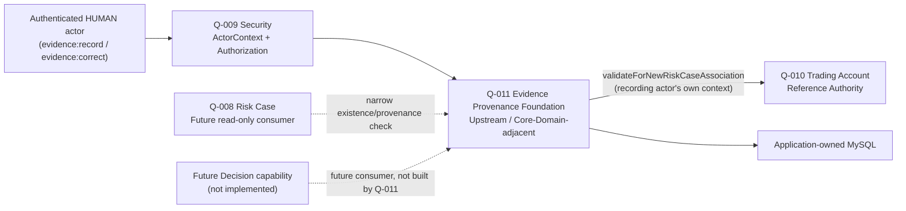

# Q-011 Evidence Provenance Foundation Architecture

## Document Status

- Requirement: Q-011 — V3, APPROVED — 2026-08-28 — Product Owner
- Architecture submission: **V4 — APPROVED — 2026-08-28 — Product Owner**
  (V1 → V2 round two → V3 approved 2026-08-28, subject-bar fix — see this
  document's own history above this line — → a fourth, independently
  authored governance-consistency task found two leftover
  inconsistencies in §23 items 15 and 17 that the V3 round did not reach;
  this V4 fixed them and is now approved; V3's substantive decisions are
  otherwise unchanged)
- Architecture status: **APPROVED**
- Prepared by: Claude Code, holding the external Architect review role by
  explicit Product Owner direction (2026-08-28); see
  `prompts/Claude-Code-BrokerOS-Risk-Project-Handover-Prompt.md` and
  `docs/requirements/Q-011-Evidence-Provenance-Foundation.md` §18.
- ADR: ADR-013 — accepted (original) 2026-08-28; **amendment RE-ACCEPTED —
  2026-08-28 — Product Owner** (see ADR-013's own Amendment section)
- Implementation Design: V5, APPROVED — 2026-08-28 — Product Owner (see
  that document's own Document Status)
- Implementation: **AUTHORIZED — 2026-08-28 — Product Owner, against
  Requirement V3/this Architecture V4/ADR-013-as-amended/Design V5**
- Implementation Allowed: **YES — see the Codex resume Prompt issued
  2026-08-28**

This document turns the approved Q-011 Requirement boundary into a proposed
Architecture V4 baseline. **V1 through V3 history is recorded above; V3 was
approved 2026-08-28 after correcting the subject bar to match Requirement
`Q011-FR-002`.** A fourth, independently authored governance-consistency
task (`prompts/Q-011-V11-Fourth-Governance-Consistency-Correction-Prompt.md`)
then found that V3's fix had not fully propagated within this same
document: §23 item 15 still listed inactive-subject Evidence as future
scope after §22 and §9 had already brought it in scope, and item 17 made a
point-in-time "Implementation authorized: No" claim that had already gone
stale twice in opposite directions across rounds three and four. Both are
fixed in this V4. No substantive decision changed — §9's subject-bar
correction from V3 stands unmodified. Because the same party drafted the
Requirement and this Architecture, this remains a self-review artifact,
not an independent one — the disclosed limitation recorded in
Q-011-Evidence-Provenance-Foundation.md §18 applies here too. Approval
creates no Java/SQL/API/configuration and does not itself authorize
implementation — Implementation Design and a separate explicit
implementation authorization remain required.

## 1. Authority and Fixed Boundary

The following are authoritative, in order:

1. repository `AGENTS.md` and development standards;
2. approved Q-011 Requirement V2, especially Sections 5, 7, 8, and 14;
3. accepted ADR-009, ADR-010, ADR-011, and ADR-012;
4. approved Q-007/Q-008/Q-009/Q-010 architecture and gate records; and
5. Q-011's V1 Candidate Analysis and V2 Requirement Architect Review
   evidence.

This architecture does not reopen: Evidence Source limited to `MANUAL`;
Evidence Subject limited to `TRADING_ACCOUNT`; `HUMAN`-only recording;
Evidence immutability and single-level supersession; the two-tier
read-contract design; mandatory correction reason and subject-reference
stability across a correction; or fail-closed behavior. Those are Requirement
Gate decisions, not Architecture's to change.

## 2. Architecture Decision Summary

| Area | Approved architecture decision |
| --- | --- |
| Owning capability | Evidence Provenance Foundation, an upstream/Core-Domain-adjacent capability inside the Phase 1 modular monolith |
| Future package boundary | `com.brokeros.risk.evidence`; no package or code is created by this document |
| EvidenceRef | server-generated `ev-<canonical-lowercase-UUIDv4>` |
| Subject validation | reuse Q-010's existing `validateForNewRiskCaseAssociation(ActorContext, TradingAccountRef)` unchanged, called with the recording actor's own `ActorContext`; no new Q-010 method or SERVICE-actor indirection |
| Subject recognition scope | Evidence may reference any subject Q-010 recognizes (`ELIGIBLE_FOR_NEW_ASSOCIATION` or `RECOGNIZED_NOT_ELIGIBLE`); only `NOT_RECOGNIZED` is rejected (V3 fix, matches Requirement `Q011-FR-002` — see §9) |
| Content | bounded structured record; observation text and correction reason are separate bounded fields; no blob/file storage |
| Status model | `ACTIVE`, `SUPERSEDED`; one-way, at most one correction per record |
| Durable authority | application-owned MySQL/InnoDB through Spring JDBC and Flyway |
| Mutation consistency | current record state, operation/idempotency outcome, and immutable history commit atomically |
| Recording/correction exposure | protected authenticated HTTP endpoints (unlike Q-010's non-web-only registration) |
| Q-008 contract | protected in-process read-only existence/provenance validation by `EvidenceRef` only, no observation text |
| Full-detail read | separately protected HTTP endpoint; itself an auditable access event |
| Messaging/cache | no Kafka topic/event and no Redis cache/key |
| Dependencies | no new library, framework, deployable, or external runtime dependency |

## 3. Context and Ownership Map



### 3.1 Q-011 ownership

Q-011 owns:

- stable `EvidenceRef` identity;
- bounded, immutable Evidence content (observation text, source, subject
  reference, recording actor, recorded-at time);
- the `ACTIVE`/`SUPERSEDED` status and single-level supersession chain;
- recording and correction use cases and their audit trail;
- the two-tier read-contract implementation; and
- the Q-011 capability catalog.

Q-011 owns no Decision, Rule Engine, Trading Data, customer data, or Trading
Account identity. It is a provenance record store, not an investigation
workflow or a master-data system.

### 3.2 Other ownership

- Q-007/ADR-009 keeps Decision as Core Domain; Evidence remains upstream of
  it and does not become the Core Domain by having a runtime provider.
- Q-009/ADR-011 owns authentication, ActorRef mapping, ActorContext, and
  capability decisions; Q-011 reuses them unchanged.
- Q-010/ADR-012 owns Trading Account identity and eligibility; Q-011 reuses
  its existing published contract unchanged (Section 9).
- Q-008/ADR-010 owns Risk Case. It may consume only Q-011's narrow
  existence/provenance contract (Section 12.1) and cannot create, mutate, or
  bulk-read Evidence content through that contract.
- A future Decision capability is Q-011's other anticipated consumer; this
  architecture defines Q-011's contracts to be reusable by it without
  redesign, but builds no Decision code.

## 4. Domain Concepts and Invariants

### 4.1 EvidenceRef

`EvidenceRef` is the immutable BrokerOS business identity for one recorded
Evidence item. It is separate from the internal `BIGINT id`, never changes,
and remains resolvable regardless of status.

### 4.2 Subject reference

Every Evidence record carries exactly one `TradingAccountRef` (Q-010) as its
subject. Q-011 stores no independent subject registry; Q-010 remains the
sole authority for what a `TradingAccountRef` is and whether it is
currently recognized (V3 fix: "eligible" here previously implied the
stricter bar this document no longer requires — see §9).

### 4.3 Observation content

An Evidence record is a bounded structured tuple: observation/summary text,
source (fixed `MANUAL` for this Foundation), subject reference, recording
`ActorRef`, and UTC recorded-at time. It is not a document, file, or
free-form key-value bag. Content is immutable once the record is created.

### 4.4 Status and supersession

- `ACTIVE` — the default status; the record has not been corrected.
- `SUPERSEDED` — a specific replacement record exists; set exactly once,
  atomically with the replacement's creation.
- A record's `supersedes_ref` (if it is a correction) and
  `superseded_by_ref` (if it has been superseded) are the only status-related
  mutable-at-creation-time-only pointers; neither is ever reassigned after
  being set.
- Status describes the Evidence record's own validity as a source-of-truth
  observation. It is distinct from, and Q-011 has no visibility into, any
  Risk Case association-level disposition Q-008 will separately maintain
  (Q-008-Requirement.md §11).

### 4.5 Provenance

The bounded provenance view (Requirement §6.4) is: subject reference,
source, recording actor reference, recorded-at UTC time, status, and — if
superseded — the `superseded_by_ref` pointer. It never includes observation
text.

## 5. Opaque Reference Strategy

Select server-generated, consistent with Q-010's established convention:

```text
ev-<canonical-lowercase-UUIDv4>
```

Validation accepts only the exact lowercase canonical form and exact `ev-`
prefix; no trimming or case-folding. Generation occurs inside Q-011 before
persistence; a database unique constraint remains authoritative for
collision detection. The prefix encodes only the stable reference type,
never subject, actor, or time information. A distinct type prefix from
`ta-`/`aas-` prevents cross-type confusion. Alternatives (exposed database
ID, unprefixed UUID, time-ordered identifier, content-derived identifier)
are rejected for the same reasons Q-010's Architecture §5.3 already
recorded and are not re-argued here.

## 6. Content Bounds

- Observation/summary text: bounded UTF-8, Architecture recommends up to
  4,000 bytes — large enough for a substantive human-written observation,
  small enough to keep the record a structured field rather than a document.
  Exact limit is confirmed by Implementation Design.
- Correction reason: bounded UTF-8, up to 1,000 bytes, matching the
  `reason` field convention already used by Q-008 and Q-010 designs.
- Both fields reject NUL/control characters. Neither is trimmed or
  normalized beyond standard UTF-8 validation — Evidence preserves exactly
  what was written, consistent with immutability.
- Content is never logged in full (Q011-SR-004); safe logs reference
  `EvidenceRef` and bounded event/outcome codes only.

## 7. Durable Source of Truth and Relational Boundary

Application-owned MySQL/InnoDB is the authoritative store. The coherent
relational concepts are:

1. **Evidence record current state** — one row containing the immutable
   `EvidenceRef`, immutable subject reference, immutable content
   (observation text, source), recording actor/time, current status, and
   the two nullable correction pointers;
2. **append-only Evidence operation history** — idempotency identity,
   operation (`RECORD` / `CORRECT`), target `EvidenceRef`, actor/
   authorization provenance, reason (mandatory for `CORRECT`), before/after
   state, UTC time, and resulting version; and
3. **append-only access log for full-detail reads** — accessing
   `ActorRef`, target `EvidenceRef`, and UTC time, satisfying Q011-FR-014
   without joining or duplicating Evidence content.

Because an Evidence record has at most one lifecycle transition ever
(`ACTIVE` → `SUPERSEDED`), the operation-history volume per record is far
smaller than Q-010's account-lifecycle history; the access-log table is the
one genuinely open-ended growth concern and is called out in Section 17 as
an operational item, not a blocker.

The later schema must enforce at least:

- unique `EvidenceRef`;
- immutable content/subject columns by application update contract (only
  `status` and `superseded_by_ref` are ever updated, and only once, only by
  the correction operation that targets that exact record);
- foreign-key/restrict relationship is **not** created to Q-010's schema —
  Q-011 does not join across module-owned tables; it validates the subject
  through Q-010's application contract (Section 9), consistent with ADR-002
  system isolation applied at the module boundary, not just the external-
  system boundary;
- unique operation/idempotency identity; and
- append-only history and access-log tables with restrict-delete
  relationships.

No physical delete or cascade delete is permitted. Exact table/column names
and DDL remain Implementation Design work.

Redis and Kafka are not selected, for the same reasons ADR-012 already gave
for Q-010: neither can atomically enforce uniqueness, idempotency, and
required history together with the primary record.

## 8. Recording and Correction: HTTP Exposure

Unlike Q-010's non-web-only registration, Evidence recording is a routine
operational action expected to be performed frequently by authorized staff
through the application, not a low-frequency externally attested mapping
event. Architecture therefore selects protected authenticated HTTP
endpoints (exact paths, DTOs, and controller shape are Implementation
Design work) rather than a non-web command, subject to:

- every request obtains ActorContext from the existing Q-009
  authentication boundary — no new authentication mechanism;
- `evidence:record` is required before a recording use case executes;
- `evidence:correct` is required before a correction use case executes;
  and
- request bodies never carry an actor field, EvidenceRef (for recording),
  or status — those are always server-derived or server-generated.

## 9. Subject Validation: Resolving Requirement §14.1

(V3 correction: this section previously decided that Evidence's subject
must be `ELIGIBLE_FOR_NEW_ASSOCIATION`, narrowing Requirement §14.1's open
question in the opposite direction from what the Requirement itself
already resolved. Requirement `Q011-FR-002` (V2) explicitly states
"recognition... is a lower bar than, and must not be conflated with,
Q-010's stricter 'eligible for a new Risk Case association' check" — i.e.
the Requirement had already decided `RECOGNIZED_NOT_ELIGIBLE` subjects are
acceptable, and this Architecture silently narrowed that, which AGENTS.md's
Requirements Discipline prohibits and which Section 1.1's own priority
order (Requirement above Architecture) forbids. Codex correctly caught this
contradiction and halted. The Product Owner confirmed on 2026-08-28: the
Requirement's "recognized" bar stands; Architecture is corrected below, not
the Requirement. See Implementation Design §20.1, third correction round.)

Requirement §14.1 flagged two concerns about reusing Q-010's existing
`validateForNewRiskCaseAssociation(ActorContext, TradingAccountRef)`
contract unchanged: (a) its eligibility semantics are scoped to "new Risk
Case association," which is a poor fit for recording evidence about an
inactive/historical account, and (b) forwarding the recording actor's own
`ActorContext` would require every Evidence-recording `HUMAN` actor to also
hold Q-010's `trading-account-reference:read` capability. The approved
Requirement V2 already resolved (a): Evidence's subject bar is "recognized
by Q-010," strictly lower than "eligible for a new Risk Case association."
Architecture's job is to implement that decision, not revisit it.

**Architecture resolves both by reuse, not extension:**

- **On (b):** further analysis shows this is not a coupling defect but the
  same pattern ADR-012 already established for Q-008 — Q-008's own analysts
  will need `trading-account-reference:read` to validate a case subject
  through the identical contract. Requiring an Evidence-recording actor to
  hold both `evidence:record` and `trading-account-reference:read` is a
  normal, explicit, least-privilege capability grant under Q-009's model,
  not an architectural flaw. Introducing a dedicated Q-011 SERVICE actor and
  a second Q-010 read contract solely to avoid this grant would add
  provisioning complexity, a new cross-module contract, and a new attack
  surface to solve a problem that capability-grant scoping already solves.
  Architecture rejects that alternative.
- **On (a):** Architecture reuses Q-010's existing contract and accepts
  both `ELIGIBLE_FOR_NEW_ASSOCIATION` and `RECOGNIZED_NOT_ELIGIBLE` as
  valid Evidence subjects — only `NOT_RECOGNIZED` rejects the request. This
  matches Requirement `Q011-FR-002` exactly and requires no new Q-010
  contract: the existing `validateForNewRiskCaseAssociation` already
  distinguishes all three outcomes; Q-011 simply treats two of the three as
  acceptable instead of one. This keeps Q-011 from touching Q-010's
  already-shipped, already-approved code at all, exactly as the original
  (correct) part of this reasoning already established.

**Correction never calls Q-010 at all — this is a hard rule, not an
optimization.** Because a correction must carry the identical subject
reference as the record it corrects (Requirement §7 FR-007), and that
subject was already validated as recognized at initial recording, correction
instead performs a purely local invariant check — the new record's subject
equals the target record's stored subject — using data already in the
`evidence_record` table. It never constructs a fresh Q-010 call with the
correcting actor's context or anyone else's. (V3 correction: this section
previously read "correction reuses the same validation using the
correcting actor's own context," which read as if correction also calls
Q-010; it does not, and other sections already said so — Implementation
Design §2 restated the ambiguous version verbatim, which is how this
surfaced. See Implementation Design §20.1, second correction round.)

## 10. Idempotency, Duplicate, and Retry

| Scenario | Required behavior |
| --- | --- |
| Same operation ID and same semantic fingerprint after a successful recording | Return the durable recorded result; no new EvidenceRef |
| Same operation ID with different semantic fingerprint | Integrity conflict; no mutation |
| Caller supplies a proposed `EvidenceRef` | Reject request; references are server-generated |
| Concurrent recording requests, different operation IDs | Both may succeed; recording does not require target uniqueness beyond `EvidenceRef` generation |
| Same correction operation ID and fingerprint replayed | Return the durable recorded result; no second correction |
| Concurrent correction of the same not-yet-superseded record | Compare-and-set on the target's status; loser fails with conflict, does not create an orphaned "extra" correction |
| Correction targeting an already-`SUPERSEDED` record | Rejected; one record may be superseded by at most one replacement (Q011-FR-008) |
| Correction whose subject reference differs from the target's | Rejected as invalid (Q011-FR-007) |
| Transient failure before commit | No state/history/idempotency outcome exists; exact retry may execute again safely |

No logical conflict is automatically retried. Q-011 never resolves ambiguity
by row order, latest timestamp, or first result — the same rule ADR-012
already established for Q-010.

## 11. Protected Read Contracts

### 11.1 Q-008 (and future Decision) existence/provenance contract

In-process application contract, conceptually:

```text
confirmProvenance(
    ActorContext,
    EvidenceRef
) -> EvidenceProvenanceView
```

Requires `evidence:read` before lookup. Returns a small immutable result:
recognized/not-found outcome, and — when recognized — subject reference,
source, status, recorded-at time, and (if superseded) `superseded_by_ref`.
Never returns observation text. This is an in-process Java call within the
Phase 1 monolith, not a public HTTP endpoint, mirroring exactly how Q-010
exposes `validateForNewRiskCaseAssociation` to Q-008 today.

### 11.2 Full-detail read

A separately protected HTTP endpoint returns the complete Evidence record,
including observation text, for direct review. It requires `evidence:read`
independently — holding it does not imply access granted for any other
Q-011 use case, and vice versa. Per Q011-FR-014, the use case authorizes
access, then appends an access-log record (Section 7, item 3) before
returning content; if that write fails, no content is returned — the same
"authorize, then audit-before-disclose" sequence Q-008's Implementation
Design §9.5 already established for `RISK_CASE_VIEWED`.

## 12. Q-009 Security Integration

| Q-011 use case | Required exact capability |
| --- | --- |
| record Evidence | `evidence:record` |
| correct Evidence | `evidence:correct` |
| existence/provenance check (Q-008/future consumers) | `evidence:read` |
| full-detail read | `evidence:read` |

Every protected path receives a trusted Q-009 `ActorContext` and invokes the
existing `AuthorizationGuard`/`AuthorizationPort` boundary before Q-011 data
access. Only explicit ALLOW proceeds. Recording and correction additionally
require the actor's `ActorType` to be `HUMAN` (Q011-FR-005) — this is a
domain invariant enforced by Q-011's own application layer using the
`ActorType` already present on `ActorContext`, not a new Q-009 concept.

No new Q-009 capability model, dependency, or authentication mechanism is
introduced. A Q-009 dependency failure stops the use case before target
lookup, preventing existence disclosure, exactly as Q-010 already requires.

## 13. Mutation History, Audit-on-Read, and Atomicity

Recording and correction commit current record state, the durable operation
outcome, and one immutable history row in the same local MySQL transaction.
If any step fails, the complete mutation rolls back — no `REQUIRES_NEW`,
Kafka publication, or best-effort audit.

A full-detail read commits its access-log row before returning content, in
its own short, dedicated transaction. That transaction is **not** a
database-level read-only transaction — it performs one write (the
access-log insert) alongside the read of the Evidence record — and must not
be marked `readOnly = true` at the Spring/JDBC level (V2 correction, no
decision change: this was mislabeled "read-only" in the first draft). If
the access-log write fails, the read fails closed (Section 11.2).
Read-audit failure never blocks or corrupts a concurrent recording/
correction transaction — they touch different tables and share no lock
ordering requirement beyond normal row-level MySQL isolation.

History and the access log are append-only, queryable separately, and never
loaded as unbounded collections attached to an Evidence record. No
retention/deletion policy is approved; legal hold, redaction, and general
audit search remain future Requirements, exactly as Q-010's Architecture
already deferred them.

## 14. Transaction and Concurrency Model

(V3 correction: this section previously listed content validation and the
Q-010 call *before* the replay check, which — as Section 13's exact-replay
guarantee requires — would have re-run both on every replay and could fail
a request that had already succeeded once. The corrected order below
matches Implementation Design §11.1/§12.1/§12.2. See Implementation Design
§20.1, second correction round.)

For recording:

1. acquire trusted `ActorContext`; authorize `evidence:record`; require
   `ActorType = HUMAN` — **never skipped, including on an exact replay**;
2. check for an exact operation-ID/fingerprint replay; if found, return the
   stored result immediately (skip to step 7) without touching content
   validation, Q-010, or the transaction below; a different fingerprint
   under the same operation ID conflicts immediately;
3. validate content bounds (Section 6);
4. validate the subject via Q-010 (Section 9), using the recording actor's
   own `ActorContext` — only reached for a genuinely new operation ID;
5. begin one local MySQL transaction; recheck the operation ID inside it to
   close the race window;
6. generate `EvidenceRef`; insert record (`ACTIVE`) and history row; and
7. commit before reporting success (the stored result on replay, or the
   newly committed result otherwise).

For correction, the same ordering applies to `evidence:correct` and
`ActorType = HUMAN` (steps 1–2 identical, including that authorization/actor-
type is never skipped even on replay), substituting from step 3: validate
content bounds; begin the transaction; load the target record and verify it
is `ACTIVE` — **this check applies only to a genuinely new correction, never
to a replay**, since the target is expected to already be `SUPERSEDED`
immediately after its first successful correction; compare-and-set the
target's status to `SUPERSEDED` and set its `superseded_by_ref`; insert the
new `ACTIVE` record with `supersedes_ref` pointing at the target (subject
copied from the target, never re-validated against Q-010, Section 9);
insert the history row; commit.

Database unique constraints are the final authority for `EvidenceRef`
collisions and for the "at most one correction" invariant (enforced by a
unique constraint on `supersedes_ref` where not null, or an equivalent
compare-and-set on the target's status — exact mechanism is Implementation
Design work, but the invariant itself is fixed here).

## 15. Database and Collation Architecture

**Decision: application-owned MySQL/InnoDB, reusing the existing Spring
JDBC/Flyway/MySQL Connector stack. No new database, ORM, library, or
framework.**

Later Implementation Design/Flyway must provide, continuing after the
existing V1–V3 migrations:

- an additive forward-only migration (`V4__...`);
- `BIGINT id` internal primary keys, never exposed as business identity;
- ASCII/UTF-8 binary storage appropriate to `EvidenceRef` (ASCII, like
  `ta-`/`aas-`) versus observation/reason text (UTF-8);
- unique indexes for `EvidenceRef`, operation ID, and the "at most one
  correction per target" invariant;
- `BOOLEAN`/enum-like stable status codes, never ordinals;
- UTC `DATETIME(6)` or the repository-approved equivalent; and
- disposable MySQL 8.4 migration, constraint, concurrency, and query-plan
  verification with no mandatory skip, matching the standard already
  applied to Q-009/Q-010.

Direct reads/writes to any external system remain prohibited; not
applicable here since Q-011 has no external-system dependency at all.

## 16. Failure Model

| Condition | Architecture outcome | Disclosure/mutation rule |
| --- | --- | --- |
| No trusted ActorContext | unauthenticated/actor access denied under Q-009 | no Q-011 lookup or existence disclosure |
| Missing/revoked capability | authorization denied | authorize before lookup; no existence disclosure |
| Actor type is `SERVICE` recording/correcting | domain-invariant rejection | no record created/mutated |
| Security authority unavailable | security dependency unavailable | no Q-011 access/mutation |
| Subject `NOT_RECOGNIZED` by Q-010 (V3 fix: `RECOGNIZED_NOT_ELIGIBLE` is accepted, not rejected — see §9) | reference rejected | no Evidence created |
| Q-010 dependency unavailable during recording | dependency unavailable | no Evidence created; never assume recognized |
| Correction target not found | not found | no mutation |
| Correction target already `SUPERSEDED` | conflict | no branching supersession |
| Correction subject mismatch | validation failure | no mutation; reject whole request |
| Missing correction reason | validation failure | no mutation |
| Exact completed replay | recorded success result | no new record/version/history |
| Full-detail read, access-log write fails | dependency unavailable | no content returned |
| MySQL unavailable | dependency unavailable | no cache/stale-success fallback |
| History write fails during recording/correction | complete transaction rollback | record state cannot commit alone |

Concrete exceptions, ResultCodes, and HTTP mapping are Implementation Design
decisions.

## 17. Threat Analysis

| Threat | Architectural control |
| --- | --- |
| Unauthorized Evidence recording | Q-009 authorization before any Q-011 data access; `HUMAN`-only domain check |
| `SERVICE` actor posing as automated Evidence source | `ActorType = HUMAN` required; no automated source exists to authorize in this Foundation |
| Evidence "correction" used to change the subject | subject-reference equality enforced as a hard invariant (Section 9, 14) |
| Evidence content edited after the fact | immutability by application update contract; only status/pointer fields ever change, exactly once |
| Branching/ambiguous correction chains | unique "at most one correction per target" constraint |
| Existence probing via the narrow contract | authorization before lookup; bounded not-found/recognized outcomes only |
| Sensitive observation text leaking through logs/audit | SR-004/SR-006 bound logs and audit JSON to safe metadata only |
| Undetected bulk reading of sensitive content | every full-detail read is itself an audited access event (Section 11.2) |
| Capability-grant sprawl from cross-module validation | accepted as an explicit, narrow, least-privilege grant (Section 9), not solved by adding a new trust boundary |
| Access-log/history growth | append-only by design; retention is an explicit future Requirement, not silently unbounded scope creep now |

## 18. Q-008 Dependency Effect

After separate ADR acceptance, Implementation Design, implementation,
runtime verification, and final approval, Q-011 can satisfy exactly one
Q-008 prerequisite: the authoritative Evidence existence/provenance
provider (`EvidenceReferenceQuery`). This document does not implement it.

Q-008 will still lack authoritative Decision, Action, and ActionOutcome
providers after Q-011 is eventually implemented. Q-009 and Q-010 have
already satisfied their respective prerequisites. Q-008 remains
unimplemented and Implementation Allowed remains NO until all remaining
providers exist and a separate explicit Q-008 implementation authorization
is granted.

## 19. Dependencies and Operational Boundary

### Existing dependencies reused

- Java 21 and Spring Boot 3.x modular monolith;
- Spring JDBC/local transaction manager;
- application-owned MySQL and Flyway;
- Q-009 `ActorContext`, `AuthorizationGuard`/`AuthorizationPort`, `ActorRef`,
  `ActorType`, and exact `Capability` syntax; and
- Q-010's existing `validateForNewRiskCaseAssociation` contract, called
  unchanged.

No new Maven dependency, framework, microservice, database, cache, broker,
topic, deployment object, or external call is required.

### Operational sequence after later implementation approval

1. migrate/validate application schema through Flyway;
2. grant `evidence:record`/`evidence:correct`/`evidence:read` and
   `trading-account-reference:read` to the intended human operator role(s)
   through existing Q-009 provisioning;
3. enable the protected HTTP endpoints; and
4. enable only separately approved consumers of the narrow existence/
   provenance contract (initially none, until Q-008 is separately
   authorized).

There is no runtime polling, discovery, synchronization, CDC, Kafka, Redis,
or external system access anywhere in this architecture.

## 20. Requirement Traceability

| Requirement | Architecture coverage |
| --- | --- |
| Q011-FR-001 | Sections 4.1 and 5 select independent opaque EvidenceRef |
| Q011-FR-002 | Sections 4.2 and 9 define subject validation at the "recognized" bar (V3 fix) |
| Q011-FR-003 | Sections 4.3 and 6 define bounded content |
| Q011-FR-004 | Section 4.3 fixes source to `MANUAL` |
| Q011-FR-005 | Sections 12 and 16 enforce `HUMAN`-only recording/correction |
| Q011-FR-006 | Section 7 makes content immutable by update contract |
| Q011-FR-007 | Sections 4.4, 9, and 14 enforce subject-preserving, reasoned correction |
| Q011-FR-008 | Sections 10 and 14 enforce at-most-one correction per record |
| Q011-FR-009 | Section 10 defines idempotent recording/correction |
| Q011-FR-010 | Section 11 defines the two-tier read contracts |
| Q011-FR-011 | Sections 12 and 16 fail closed on denial, conflict, and unavailability |
| Q011-FR-012 | Sections 7 and 13 retain actor/time/reason/before-after atomically |
| Q011-FR-013 | Sections 7 and 15 select no Kafka, Redis, or permissive provider |
| Q011-FR-014 | Section 11.2 and 13 make full-detail reads self-auditing |

All fifteen approved Acceptance Criteria remain satisfied at architecture
scope: the Requirement/ADR gates stay separate; Q-008 sees a narrow
existence/provenance contract only; Q-009 protects every use case; MySQL/
Flyway is additive; no trading/customer/vendor behavior is introduced; and
future runtime verification remains mandatory rather than claimed here.

## 21. Decisions Deferred to Implementation Design

- exact Java types, package substructure, ports, service/repository names;
- exact table/column/index/constraint names and migration version (`V4`);
- exact HTTP endpoint paths, DTOs, and OpenAPI documentation;
- exact operation-ID/fingerprint serialization for idempotency;
- transaction annotation/isolation/locking SQL;
- concrete exception and ResultCode mapping (`EVIDENCE_NOT_FOUND`,
  `EVIDENCE_SUBJECT_NOT_RECOGNIZED`, `EVIDENCE_CORRECTION_CONFLICT`, etc. —
  names are illustrative, not approved here); and
- precise query shapes/plans and test fixtures.

## 22. Decisions Requiring a Future Requirement

- an Evidence source other than `MANUAL` (Rule Engine, trading-data
  anomaly detection, external alerts), including any `SERVICE`-actor
  authoring path;
- an Evidence subject type other than `TRADING_ACCOUNT`;
- evidence polarity/confidence/severity classification;
- file/document/blob attachment to an Evidence record;
- multi-subject or cross-account Evidence;
- legal hold, redaction, or retention-duration policy beyond
  "no physical deletion"; and
- a general Audit query API spanning Q-009/Q-010/Q-011 history uniformly.

## 23. Required Architecture Review Answers

1. **Owner:** Q-011 Evidence Provenance Foundation owns EvidenceRef and
   observation content.
2. **Why not reuse Q-010's or Q-009's schema:** neither models an
   immutable, source-attributed, correctable observation record; Evidence
   is a distinct business identity.
3. **Subject validation mechanism:** Q-010's existing
   `validateForNewRiskCaseAssociation`, called with the recording actor's
   own context — no new Q-010 contract (Section 9).
4. **Why not build a new Q-010 contract:** avoids touching already-shipped,
   already-approved Q-010 code; the capability-grant "coupling" is accepted
   as normal least-privilege scoping (Section 9).
5. **Recognition, not eligibility, is the bar (V3 fix):** Requirement
   `Q011-FR-002` already decided Evidence requires only a Q-010-recognized
   subject, not one currently eligible for a new Risk Case. Architecture
   V1/V2 incorrectly narrowed this to "eligible" — Codex caught the
   contradiction against the Requirement and halted; V3 corrects Architecture
   to match the Requirement instead of the reverse. `RECOGNIZED_NOT_ELIGIBLE`
   subjects (e.g., inactive/retired accounts) are therefore in scope now,
   not a future Requirement.
6. **Correction integrity:** subject reference must match exactly; reason
   is mandatory; at most one correction per record (Sections 4.4, 9, 10,
   14).
7. **Read-contract separation:** narrow in-process existence/provenance
   contract for consumers versus a separately capability-gated, self-
   auditing full-detail HTTP read (Section 11).
8. **HTTP exposure:** recording/correction/full-detail-read are protected
   HTTP endpoints, unlike Q-010's non-web-only registration, because
   Evidence recording is routine operational activity (Section 8).
9. **Audit-on-read:** every full-detail read commits an access-log row
   before content is returned; failure blocks disclosure (Section 11.2,
   13).
10. **Atomic state/history:** one local MySQL transaction per mutation
    (Section 13, 14).
11. **MySQL unavailable:** dependency unavailable; no create/mutate/
    read-as-success fallback (Section 16).
12. **Redis/Kafka:** not required; cannot atomically enforce the
    consistency boundary (Section 7, 15).
13. **New dependency/framework:** none.
14. **Implementation Design deferrals:** exact code/DDL/endpoint/error/test
    mechanics listed in Section 21.
15. **Future Requirement items:** automated sources, additional subject
    types, and the rest listed in Section 22 (V4 fix, fourth correction
    round: this item previously still listed "inactive-subject Evidence"
    after Section 22 itself, and Section 9's decision, had already brought
    it in scope — a leftover from the round-three fix not reaching every
    restatement).
16. **Q-008 effect:** eventually supplies only the Evidence existence/
    provenance prerequisite; Decision, Action, and ActionOutcome and final
    Q-008 authorization remain separately required.
17. **Implementation authorization is never implied by Architecture
    approval alone** (V4 fix, fourth correction round: this item previously
    made a point-in-time "No" claim that went stale the moment
    implementation was later authorized, then stale again in the opposite
    direction when this document's own Gate section changed without this
    item being checked — the general principle below is written to survive
    every future round without going stale again). Architecture approval
    never by itself replaces ADR acceptance, Implementation Design
    approval, or a separate explicit implementation authorization decision.
    For the actual current authorization state, see Section 24 (Architecture
    Gate), which is the single place this document records it.

## 24. Architecture Gate

- Architecture submission complete: YES (V4)
- Architecture V1 approved: YES — 2026-08-28 — Product Owner
- Architecture V2 approved: YES — 2026-08-28 — Product Owner (§9/§14
  fixes, round two)
- Architecture V3 approved: YES — 2026-08-28 — Product Owner (subject-bar
  correction, round three)
- Architecture V4 approved: **YES — 2026-08-28 — Product Owner** (§23
  items 15/17 fixes, round four)
- ADR-013: accepted (original) 2026-08-28; **amendment RE-ACCEPTED —
  2026-08-28 — Product Owner** — see ADR-013's own Amendment section
- Implementation Design status: V1 → V2 → V3 → V4 (approved,
  round three) → **V5 — APPROVED — 2026-08-28 — Product Owner** (round
  four; see Implementation Design's own Document Status)
- Implementation: **AUTHORIZED — 2026-08-28 — Product Owner**
- Implementation Allowed: **YES**

Next gate: Codex executes the resume Prompt issued 2026-08-28, built
strictly from Implementation Design §11.1/§11.4, then Claude Code performs
an independent implementation review before any commit.
