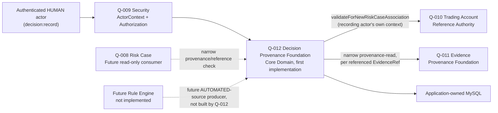

# Q-012 Decision Provenance Foundation Architecture

## Document Status

- Requirement: Q-012 — V1, APPROVED — 2026-08-31 — Product Owner
- Architecture submission: **V1 — DRAFT, not yet approved**
- Prepared by: Claude Code, holding the external Architect review role by
  explicit Product Owner direction; see
  `prompts/Claude-Code-BrokerOS-Risk-Project-Handover-Prompt.md` and
  `docs/requirements/Q-012-Decision-Provenance-Foundation.md`.
- ADR: none yet. This Architecture recommends a new **ADR-014** (see §2,
  §25) — every prior Requirement that introduced a real domain-module
  provider (Q-009→ADR-011, Q-010→ADR-012, Q-011→ADR-013) received its own
  ADR; Q-012 is architecturally more significant than any of them, since
  it gives the Core Domain (Decision, per ADR-009) its first real
  implementation.
- Implementation Design: not started.
- Implementation: NOT AUTHORIZED.

This document turns the approved Q-012 Requirement into a proposed
Architecture V1 baseline, per
`docs/engineering/AI-Engineering-Execution-Protocol.md`'s stage-bounded
workflow. Because the same party (Claude Code) drafted the Requirement and
this Architecture, this remains a self-review artifact, not an
independent one — the same disclosed limitation recorded throughout
Q-009/Q-010/Q-011's history applies here. Approval creates no Java, SQL,
or API and does not itself authorize implementation.

### Correction to a Requirement-stage technical aside

Requirement §9 ("Data Integrity and Provenance Requirements") states the
Decision-to-Evidence reference "shall use a foreign key to Q-011's
evidence table... `ON DELETE RESTRICT`." Checking the actual, already
-committed Q-011 schema (`V4__create_evidence_provenance_foundation.sql`)
shows Q-011 itself does **not** use a real SQL foreign key from
`evidence_record.subject_ref` to Q-010's `trading_account_reference`
table — cross-module subject validity is enforced by a live application
-layer service call (Q-010's eligibility service), not a database-level
FK, deliberately keeping each module's schema independently ownable in
this modular monolith. The Requirement's aside was a plausible-sounding
guess made before this was checked against the actual precedent; §14
correctly deferred the exact shape to Architecture. This Architecture
follows the real, established pattern instead (§8): Decision's evidence
references are validated `CHAR(39)` values, not a cross-module foreign
key. The Requirement's §9 wording will be corrected to match once this
Architecture is approved, the same way this repository has always
corrected an earlier-stage assumption once a later stage finds the
authoritative precedent — logged, not silently overwritten.

## 1. Authority and Fixed Boundary

The following are authoritative, in order:

1. repository `AGENTS.md`, `docs/engineering/AI-Engineering-Execution-Protocol.md`,
   and development standards;
2. approved Q-012 Requirement V1, especially §5, §7, §8, §9;
3. accepted ADR-009 (core domain model), ADR-011 (Q-009), ADR-012 (Q-010),
   ADR-013 (Q-011);
4. approved Q-007/Q-008/Q-009/Q-010/Q-011 architecture and gate records
   and their actual current committed implementation (not just their
   design intent); and
5. Q-012's own V1 Requirement self-review evidence
   (`review/q-012/review-q-012-v1-requirement-candidate-analysis-20260831-153000/`).

This architecture does not reopen: Decision immutability (no correction/
supersede use case); `MANUAL`-only `DecisionSource`; `HUMAN`-only
recording; the two-tier read-contract design; the deliberate omission of
a Q-010-style eligibility service (Requirement §5.3, explicitly accepted
by the Product Owner at the Requirement gate); or the mandatory
at-least-one-Evidence-reference rule. Those are Requirement Gate
decisions, not Architecture's to change.

## 2. Architecture Decision Summary

| Area | Proposed architecture decision |
| --- | --- |
| Owning capability | Decision Provenance Foundation — the Core Domain's first real implementation, inside the Phase 1 modular monolith |
| Future package boundary | `com.brokeros.risk.decision`; no package or code is created by this document |
| DecisionRef | server-generated `dec-<canonical-lowercase-UUIDv4>`, `CHAR(40)` |
| Subject validation | reuse Q-010's existing `validateForNewRiskCaseAssociation(ActorContext, TradingAccountRef)` unchanged, called with the recording actor's own `ActorContext` — identical to Q-011's pattern |
| Evidence validation | reuse Q-011's existing narrow provenance-read contract, once per referenced `EvidenceRef`, accepting `ACTIVE` or `SUPERSEDED`, rejecting only not-found |
| Evidence reference persistence | a Decision-owned join table storing validated `EvidenceRef` values as `CHAR(39)`, **not** a cross-module SQL foreign key (corrects Requirement §9 — see Document Status) |
| Content | bounded free-text conclusion; no structured outcome/severity/confidence field (deferred, matches Requirement §5.2) |
| Status model | none — a Decision has no status. It exists once recorded and never changes. No `ACTIVE`/`SUPERSEDED` equivalent, no correction, no supersession chain |
| Durable authority | application-owned MySQL/InnoDB through Spring JDBC and Flyway, same additive-migration discipline as V1–V4 |
| Mutation consistency | Decision row and its Evidence-reference rows and idempotency-ledger row commit atomically |
| Recording exposure | protected authenticated HTTP endpoint, matching Q-011's recording endpoint pattern |
| Q-008 contract | protected in-process read-only narrow provenance contract by `DecisionRef` only, no conclusion text — Q-008 does not exist yet, matches Q-011's forward-compatible-but-unwired posture |
| Full-detail read | separately protected HTTP endpoint; itself an auditable access event, matching Q-011 exactly |
| No eligibility service | confirmed by this Architecture (§9); Decision's own state never changes after recording, so there is no "eligible vs. not-yet-eligible" dimension to check — only "recognized or not" |
| Messaging/cache | no Kafka topic/event and no Redis cache/key |
| Dependencies | no new library, framework, deployable, or external runtime dependency |
| New ADR | recommend ADR-014, given Decision's status as the Core Domain's first implementation |

## 3. Context and Ownership Map

### 3.1 Q-012 ownership

Q-012 owns:

- stable `DecisionRef` identity;
- bounded, immutable Decision content (conclusion text, subject
  reference, evidentiary `EvidenceRef` set, recording actor,
  recorded-at time);
- the recording use case and its idempotency ledger;
- the two-tier read-contract implementation; and
- the Q-012 capability catalog.

Q-012 owns no Risk Case, Action, ActionOutcome, Rule, or Rule Engine. It
is a provenance record store for the Core Domain's conclusions, not a
decisioning engine and not a case-management workflow.

### 3.2 Other ownership

- Q-007/ADR-009 established Decision as Core Domain conceptually; Q-012
  is the first Requirement to give it a real, persisted implementation,
  scoped narrowly to what Q-008 needs (per Requirement §3).
- Q-009/ADR-011 owns authentication, ActorRef mapping, ActorContext, and
  capability decisions; Q-012 reuses them unchanged.
- Q-010/ADR-012 owns Trading Account identity and eligibility; Q-012
  reuses its existing published contract unchanged, exactly as Q-011
  does.
- Q-011/ADR-013 owns Evidence identity and provenance; Q-012 reuses its
  existing published narrow provenance-read contract unchanged — Q-012 is
  the first real consumer of that contract, which Q-011's own
  architecture anticipated (`q-011-...-architecture.md` §3, "future
  Decision capability... not implemented" as an anticipated consumer).
- Q-008/ADR-010 owns Risk Case. It may consume only Q-012's narrow
  provenance contract (§13.1) once it exists, and cannot create, mutate,
  or bulk-read Decision content through that contract.
- A future Rule Engine (deferred by Q-007/ADR-009) is Q-012's other
  anticipated future producer, via a new `DecisionSource.AUTOMATED` value
  requiring its own separately approved Requirement (Requirement §14
  risk). This architecture does not design for it beyond keeping
  `decision_source` an extensible enum column.

## 4. Domain Concepts and Invariants

- A **Decision** is created exactly once, by a `HUMAN` actor, referencing
  a subject (`TradingAccountRef`) and at least one `EvidenceRef`, carrying
  a free-text conclusion. It has no further lifecycle — no status
  transition, no correction, no supersession, no deletion.
- A Decision's evidentiary basis is fixed at recording time. If the
  underlying Evidence is later corrected (superseded) in Q-011, the
  Decision's reference remains valid (Q-011's "recognized" bar accepts
  `SUPERSEDED`) and unchanged — the Decision continues to explain itself
  using the Evidence set it was actually recorded against, which is the
  correct explainability behavior (a decision should not silently start
  pointing at content that didn't exist when it was made).
- A Decision's subject and its Evidence references are independently
  validated; Q-012 does not require that all referenced Evidence share
  the Decision's own subject (Requirement `Q012-FR-004`). This is a
  deliberate design choice, not an oversight: a Decision may legitimately
  synthesize Evidence gathered under related but not-identical contexts,
  and inventing a same-subject constraint would be scope creep beyond
  what Q-008 requires.

## 5. Opaque Reference Strategy

`DecisionRef` follows the established `<prefix>-<canonical-lowercase-UUIDv4>`
convention exactly (`ta-`, `ev-`, now `dec-`): server-generated, never
client-supplied, `CHAR(40)` (`dec-` is 4 characters + 36-character UUID).
Canonical form is lowercase; a regex `CHECK` constraint enforces the exact
shape, mirroring `V3`/`V4`'s existing pattern precisely.

## 6. Content Bounds

- **Conclusion text**: bounded free-text, non-blank after trimming,
  UTF-8 byte-bound validated, matching Q-011's `ObservationText` value
  object pattern exactly (reuse the validation approach, not the class
  itself — Decision's conclusion is a distinct concept from Evidence's
  observation, even though the validation shape is identical).
- No blob, file, image, or unbounded-length storage. No markdown/HTML
  rendering; plain text only, matching Q-011's precedent.

## 7. Durable Source of Truth and Relational Boundary

Decision is durable, application-owned MySQL, via Spring JDBC and Flyway,
matching every prior module. Proposed tables (next additive migration
version — exact number determined at Implementation Design time, after
confirming the currently-committed highest version):

- **`decision_record`** — one row per Decision. Columns: internal `id`
  (PK), `decision_ref` (`CHAR(40)`, unique, regex-checked), `subject_ref`
  (`CHAR(39)`, regex-checked — no cross-module FK, matching Evidence's
  precedent), `conclusion_text` (bounded `VARBINARY`, matching Q-011's
  raw-bytes choice for UTF-8-validated free text), `recorded_by_actor_ref`
  (`CHAR(36)`), `recorded_at` (`DATETIME(6)`).
- **`decision_evidence_reference`** — one row per (Decision, Evidence)
  pair, the one-to-many relationship Requirement `Q012-FR-004` requires.
  Columns: internal `id` (PK), `decision_id` (FK to `decision_record.id`,
  `ON DELETE RESTRICT` — the only real FK in this schema, since it is
  intra-module), `evidence_ref` (`CHAR(39)`, regex-checked, **not** a
  cross-module FK to Q-011's `evidence_record` table), `created_at`
  (`DATETIME(6)`). Unique on (`decision_id`, `evidence_ref`) — the same
  Evidence reference cannot be listed twice for one Decision.
- **`decision_operation`** — the idempotency ledger, mirroring
  `evidence_operation` exactly: `operation_id` (`CHAR(36)`, unique),
  `fingerprint` (SHA-256 of semantic content), `decision_id` (nullable
  until committed, matching Q-011's pattern), `outcome`, timestamps.
- **`decision_access_log`** — the full-detail-read audit trail, mirroring
  `evidence_access_log` exactly: `decision_id` (FK, `ON DELETE RESTRICT`),
  `accessing_actor_ref`, `accessed_at`.

No `decision_operation_history` table is needed — Q-011's equivalent table
exists specifically to record correction history (before/after status,
reason), and Decision has no correction to have history of. This is a
genuine simplification relative to Q-011, not a missing piece: four
Q-011 tables become three Q-012 tables (`decision_record`,
`decision_evidence_reference`, `decision_operation`, `decision_access_log`
— actually four, matching Q-011's table count, with
`decision_evidence_reference` replacing the role
`evidence_operation_history` played, but for a structurally different
reason: a join table for the evidence relationship, not a correction
audit trail).

## 8. Recording: HTTP Exposure

Unlike Q-011 (which exposes both Record and Correct over HTTP), Q-012 has
exactly one mutating use case: Record. `POST /api/decisions`, matching
Q-011's `POST /api/evidence` pattern: actor from
`ActorContextProvider.currentContext()` only (never from the request
body), `@Valid @RequestBody`, returns `ApiResponse`. No
`PATCH`/`PUT`/correction route exists — there is nothing to correct.

## 9. Subject and Evidence Validation

**Subject** (`TradingAccountRef`): identical to Q-011 §9 — call Q-010's
`TradingAccountReferenceEligibilityService.validateForNewRiskCaseAssociation`
with the recording actor's own `ActorContext`. Accept
`ELIGIBLE_FOR_NEW_ASSOCIATION` or `RECOGNIZED_NOT_ELIGIBLE`; reject only
`NOT_RECOGNIZED` with `DECISION_SUBJECT_NOT_RECOGNIZED`.

**Evidence** (one or more `EvidenceRef`): call Q-011's existing narrow
provenance-read contract once per distinct referenced `EvidenceRef`
(de-duplicated before validation — referencing the same `EvidenceRef`
twice in one request is a client error, not two references). Accept a
`RECOGNIZED` outcome regardless of the Evidence's `ACTIVE`/`SUPERSEDED`
status; reject a `NOT_FOUND` outcome with
`DECISION_EVIDENCE_NOT_RECOGNIZED`. Reject an empty evidence-reference set
with `DECISION_CONTENT_INVALID` before any Q-010/Q-011 call is made (fail
fast on a request that cannot possibly be valid).

**Confirmed: no eligibility-style service for Decision itself is needed
by Q-008 or any other consumer identified so far** (Requirement §5.3,
accepted at the Requirement gate). This Architecture reaffirms that
reasoning after reviewing Q-010/Q-011's actual implementations: neither
introduces mutable per-reference state that a consumer needs to
distinguish from "reference exists" — Q-010's tri-state exists because
account status is a genuinely mutable fact independent of any consumer;
Decision has no equivalent mutable fact.

## 10. Idempotency, Duplicate, and Retry

Identical mechanism to Q-011's recording path: `operationId` +
SHA-256 semantic fingerprint (over subject, the ordered/de-duplicated
Evidence-reference set, and conclusion text). Exact replay (same
operation id, same fingerprint) returns the original `CompletedOperation`
without a new `decision_record`/`decision_evidence_reference` row. A
changed request under the same operation id is rejected as a conflict
(`DECISION_IDEMPOTENCY_CONFLICT`), never silently applied — matching
Requirement `Q012-FR-005` and Q-011's precedent exactly. Authorization and
the `HUMAN` check always precede the replay check, exactly as the
hard-won Q-011 ordering established (Design §11.1 there); the replay
check itself precedes content validation and the Q-010/Q-011 calls.

## 11. Protected Read Contracts

### 11.1 Narrow provenance/confirmation contract (in-process only)

`confirmProvenance(ActorContext, DecisionRef)` → `DecisionProvenanceView`,
mirroring `EvidenceProvenanceView` exactly: a `RECOGNIZED` outcome
carries `subjectRef`, the `EvidenceRef` set, `recordedByActorRef`, and
`recordedAt` — never `conclusionText`. A `NOT_FOUND` outcome carries no
metadata. Enforced structurally (no such field exists on the type, not a
runtime check), matching `EvidenceProvenanceView`'s compact-constructor
invariant. Requires `decision:read`; no `ActorType` restriction. Not
exposed over HTTP (Requirement `Q012-FR-009`) — Q-008 does not exist yet
to consume it, matching Q-011's forward-compatible-but-unwired posture at
the time it was built.

### 11.2 Full-detail read (HTTP)

`GET /api/decisions/{decisionRef}` → includes `conclusionText`. Requires
`decision:read`; no `ActorType` restriction. Commits a
`decision_access_log` row, in a short dedicated (not database-read-only)
transaction, before returning content — a failed audit write must prevent
disclosure, identical to Q-011 §13/§14.

## 12. Q-009 Security Integration

Identical integration shape to Q-010/Q-011: `AuthorizationGuard.requireAllowed`
called before any lookup or mutation; capabilities `decision:record`
(HUMAN-only, checked immediately after authorization and before the
replay check — same ordering discipline as Q-011) and `decision:read`
(no `ActorType` restriction). No new Q-009 file or capability-model
change; only two new `Capability` string values are registered, matching
how Q-010/Q-011 each added their own capability strings without touching
Q-009's `AuthorizationGuard`/`ActorContext` types.

## 13. Access Audit and Atomicity

- Recording a Decision commits `decision_record`, its
  `decision_evidence_reference` rows, and its `decision_operation` ledger
  row atomically in one transaction. A failure at any point rolls back
  the whole operation — no partial Decision, no orphaned evidence
  reference, no ledger entry pointing at a non-existent Decision.
- Full-detail read's access-audit commit uses a short, dedicated
  transaction separate from the read itself (mirroring Q-011's
  `REQUIRES_NEW` pattern), so a concurrent, unrelated recording is never
  blocked or rolled back by an access-log write, and vice versa.

## 14. Transaction and Concurrency Model

Recording: single-transaction, matching Q-011's `EvidenceRecordingService`
ordering exactly — authorize → require `HUMAN` → compute fingerprint →
replay check (return immediately on match, before any content validation
or Q-010/Q-011 call) → content validation (non-empty, de-duplicated
Evidence set; non-blank conclusion) → Q-010 subject validation → Q-011
Evidence validation (once per distinct reference) → commit. Concurrent
identical-operation-id requests: exactly one commits, the other observes
the committed row and replays (matching Q-011's persistence-test-proven
behavior, `concurrentSameRecordOperationReturnsOneCommitAndOneReplay`).
There is no concurrent-correction case to handle, since Decision has no
correction — this removes an entire class of concurrency scenario Q-011
had to handle (`concurrentDifferentCorrectionsElectExactlyOneWinner` and
its sibling), a genuine simplification.

## 15. Database and Collation Architecture

Identical to Q-011: ASCII/`ascii_bin` collation for controlled-shape
reference columns (`decision_ref`, `subject_ref`, `evidence_ref`,
`recorded_by_actor_ref`); `VARBINARY` for the free-text `conclusion_text`
column, decoded with a strict UTF-8 decoder that fails closed on
malformed bytes rather than substituting replacement characters — the
same fail-closed choice Q-011 made and independently verified.

## 16. Failure Model

- Unrecognized subject → `DECISION_SUBJECT_NOT_RECOGNIZED` (fail closed,
  no Decision created).
- Unrecognized Evidence reference → `DECISION_EVIDENCE_NOT_RECOGNIZED`.
- Empty Evidence-reference set or blank/oversized conclusion →
  `DECISION_CONTENT_INVALID`, checked before any external call.
- Q-010 or Q-011 unavailable (exception, not a negative-but-valid
  response) → `DECISION_SUBJECT_AUTHORITY_UNAVAILABLE` /
  `DECISION_EVIDENCE_AUTHORITY_UNAVAILABLE`, mapped to a fail-closed
  availability error, matching Q-011's `EVIDENCE_SUBJECT_AUTHORITY_UNAVAILABLE`
  precedent.
- Idempotency conflict → `DECISION_IDEMPOTENCY_CONFLICT`.
- Access-log write failure on full-detail read → no content returned,
  fail-closed, matching Q-011.
- No "not found" case for recording exists that isn't one of the above —
  there is no target-status check (`EVIDENCE_ALREADY_SUPERSEDED`'s
  equivalent) because Decision has no correction path to fail against.

## 17. Threat Analysis

Same threat model as Q-011, minus correction-specific threats (no
subject-substitution-during-correction risk, since there is no
correction). Retained: replay/duplicate-submission handled by the
idempotency ledger; unauthorized disclosure prevented by the narrow
contract's structural guarantee and the audited full-detail read;
unrecognized-subject/evidence spoofing rejected by live Q-010/Q-011
validation rather than trusting client-supplied claims about either.

## 18. Q-008 Dependency Effect

Once Q-012 is implemented, Q-008's Implementation Gate (§26) has exactly
two remaining unresolved prerequisites: Action and ActionOutcome
providers. This Architecture does not implement, design, or reserve any
naming for either — they remain separate, not-yet-started Requirements.

## 19. Dependencies and Operational Boundary

No new library, framework, Kafka topic, Redis key, deployment manifest,
or external adapter. No change to `backend/pom.xml`. No change to any
Q-009/Q-010/Q-011 file — Q-012 reuses their published contracts exactly
as committed, the same discipline Q-011 held toward Q-009/Q-010.

## 20. Requirement Traceability

| Requirement item | Architecture answer |
| --- | --- |
| Q012-FR-001 (record a Decision) | §7 schema, §8 HTTP exposure, §14 ordering |
| Q012-FR-002 (HUMAN + decision:record) | §12 |
| Q012-FR-003 (subject "recognized" bar) | §9 |
| Q012-FR-004 (Evidence "recognized" bar, ≥1 reference, no subject-consistency requirement) | §9, §4 |
| Q012-FR-005 (idempotent recording) | §10 |
| Q012-FR-006 (immutability — no correction) | §4, §7 (no status/history table), §14 |
| Q012-FR-007 (narrow provenance contract) | §11.1 |
| Q012-FR-008 (audited full-detail read) | §11.2, §13 |
| Q012-FR-009 (narrow contract not on HTTP) | §11.1 |
| §5.3 (no eligibility service) | §9, reaffirmed after implementation-level review |

## 21. Decisions Deferred to Implementation Design

- Exact next Flyway migration version number (determined at
  Implementation Design time from the actual then-current committed
  state, not guessed now).
- Exact `ResultCode` string values for the new error codes named in §16.
- Exact package/class names within `com.brokeros.risk.decision`, following
  the existing `evidence`/`tradingaccount` module layout convention.
- Exact test class names and the full §8.5-style constraint-to-test
  traceability table (Q-011's pattern), to be produced fresh for Q-012's
  actual schema.

## 22. Decisions Requiring a Future Requirement

- Adding `DecisionSource.AUTOMATED` for a future Rule Engine.
- Any Decision-history-per-case query beyond the narrow provenance
  contract, if Q-008 later needs one (Requirement §14 risk).
- Any correction/reassessment-linking mechanism, if a future Requirement
  determines Decision itself (not just Risk Case) needs to track that a
  later Decision reassessed an earlier one.

## 23. Required Architecture Review Answers

1. Is the corrected cross-module reference pattern (§8, no hard FK to
   Q-011's table) acceptable, given it also implies the Requirement's §9
   FK language will be corrected afterward? **Recommend yes** — it matches
   the actual precedent already committed and running in production
   schema, not a new pattern being invented.
2. Is a new ADR-014 warranted, or should Q-012 proceed under ADR-009
   alone? **Recommend ADR-014** — Q-012 is the first real Decision
   implementation and several genuinely new architectural choices are
   being made here (no-eligibility-service reasoning, no-correction
   schema shape) that deserve their own durable record, matching the
   precedent every other implemented Q-0XX module set.
3. Is deferring `decision_operation_history` (no correction-audit table)
   acceptable given Decision's immutability, or should a future-proofing
   placeholder table be added now? **Recommend no placeholder** — adding
   an unused table for a use case this Requirement explicitly forbids
   would be speculative schema, contrary to this project's stated
   discipline against building for hypothetical future requirements.

## 24. Architecture Gate

- Architecture submission complete: YES (V1)
- Architecture V1 approved: **YES — 2026-08-31 — Product Owner.** Gate
  Decision: **PASS.** §23's three review questions are resolved as
  recommended: (1) the corrected cross-module reference pattern is
  accepted; (2) a new ADR-014 is authorized to be drafted; (3) no
  correction-history placeholder table will be added.
- ADR-014: **AUTHORIZED to be drafted — 2026-08-31 — Product Owner.**
- Implementation Design status: not started
- Implementation: NOT AUTHORIZED
- Implementation Allowed: **NO**

Next gate: ADR-014 drafting (explicitly authorized above), then its own
Product Owner Gate Decision. Per protocol §3, Implementation Design does
not begin automatically even after ADR-014 is accepted.
