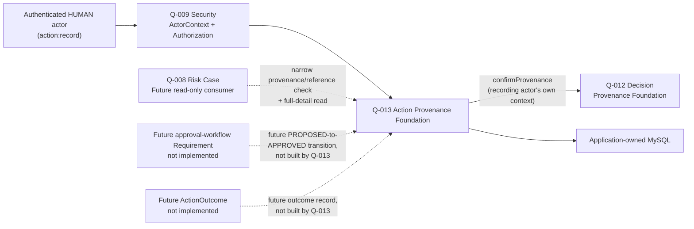

# Q-013 Action Provenance Foundation Architecture

## Document Status

- Requirement: Q-013 — V1, APPROVED — 2026-08-31 — Product Owner
- Architecture submission: **V1 — DRAFT, not yet approved**
- Prepared by: Claude Code, holding the external Architect review role by
  explicit Product Owner direction.
- ADR: none yet. This Architecture recommends a new **ADR-015**, matching
  the precedent every prior module-introducing Requirement received
  (Q-009→ADR-011, Q-010→ADR-012, Q-011→ADR-013, Q-012→ADR-014).
- Implementation Design: not started.
- Implementation: NOT AUTHORIZED.

This document turns approved Q-013 Requirement V1 into a proposed
Architecture V1 baseline, per
`docs/engineering/AI-Engineering-Execution-Protocol.md`'s stage-bounded
workflow. Self-review artifact, not an independent one — same disclosed
limitation as every prior Architecture in this repository. Approval
creates no Java, SQL, or API and does not itself authorize implementation.

## 1. Authority and Fixed Boundary

Authoritative, in order: repository `AGENTS.md` and the AI Engineering
Execution Protocol; approved Q-013 Requirement V1, especially §5, §7,
§8, §9; accepted ADR-009, ADR-011, ADR-012, ADR-013, ADR-014; approved
Q-007/Q-008/Q-009/Q-010/Q-011/Q-012 architecture and their actual
committed implementation.

This architecture does not reopen: exactly one originating `DecisionRef`
per Action (not a set); `MANUAL`-only `ActionSource`; `PROPOSED`-only
`ActionStatus` with no transition; Action immutability (no correction);
the two-tier narrow/full-detail read split (confirmed at the Requirement
gate, reversing an earlier draft's single-read proposal); `HUMAN`-only
recording; or the absence of an eligibility service. Those are
Requirement Gate decisions the Product Owner already made, several of
them explicitly reversing this document's own drafter's first proposal —
not Architecture's to relitigate.

## 2. Architecture Decision Summary

| Area | Proposed architecture decision |
| --- | --- |
| Owning capability | Action Provenance Foundation, inside the Phase 1 modular monolith |
| Future package boundary | `com.brokeros.risk.action`; no package or code is created by this document |
| ActionRef | server-generated `act-<canonical-lowercase-UUIDv4>`, `CHAR(40)` (verified by arithmetic, not copied: `len("act-")=4 + 36 = 40`, same as `dec-`, coincidentally not automatically — Q-012's own Architecture made the same mistake once with a 3-vs-4-character prefix and caught it before finalizing; this Architecture checked directly rather than assuming the coincidence) |
| Originating Decision validation | reuse Q-012's existing narrow provenance-read contract unchanged, called with the recording actor's own `ActorContext`; accept any `RECOGNIZED` outcome (Decision has no status to further gate on), reject only `NOT_FOUND` |
| Reference cardinality | exactly one `decision_ref` column on `action_record` — no join table, unlike Decision's one-to-many Evidence relationship (Requirement §7 requires exactly one originating Decision, not a set) |
| Content | bounded free-text intent description; no structured vendor-operation field |
| Status model | single-value enum `PROPOSED`, `CHECK`-constrained, no transition use case — deliberately shaped (per Requirement §5.3) so a future Requirement can relax the `CHECK` and add a transition without a new column |
| Durable authority | application-owned MySQL/InnoDB through Spring JDBC and Flyway, same additive-migration discipline as V1–V5 |
| Table count | three tables — `action_record`, `action_operation`, `action_access_log` — one fewer than Decision's four, because there is no Evidence-style one-to-many join table to maintain |
| Mutation consistency | `action_record` row and its `action_operation` ledger row commit atomically |
| Recording exposure | protected authenticated HTTP endpoint, matching Q-011/Q-012's recording endpoint pattern |
| Q-008 contract | protected in-process read-only narrow provenance contract by `ActionRef` only, no intent text — Q-008 does not exist yet |
| Full-detail read | separately protected HTTP endpoint; itself an auditable access event, matching Q-011/Q-012 exactly |
| Cross-module reference persistence | `decision_ref` stored as a validated `CHAR(40)` value, **not** a SQL foreign key to Q-012's table — same established pattern as Decision's reference to Evidence (ADR-014) |
| No eligibility service | reaffirmed — Action has no mutable per-reference state after recording that a consumer needs to distinguish from "exists," the same reasoning ADR-014 established for Decision |
| Messaging/cache | no Kafka topic/event and no Redis cache/key |
| Dependencies | no new library, framework, deployable, or external runtime dependency |
| New ADR | recommend ADR-015 |

## 3. Context and Ownership Map

### 3.1 Q-013 ownership

Q-013 owns: stable `ActionRef` identity; bounded, immutable Action
content (intent description, originating `DecisionRef`, recording actor,
recorded-at time); the `PROPOSED`-only status; the recording use case and
its idempotency ledger; the two-tier read-contract implementation; and
the Q-013 capability catalog.

Q-013 owns no approval workflow, no ActionOutcome, no Execution, and no
Account Control adapter behavior.

### 3.2 Other ownership

- Q-007/ADR-009 places Action downstream of Decision, upstream of
  Execution; Q-013 does not become Execution by having a runtime
  provider.
- Q-009/ADR-011 owns authentication/authorization; reused unchanged.
- Q-012/ADR-014 owns Decision identity and provenance; reused unchanged —
  Q-013 is the second real consumer of Q-012's narrow contract (the first
  being the still-unbuilt Q-008).
- Q-008/ADR-010 owns Risk Case. It may consume only Q-013's two read
  contracts once it exists.
- A future approval-workflow Requirement is Action's anticipated
  extension point (§2's status-column shaping exists specifically for
  it). A future ActionOutcome Requirement and a future Account Control
  Requirement are Action's other anticipated, unbuilt consumers/adjacent
  capabilities.

## 4. Domain Concepts and Invariants

- An **Action** is created exactly once, by a `HUMAN` actor, referencing
  exactly one originating `DecisionRef`, carrying a free-text intent
  description and status `PROPOSED`. It has no further lifecycle in this
  Requirement — no transition, no correction, no deletion.
- An Action's originating Decision is fixed at recording time and
  independently validated as recognized — Action does not additionally
  validate the Decision's subject or evidentiary basis; that is Decision's
  own already-validated concern (transitively trusted, not re-checked).
- Intent description content is free text, deliberately not a
  vendor-operation taxonomy (Requirement §5.2/`Q013-FR-009`).

## 5. Opaque Reference Strategy

`ActionRef` follows the established `<prefix>-<canonical-lowercase-UUIDv4>`
convention: server-generated, never client-supplied, `CHAR(40)`. Canonical
form lowercase; a regex `CHECK` enforces the exact shape, mirroring
`V3`–`V5`'s existing pattern.

## 6. Content Bounds

Intent description: bounded free-text, non-blank after trimming, UTF-8
byte-bound validated (1–4,000 bytes, matching `ConclusionText`/
`ObservationText`'s precedent), stored `VARBINARY`, strict UTF-8 decode
that fails closed on malformed bytes. No blob/file/markdown/HTML content.

## 7. Durable Source of Truth and Relational Boundary

Three application-owned InnoDB tables, next additive migration version
(exact number confirmed at Implementation Design time):

- **`action_record`** — one row per Action. `id` (PK), `action_ref`
  (`CHAR(40)`, unique, regex-checked), `decision_ref` (`CHAR(40)`,
  regex-checked, **no** cross-module FK — matching Decision's reference
  to Evidence), `source` (`VARCHAR(16)`, `CHECK IN ('MANUAL')`), `status`
  (`VARCHAR(16)`, `CHECK IN ('PROPOSED')` — the single-value, extensible
  -by-relaxation column Requirement §5.3 specifies), `intent_text`
  (bounded `VARBINARY`), `recorded_by_actor_ref` (`CHAR(36)`),
  `recorded_at` (`DATETIME(6)`).
- **`action_operation`** — the idempotency ledger, mirroring
  `decision_operation`: `operation_id` (`CHAR(36)`, unique),
  `operation_type` (`CHECK IN ('RECORD')`), `semantic_fingerprint`
  (`BINARY(32)`), `action_id` (FK to `action_record.id`, `ON DELETE
  RESTRICT` — the only real FK in this schema), `outcome` (`CHECK IN
  ('CREATED')`), `occurred_at` (`DATETIME(6)`).
- **`action_access_log`** — the full-detail-read audit trail, mirroring
  `decision_access_log`: `action_id` (FK, `ON DELETE RESTRICT`),
  `accessing_actor_ref`, `accessed_at`.

No join table exists — unlike Decision-to-Evidence (one-to-many),
Action-to-Decision is one-to-one, so `decision_ref` is a direct column.
No `*_history` table exists — there is no correction to have history of,
same reasoning as Decision (ADR-014, "Alternative 5").

## 8. Recording: HTTP Exposure

`POST /api/actions`, matching Q-011/Q-012's recording pattern: actor from
`ActorContextProvider.currentContext()` only, `@Valid @RequestBody`,
returns `ApiResponse`. No correction/transition route exists.

## 9. Originating-Decision Validation

Call Q-012's existing narrow provenance-read contract
(`confirmProvenance`) with the recording actor's own `ActorContext`.
Accept any `RECOGNIZED` outcome; reject `NOT_FOUND` with
`ACTION_DECISION_NOT_RECOGNIZED`. Unlike Decision's dual validation
(subject via Q-010 + evidence via Q-011), Action validates exactly one
upstream reference through exactly one call.

## 10. Idempotency, Duplicate, and Retry

Identical mechanism to Q-011/Q-012: `operationId` + SHA-256 semantic
fingerprint (over the raw originating-Decision string and intent-text
string, computed before domain parsing). Exact replay returns the
original outcome without a new row; a changed request under the same
operation id is rejected as a conflict
(`ACTION_IDEMPOTENCY_CONFLICT`). Authorization and the `HUMAN` check
always precede the replay check; the replay check itself precedes content
validation and the Q-012 call — the same canonical ordering discipline
Q-011/Q-012 established.

## 11. Protected Read Contracts

### 11.1 Narrow provenance/confirmation contract (in-process only)

`confirmProvenance(ActorContext, ActionRef)` → `ActionProvenanceView`:
a `RECOGNIZED` outcome carries `decisionRef`, `status`,
`recordedByActorRef`, `recordedAt` — never `intentText`. A `NOT_FOUND`
outcome carries no metadata. Enforced structurally (no such field exists
on the type), mirroring `DecisionProvenanceView`/`EvidenceProvenanceView`'s
compact-constructor invariant exactly. Requires `action:read`; no
`ActorType` restriction. Not exposed over HTTP.

### 11.2 Full-detail read (HTTP)

`GET /api/actions/{actionRef}` → includes `intentText`. Requires
`action:read`; no `ActorType` restriction. Commits an `action_access_log`
row, in a short dedicated (`PROPAGATION_REQUIRES_NEW`, not
database-read-only) transaction, before returning content — identical
discipline to Q-011/Q-012.

## 12. Q-009 Security Integration

Identical shape to Q-011/Q-012: `AuthorizationGuard.requireAllowed`
before any lookup or mutation; capabilities `action:record` (`HUMAN`
-only, checked immediately after authorization and before the replay
check) and `action:read` (no `ActorType` restriction). No Q-009 file
change; two new `Capability` string values registered the same way
Q-010/Q-011/Q-012 each added their own.

## 13. Access Audit and Atomicity

Recording commits `action_record` and its `action_operation` ledger row
atomically. Full-detail read's access-audit commit uses a short, dedicated
transaction separate from the read itself and from any concurrent,
unrelated recording transaction — mirrors Q-011/Q-012.

## 14. Transaction and Concurrency Design

Recording: single-transaction, canonical order per §10. Concurrent
identical-operation-id requests: exactly one commits via the database
unique constraint on `action_operation.operation_id`, the other observes
and replays. No concurrent-correction scenario exists (no correction to
have one).

## 15. Database and Collation Architecture

Identical to Q-011/Q-012: ASCII/`ascii_bin` collation for controlled
-shape reference columns; `VARBINARY` with strict, fail-closed UTF-8
decoding for `intent_text`.

## 16. Failure Model

- Unrecognized `DecisionRef` → `ACTION_DECISION_NOT_RECOGNIZED`.
- Blank/oversized intent text → `ACTION_CONTENT_INVALID`.
- Q-012 call fails (exception, not a negative-but-valid response) →
  `ACTION_DECISION_AUTHORITY_UNAVAILABLE`.
- Idempotency conflict → `ACTION_IDEMPOTENCY_CONFLICT`.
- Access-log write failure on full-detail read → no content returned,
  fail-closed.
- Not-found on full-detail read → `ACTION_NOT_FOUND`.
- Non-`HUMAN` recording attempt → `ACTION_ACTOR_TYPE_NOT_PERMITTED`.
- Unclassified persistence failure → `ACTION_AUTHORITY_UNAVAILABLE`.

## 17. Threat Analysis

Same threat model as Q-011/Q-012, minus any correction-specific threat
(none exists). Replay/duplicate-submission handled by the idempotency
ledger; unauthorized disclosure prevented by the narrow contract's
structural guarantee and the audited full-detail read; unrecognized
-Decision spoofing rejected by a live Q-012 call rather than trusting a
client-supplied claim.

## 18. Q-008 Dependency Effect

Once Q-013 is implemented, Q-008's Implementation Gate (§26) has exactly
one remaining unresolved prerequisite: ActionOutcome. This Architecture
does not implement, design, or reserve any naming for it.

## 19. Dependencies and Operational Boundary

No new library, framework, Kafka topic, Redis key, deployment manifest,
or external adapter. No change to `backend/pom.xml`. No change to any
Q-009/Q-010/Q-011/Q-012 file.

## 20. Requirement Traceability

| Requirement item | Architecture answer |
| --- | --- |
| Q013-FR-001 (record an Action) | §7 schema, §8 HTTP exposure, §10 ordering |
| Q013-FR-002 (HUMAN + action:record) | §12 |
| Q013-FR-003 (originating Decision "recognized" bar) | §9 |
| Q013-FR-004 (idempotent recording) | §10 |
| Q013-FR-005 (PROPOSED-only status) | §7 (single-value, extensible-by-relaxation CHECK) |
| Q013-FR-006 (immutability — no correction) | §7 (no history table), §14 |
| Q013-FR-007 (narrow provenance contract) | §11.1 |
| Q013-FR-008 (audited full-detail read) | §11.2, §13 |
| Q013-FR-009 (no vendor-specific semantics) | §4, §6 (free text only) |

## 21. Decisions Deferred to Implementation Design

Exact next Flyway migration version number; exact `ResultCode` string
values named in §16; exact package/class names within
`com.brokeros.risk.action`; full §8.5-style constraint-to-test
traceability table.

## 22. Decisions Requiring a Future Requirement

Adding `ActionStatus.APPROVED`/`REJECTED` and the approval-workflow
capability/actor semantics for that transition; ActionOutcome; any
Execution/Account Control adapter contract; any correction/withdrawal
mechanism for a recorded Action, if ever needed.

## 23. Required Architecture Review Answers

1. Is the no-join-table schema (single `decision_ref` column, three
   tables total) acceptable, given Decision needed a join table for its
   one-to-many Evidence relationship but Action's relationship to
   Decision is one-to-one? **Recommend yes** — matches Requirement §7's
   "exactly one" cardinality exactly; a join table would be unwarranted
   schema for a relationship that can never have more than one row.
2. Is a new ADR-015 warranted? **Recommend yes**, matching precedent.
3. Is the single-value, extensible-by-relaxation `status` `CHECK` design
   (rather than omitting the column entirely, or building the transition
   now) the right balance of the Product Owner's stated
   extensibility-and-stability principle? **Recommend yes** — this is the
   same balance the Requirement gate already confirmed; Architecture
   found no reason to revisit it.

## 24. Architecture Gate

- Architecture submission complete: YES (V1)
- Architecture V1 approved: **YES — 2026-09-01 — Product Owner.** Gate
  Decision: **PASS.** §23's three review questions resolved as
  recommended: (1) the no-join-table three-table schema is accepted; (2)
  a new ADR-015 is authorized to be drafted; (3) the single-value,
  extensible-by-relaxation `status` design is confirmed correct.
- ADR-015: **AUTHORIZED to be drafted — 2026-09-01 — Product Owner.**
- Implementation Design status: not started
- Implementation: NOT AUTHORIZED
- Implementation Allowed: **NO**

Next gate: ADR-015 drafting (explicitly authorized above), then its own
Product Owner Gate Decision. Per protocol §3, Implementation Design does
not begin automatically even after ADR-015 is accepted.
