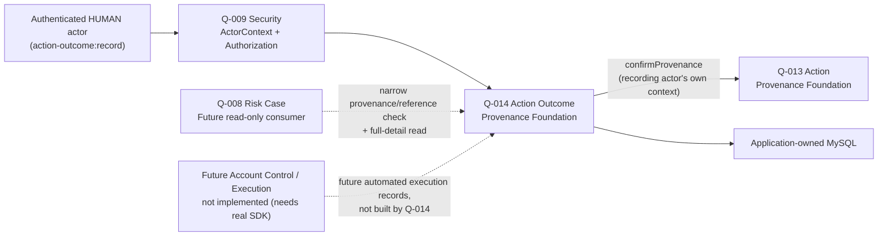

# Q-014 Action Outcome Provenance Foundation Architecture

## Document Status

- Requirement: Q-014 — V1, APPROVED — 2026-09-01 — Product Owner (all
  three §5.3 business-scope questions confirmed as recommended)
- Architecture submission: **V1 — APPROVED — 2026-09-01 — Product Owner**
  (accepted as one bundle with ADR-016 and the Implementation Design at
  the implementation-authorization gate, per Decision Authority §16.5-B;
  see §24)
- Prepared by: Claude Code, external Architect role. Drafted as part of
  the connected Architecture → ADR → Implementation Design chain authorized
  by Decision Authority §16.5-B after Requirement approval. Self-review
  artifact; accepted as a bundle at the implementation-authorization gate.
- ADR: **ADR-016 — Accepted — 2026-09-01 — Product Owner.**
- Implementation: **AUTHORIZED — 2026-09-01 — Product Owner** (see §24).

## 1. Authority and Fixed Boundary

Authoritative, in order: `AGENTS.md`, the two engineering docs, approved
Q-014 Requirement V1, accepted ADR-009/ADR-011/ADR-015, and the actual
committed Q-009/Q-013 code.

Does not reopen: human-recorded outcome-fact scope (not real execution);
`MANUAL`-only source; free-text outcome, no result taxonomy; immutable, no
correction; many-to-one ActionOutcome→Action with no one-per-Action
constraint; two-tier read; `HUMAN`-only recording. Those are Requirement
Gate decisions.

## 2. Architecture Decision Summary

| Area | Decision |
| --- | --- |
| Owning capability | Action Outcome Provenance Foundation, in the Phase 1 modular monolith |
| Package | `com.brokeros.risk.actionoutcome`; no code created by this document |
| ActionOutcomeRef | server-generated `aoc-<canonical-lowercase-UUIDv4>`, `CHAR(40)` (`len("aoc-")=4 + 36 = 40`, verified, not assumed) |
| Pertaining-Action validation | reuse Q-013's narrow `confirmProvenance` unchanged, actor's own context; accept `RECOGNIZED`, reject only `NOT_FOUND` |
| Reference cardinality | one `action_ref` column on `action_outcome_record` (each outcome names one Action); many-to-one — no uniqueness on `action_ref` |
| Content | free-text outcome description; no structured result column |
| Status model | **none** — an outcome fact has no lifecycle; follows Decision's shape (no status column), not Action's (Action had `PROPOSED` because it has a proposed→approved lifecycle; an outcome fact does not transition) |
| Table count | three — `action_outcome_record`, `action_outcome_operation`, `action_outcome_access_log` (no join table; ActionOutcome→Action is a single reference) |
| Durable authority | application-owned MySQL/InnoDB via Spring JDBC + Flyway, additive migration |
| Recording exposure | protected HTTP `POST /api/action-outcomes` |
| Q-008 contract | in-process narrow provenance by `ActionOutcomeRef`, no outcome text |
| Full-detail read | protected HTTP, audited access before disclosure |
| Cross-module reference | `action_ref` as validated `CHAR(40)`, **not** a SQL FK to Q-013 (ADR-015 precedent) |
| No eligibility service | reaffirmed — no mutable per-reference state |
| Messaging/cache | none |
| New ADR | ADR-016 |

## 3. Context and Ownership Map

### 3.1 Q-014 ownership

Owns: stable `ActionOutcomeRef` identity; bounded, immutable outcome-fact
content (pertaining `ActionRef`, free-text outcome description, recording
actor, record time); the recording use case and its idempotency ledger;
the two-tier read-contract implementation; the Q-014 capability catalog.

Owns no execution, execution attempt/retry, Account Control adapter, or
result taxonomy.

### 3.2 Other ownership

- ADR-009 keeps Execution outside the Core Domain; Q-014 records a fact
  *about* an outcome, it is not the execution record, and does not become
  one by having a runtime provider.
- Q-009/ADR-011 owns authorization; reused unchanged.
- Q-013/ADR-015 owns Action identity; reused unchanged — Q-014 is the
  second real consumer of Q-013's narrow contract (after the unbuilt
  Q-008).
- Q-008/ADR-010 owns Risk Case; may consume Q-014's two read contracts.
- A future Account Control / Execution Requirement is Q-014's anticipated,
  unbuilt adjacent capability.

## 4. Domain Concepts and Invariants

- An **ActionOutcome** is created exactly once, by a `HUMAN` actor,
  pertaining to exactly one `ActionRef`, carrying a free-text outcome
  description. No lifecycle, no transition, no correction, no deletion.
- The pertaining Action is fixed at recording time and independently
  validated as recognized; Q-014 does not re-validate the Action's own
  Decision (transitively trusted — Q-013 already validated it and Action
  is immutable).
- Outcome content is free text, deliberately not an execution-result
  taxonomy (Requirement §5.2/`Q014-FR-008`).

## 5. Opaque Reference Strategy

`ActionOutcomeRef` = `aoc-<canonical-lowercase-UUIDv4>`, server-generated,
`CHAR(40)`, regex-`CHECK` enforced, lowercase — mirroring `V3`–`V6`.

## 6. Content Bounds

Outcome description: bounded free-text, non-blank after trim, UTF-8 byte
length 1–4,000 (matching `ConclusionText`/`IntentText`), stored
`VARBINARY`, strict fail-closed UTF-8 decode. No blob/file/markdown.

## 7. Durable Source of Truth and Relational Boundary

Three InnoDB tables, additive migration (next unused version, confirmed at
Implementation Design time). All timestamps server UTC `DATETIME(6)`; all
PKs `BIGINT AUTO_INCREMENT id`, never exposed; no cascade delete.

- **`action_outcome_record`** — one row per outcome. `id`,
  `action_outcome_ref` (`CHAR(40)`, unique, regex), `action_ref`
  (`CHAR(40)`, regex, **no** cross-module FK), `source` (`CHECK IN
  ('MANUAL')`), `outcome_text` (`VARBINARY`, byte-bound), `recorded_by_actor_ref`
  (`CHAR(36)`), `recorded_at` (`DATETIME(6)`). No status column, no
  self-FK. Index on `action_ref` for future action-scoped queries.
- **`action_outcome_operation`** — idempotency ledger, mirroring
  `decision_operation`/`action_operation`: `operation_id` (`CHAR(36)`,
  unique), `operation_type` (`CHECK IN ('RECORD')`), `semantic_fingerprint`
  (`BINARY(32)`), `action_outcome_id` (FK → record, `ON DELETE RESTRICT`),
  `outcome` (`CHECK IN ('CREATED')`), `occurred_at`.
- **`action_outcome_access_log`** — full-detail-read audit trail:
  `action_outcome_id` (FK, `ON DELETE RESTRICT`), `accessing_actor_ref`,
  `accessed_at`.

No join table (single reference), no `*_history` table (no correction).

## 8. Recording: HTTP Exposure

`POST /api/action-outcomes`: actor from `ActorContextProvider.currentContext()`
only, `@Valid @RequestBody`, returns `ApiResponse`. No correction/transition
route.

## 9. Pertaining-Action Validation

Call Q-013's narrow `confirmProvenance(actorContext, actionRef)`. Accept
`RECOGNIZED`; reject `NOT_FOUND` with `ACTION_OUTCOME_ACTION_NOT_RECOGNIZED`;
map an unavailability exception to `ACTION_OUTCOME_ACTION_AUTHORITY_UNAVAILABLE`.
Exactly one upstream reference, one call.

## 10. Idempotency, Duplicate, and Retry

`operationId` + SHA-256 semantic fingerprint over the raw pertaining
-Action reference and outcome-text strings (computed before domain
parsing). Exact replay returns the original outcome, no new row; a changed
request under the same operation id → `ACTION_OUTCOME_IDEMPOTENCY_CONFLICT`.
Authorization and the `HUMAN` check always precede the replay check; the
replay check precedes content validation and the Q-013 call. Same
canonical ordering as Q-011…Q-013.

## 11. Protected Read Contracts

- **Narrow** `confirmProvenance(ActorContext, ActionOutcomeRef)` →
  `ActionOutcomeProvenanceView`: `RECOGNIZED` carries `actionRef`,
  `recordedByActorRef`, `recordedAt` — never `outcomeText`; `NOT_FOUND`
  carries no metadata; structurally enforced (no such field on the type).
  Requires `action-outcome:read`, no `ActorType` restriction, not on HTTP.
- **Full-detail** `GET /api/action-outcomes/{actionOutcomeRef}` → includes
  `outcomeText`. Requires `action-outcome:read`, no `ActorType`
  restriction. Commits an `action_outcome_access_log` row in a short
  dedicated (`REQUIRES_NEW`, not read-only) transaction before returning
  content.

## 12. Q-009 Security Integration

`AuthorizationGuard.requireAllowed` before any lookup/mutation. Capabilities
`action-outcome:record` (`HUMAN`-only, checked right after authorization,
before the replay check) and `action-outcome:read` (no `ActorType`
restriction). No Q-009 change; two new `Capability` strings.

## 13. Access Audit and Atomicity

Recording commits `action_outcome_record` + `action_outcome_operation`
atomically. Full-detail read's audit commit is isolated (`REQUIRES_NEW`)
from the read and from any concurrent unrelated recording.

## 14. Transaction and Concurrency Design

Recording: single transaction, canonical order per §10. Concurrent
identical-operation-id: exactly one commits via the unique constraint on
`action_outcome_operation.operation_id`, the other replays. No
concurrent-correction scenario (no correction).

## 15. Database and Collation Architecture

ASCII/`ascii_bin` for controlled-shape reference columns; `VARBINARY` with
strict fail-closed UTF-8 decode for `outcome_text`. Identical to Q-011…Q-013.

## 16. Failure Model

- Unrecognized `ActionRef` → `ACTION_OUTCOME_ACTION_NOT_RECOGNIZED`.
- Blank/oversized outcome text, or malformed `ActionRef` →
  `ACTION_OUTCOME_CONTENT_INVALID`.
- Q-013 call fails → `ACTION_OUTCOME_ACTION_AUTHORITY_UNAVAILABLE`.
- Idempotency conflict → `ACTION_OUTCOME_IDEMPOTENCY_CONFLICT`.
- Not-found on full-detail read → `ACTION_OUTCOME_NOT_FOUND`.
- Access-log write failure → no content, fail-closed.
- Non-`HUMAN` recording → `ACTION_OUTCOME_ACTOR_TYPE_NOT_PERMITTED`.
- Unclassified persistence failure → `ACTION_OUTCOME_AUTHORITY_UNAVAILABLE`.

## 17. Threat Analysis

Same as Q-013, minus correction-specific threats (none). Replay handled by
the ledger; disclosure prevented by the narrow contract's structural
guarantee and audited full read; unrecognized-Action spoofing rejected by
a live Q-013 call.

## 18. Q-008 Dependency Effect

Once Q-014 is implemented, **Q-008's three provider prerequisites
(Decision, Action, ActionOutcome) are all satisfied.** Q-008's
Implementation Gate (§26) would then be unblocked on the provider side.
This Architecture implements no Q-008 code and reserves no Q-008 naming.

## 19. Dependencies and Operational Boundary

No new library, Kafka topic, Redis key, deployment manifest, or adapter.
No `pom.xml` change. No change to any Q-009…Q-013 file.

## 20. Requirement Traceability

| Requirement item | Architecture answer |
| --- | --- |
| Q014-FR-001–002 | §7, §8, §10, §12 |
| Q014-FR-003 | §9 |
| Q014-FR-004 | §10 |
| Q014-FR-005 | §7 (no history table), §4 |
| Q014-FR-006 | §11 (narrow) |
| Q014-FR-007 | §11 (full-detail), §13 |
| Q014-FR-008 | §4, §6 (free text; no taxonomy/adapter) |

## 21. Decisions Deferred to Implementation Design

Exact next migration version number; exact `ResultCode` strings; exact
package/class names; full §8.5-style constraint-to-test table.

## 22. Decisions Requiring a Future Requirement

A structured result taxonomy (would add a nullable classification column —
additive, non-breaking); real automated execution / Account Control
adapter; any one-outcome-per-Action uniqueness constraint; any
ActionOutcome correction/withdrawal mechanism.

## 23. Required Architecture Review Answers

1. No status column (following Decision, not Action) — acceptable?
   **Recommend yes**: an outcome fact has no lifecycle; a status column
   would be speculative schema, and a future taxonomy is a separate
   additive column anyway.
2. New ADR-016 warranted? **Recommend yes**, matching precedent.
3. Three-table, no-join, no-history schema (single reference, immutable)
   correct? **Recommend yes** — matches the confirmed cardinality and
   immutability.

## 24. Architecture Gate

- Architecture submission complete: YES (V1)
- Architecture V1 approved: **YES — 2026-09-01 — Product Owner** (accepted
  as one bundle with ADR-016 and the Implementation Design at the
  implementation-authorization gate, per Decision Authority §16.5-B)
- ADR-016: **Accepted — 2026-09-01 — Product Owner**
- Implementation: **AUTHORIZED — 2026-09-01 — Product Owner**
- Implementation Allowed: **YES**

Next gate: Codex executes the implementation Prompt
(`prompts/Q-014-Implementation-Prompt.md`), then Claude Code performs an
independent implementation review before any commit.
