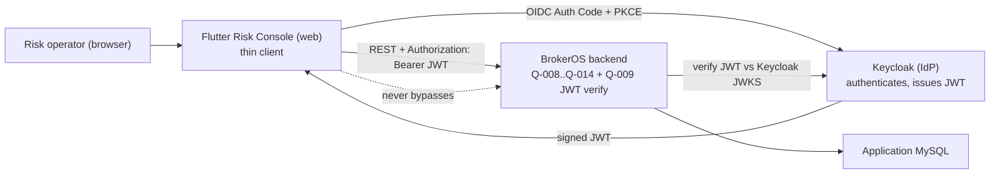

# Q-016 Frontend Foundation Architecture

## Document Status

- Requirement: Q-016 — V1, APPROVED — 2026-09-02 — Product Owner (IdP =
  Keycloak; web-first; backend list/query in this Foundation)
- Architecture submission: **V1 — its live status is §14 (Gate),
  authoritative if this header disagrees** (Execution Protocol §16).
- Prepared by: Claude Code, external Architect role, as part of the
  §16.5-B connected Architecture → ADR → Implementation Design chain.
  Self-review artifact; presented as a bundle at the implementation
  -authorization gate.
- ADR: **ADR-017 — Accepted — 2026-09-02 — Product Owner.**
- Implementation: **AUTHORIZED — 2026-09-02 — Product Owner** (see §14).

## 1. Authority and Fixed Boundary

Authoritative, in order: `AGENTS.md`, the two `docs/engineering/`
documents, approved Q-016 Requirement V1, the committed backend
Q-008…Q-014 HTTP contracts, and Q-009's JWT-verification security
boundary.

Does not reopen (Requirement-gate decisions): Flutter; Keycloak IdP;
web-first; the list/query endpoint built here; thin-client discipline;
one vertical slice + skeleton (not the whole UI); no business-rule
migration to the frontend; only additive backend read/query endpoints.

## 2. Architecture Decision Summary

| Area | Decision |
| --- | --- |
| Client app | Flutter **web-first** "Risk Console" |
| Repo placement | mono-repo **`frontend/`** directory beside `backend/` (one place to build/version; separable later) |
| State management | **Riverpod** (async-first, testable, low boilerplate; providers wrap API calls and auth/session state) |
| Routing | **go_router** (declarative, guards for auth) |
| HTTP client | **dio** (interceptors attach the Bearer token and map `ApiResponse`/`ResultCode`) |
| Typed backend contract | Dart models for `ApiResponse<T>` + the consumed DTOs + a `ResultCode` enum, so a backend contract change is a compile-time signal |
| Auth | **OIDC Authorization Code + PKCE** against Keycloak; the app never sees a password; obtains a JWT and sends it `Authorization: Bearer` |
| Token handling | in-memory access token + refresh; secure storage for the refresh token; silent refresh; logout clears session |
| Dev IdP | a **Keycloak** service added to `docker-compose.yml` (dev profile) with a seeded realm/client/user, so the slice runs locally end to end |
| Backend addition | one additive `GET /api/risk-cases` **list/query** endpoint (bounded pagination, authorized, `ApiResponse`) — no Q-008 aggregate/business change |
| First slice | login → list Risk Cases → open case (detail + history + associations) → one operation (assign / add note / change priority) with version handling |
| New infra | Keycloak only (Requirement §5.3(1)); no other new infrastructure |

## 3. Context and Boundary Map



The console is a **thin client**: all authorization and business rules
stay in the backend; the backend verifies every request's JWT against
Keycloak's published keys (Q-009). A hidden or disabled UI control is
never the security boundary — the backend rejects unauthorized calls
regardless.

## 4. Frontend Application Architecture

Layered, testable, framework-isolated where it matters:

```
frontend/lib/
├── app/            # app entry, theme (light/dark), go_router config + auth guard
├── core/
│   ├── api/        # dio client, ApiResponse<T>/ResultCode models, error mapping, Bearer interceptor
│   ├── auth/       # OIDC/Keycloak login, token store, session state (Riverpod)
│   └── result/     # typed Result / failure model surfaced to UI
├── features/
│   └── riskcase/   # the vertical slice
│       ├── data/       # typed DTOs + repository calling core/api
│       ├── application/# Riverpod providers/notifiers (list, detail, operations)
│       └── presentation/# list screen, detail screen, operation dialogs, states
└── shared/         # reusable widgets (loading, error, empty, paginated list)
```

- **Domain/UI isolation:** `features/*/application` (Riverpod notifiers)
  holds view logic and is unit-testable without a real backend (repository
  is an injected interface with a fake in tests).
- **No business rules in the client:** the console mirrors backend state
  and validation results; it does not re-decide transitions, invariants,
  or authorization. It *may* disable a control the backend would reject
  (UX), but always still calls and honors the backend's answer.
- **Error/loading/empty** are first-class states for every async view.

## 5. Authentication Flow (OIDC + Keycloak)

1. Unauthenticated → go_router auth guard redirects to login.
2. The app runs **OIDC Authorization Code + PKCE** against Keycloak
   (browser redirect for web); the user authenticates at Keycloak (never
   in the app).
3. Keycloak returns an authorization code → the app exchanges it (with the
   PKCE verifier) for an **access JWT** (+ refresh token).
4. Every backend call carries `Authorization: Bearer <access JWT>` via the
   dio interceptor. The backend verifies it against Keycloak's JWKS
   (Q-009) and derives `ActorContext`. The console never puts identity in
   a request body/param.
5. On `401`, the app attempts a silent refresh; if that fails, it
   re-authenticates. On `403`, it shows an authorization error. Logout
   clears the session and (optionally) calls Keycloak end-session.
6. Token storage: access token in memory; refresh token in the platform's
   secure storage; nothing sensitive is logged.

The Keycloak issuer/JWKS URL is configuration on both the app and the
backend, so dev→prod is a config repoint (Requirement §5.3(1)).

## 6. Backend Addition: Risk Case List/Query Endpoint

The only backend change is one additive, read-only endpoint, following the
exact existing controller/`ApiResponse`/authorization/capability patterns
and NOT touching Q-008's aggregate, migrations, or business rules:

- `GET /api/risk-cases` with bounded query params: optional `status`,
  `priority`, `subjectRef`, `assignee`, plus `page` and `size`
  (server-enforced max page size).
- Authorized by the existing Risk Case **read** capability
  (`AuthorizationGuard`); `ActorContext` from the verified JWT.
- Returns `ApiResponse<Page<RiskCaseSummary>>` where `RiskCaseSummary` is a
  **bounded projection** (case number, subject ref, status, priority,
  current assignment, created/updated timestamps, version) — never full
  history or upstream payloads.
- Implemented as a new read query in the existing riskcase query
  service/repository (a bounded, indexed `SELECT ... LIMIT ? OFFSET ?` or
  keyset page over `risk_case`), added to `RiskCaseQueryService` /
  `JdbcRiskCaseRepository` and `RiskCaseController` — additive only.
- A new `ResultCode` is not expected; existing validation/`ApiResponse`
  handles bad query params.

This is the one place the Foundation touches the backend, and it is a
read-only projection — no aggregate mutation, no new migration.

## 7. Dev Run / Keycloak Setup

- Add a **Keycloak** service to `docker-compose.yml` (behind a dev
  profile) with a seeded realm (`brokeros`), an OIDC public client for the
  web app (Auth Code + PKCE, correct redirect URIs), and a seeded dev
  operator user with the read/operate capabilities the slice needs.
- Configure the backend's `SecurityJwtProperties` (dev) to Keycloak's
  issuer/JWKS.
- Document a one-command local bring-up (backend + MySQL + Keycloak) and
  the Flutter web run, so the slice runs end to end locally. Dev
  credentials are dev-only and never a production path.

## 8. Security Design

- Authorization stays entirely server-side (Q-009); the console is not a
  trust boundary.
- OIDC Auth Code + PKCE (no implicit flow, no password grant in the app).
- Access token in memory, refresh token in secure storage; no token or
  sensitive case content logged.
- The console requests only bounded data; the list endpoint returns a
  bounded summary projection.
- CORS/redirect URIs configured tightly for the web origin; TLS in
  production (deployment concern).

## 9. Testability

- **Frontend:** unit tests for Riverpod notifiers with a fake repository
  (no backend); widget tests for the list/detail/operation screens'
  states; a typed-client contract test asserting the Dart models match the
  backend's documented `ApiResponse`/DTO shapes.
- **Backend:** a test for the new list/query endpoint — authorization
  enforced, pagination bounded, summary projection correct, no unbounded
  query — real MySQL, following the existing Q-008 test patterns and the
  session's test-discipline lessons (no hard-coded counts, exact-name
  ownership).
- **End-to-end:** the documented local run (dev Keycloak) exercised for
  the full slice.

## 10. Requirement Traceability

| Requirement item | Architecture answer |
| --- | --- |
| Q016-FR-001/002 (OIDC auth, Bearer, no body identity) | §5 |
| Q016-FR-003 (list + open case) | §4, §6 |
| Q016-FR-004 (one operation, version handling) | §4 |
| Q016-FR-005 (additive backend list/query endpoint) | §6 |
| Q016-FR-006 (thin client, bounded data) | §4, §6, §8 |
| Q016-FR-007 (runnable locally) | §7 |

## 11. Decisions Deferred to Implementation Design

Exact Dart package versions and library choices for OIDC (e.g.
`openid_client`/`flutter_appauth`) and secure storage; exact widget
composition; exact query-param validation and page-size cap; exact
Keycloak realm export; exact file/module names.

## 12. Decisions Requiring a Future Requirement

Broader UI coverage beyond the slice; real-time trading-data/exposure
dashboards (need Q-015 data); desktop/mobile targets; production Keycloak
hardening/HA; SSO federation to a corporate directory.

## 13. Required Architecture Review Answers

1. Mono-repo `frontend/` vs separate repo — **recommend mono-repo** (one
   build/version surface now, separable later). 2. Riverpod + dio +
   go_router — **recommend** (modern, testable, standard). 3. One additive
   backend list/query endpoint (no aggregate change) — **recommend** as
   the minimal real slice. All are HOW decisions under Decision Authority
   §16.1; recorded for visibility.

## 14. Architecture Gate

- Architecture submission complete: YES (V1)
- Architecture V1 approved: **YES — 2026-09-02 — Product Owner** (accepted
  as one bundle with ADR-017 and the Implementation Design at the
  implementation-authorization gate)
- ADR-017: **Accepted — 2026-09-02 — Product Owner**
- Implementation: **AUTHORIZED — 2026-09-02 — Product Owner**
- Implementation Allowed: **YES**

Next gate: Codex executes the implementation prompt
(`prompts/Q-016-Implementation-Prompt.md`), then Claude Code performs an
independent implementation review before any commit.
