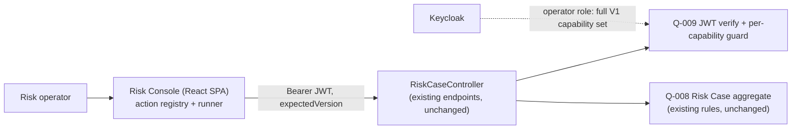

# Q-017 Case Lifecycle Operations — Architecture

## Document Status

- Requirement: Q-017 — V1, APPROVED — 2026-09-03 — Product Owner (scope A+B+D;
  single operator role, full V1 capability set; terminal actions confirmed;
  action availability = approach (c)).
- Architecture submission: **V1 — its live status is §12 (Gate), authoritative
  if this header disagrees** (Execution Protocol §16).
- Prepared by: Claude Code, external Architect role, as the §16.5-B connected
  Architecture → ADR → Implementation Design chain; presented as one bundle at
  the implementation-authorization gate.
- ADR: **ADR-019 — Accepted — 2026-09-03 — Product Owner**. Builds on ADR-018
  (React SPA) — no stack change.

## 1. Authority and Fixed Boundary

Fixed by the Requirement gate (not reopened here): thin-client on the Q-016 React
console; V1 = Groups **A (lifecycle) + B (assignment/priority) + D (note
correction)**; **C (associations) and E (creation) deferred**; a **single
console-operator role** granted the full V1 capability set; **terminal actions
(close/cancel/resolve) require confirmation + reason**; **action availability =
approach (c)** — the console offers actions valid for the current status and
relies on the backend `403`/`ResultCode` for authorization (no JWT-claims parse
or capability probe in V1). **No backend business-logic, aggregate, or migration
change**; the only backend-adjacent change is the operator capability grant.

## 2. Architecture Decision Summary

| Concern | Decision |
| --- | --- |
| Stack | Q-016 React 18 + TS + Vite (ADR-018), Ant Design, TanStack Query — unchanged |
| Operation model | A declarative **action registry** — each operation described once (endpoint, method, inputs, allowed-from statuses, terminal flag) |
| Execution | A shared **action runner** (TanStack Query `useMutation`) that reuses the Q-016 axios client (Bearer, one `401` refresh, `403`→typed error, envelope) and always sends `expectedVersion` |
| Concurrency | `RISK_CASE_VERSION_CONFLICT` → reload the case detail and preserve the operator's unsaved input, prompt retry (shared) |
| Availability | Status-driven only (approach c); backend is the authority — a `403`/`ResultCode` is surfaced as a typed error, never swallowed |
| Terminal actions | close / cancel / resolve go through a confirmation dialog with a mandatory reason |
| Authorization | Server-side (Q-009 + per-capability guards), unchanged; the operator role is granted exactly the V1 capability set (least privilege) |

## 3. Context and Boundary Map



The console consumes **already-committed** endpoints; the only new element outside
the frontend is the operator's capability grant in the security bootstrap.

## 4. Frontend Application Architecture

Additions under the existing `frontend/src/features/riskcase/`:

```
features/riskcase/
├── actions/
│   ├── actionRegistry.ts     # declarative descriptors for the A+B+D operations
│   ├── useCaseAction.ts      # shared runner: useMutation -> repository, version-conflict + error mapping
│   └── ...                   # per-operation input schemas (assignee, priority, reason, resolution, …)
├── api/
│   └── riskCaseRepository.ts # + typed methods for each operation (reuses ApiClient)
└── ui/
    ├── CaseActionsBar.tsx    # renders the actions valid for the current status
    ├── CaseActionDialog.tsx  # generic form dialog (reason/inputs) + confirmation for terminal actions
    └── ...                   # RiskCaseDetailPage wires the bar + dialog + notes-correction entry
```

- **Action descriptor** (per operation): `id`, `label`, HTTP `endpoint`/method,
  `inputs` (typed fields + validation), `allowedFrom` (set of statuses),
  `terminal` (boolean → confirmation), and the `ResultCode`s worth a bespoke
  message.
- **`useCaseAction`**: wraps a TanStack Query `useMutation` over the repository
  method; on success invalidates/refetches the case detail + history; on
  `RISK_CASE_VERSION_CONFLICT` reloads and re-surfaces the dialog with inputs
  preserved; maps `403`/other `ResultCode`s to a typed, readable error.
- **`CaseActionsBar`** computes the offered actions from `descriptor.allowedFrom`
  ∋ current status (approach c). It never encodes authorization — the backend
  decides; a rejection renders as a typed error.

## 5. Operation → Endpoint → Capability map (all existing; no backend change)

| Op (group) | Endpoint (POST) | Inputs (+ `expectedVersion`) | Backend capability | Terminal |
| --- | --- | --- | --- | --- |
| Assign (B) | `/{case}/assignments` | assigneeRef, reason | ASSIGN | — |
| Change priority (B) | `/{case}/priority-changes` | priority, reason | REVIEW | — |
| Begin review (A) | `/{case}/review-start` | reason | REVIEW | — |
| Mark action required (A) | `/{case}/action-required` | reason | REVIEW | — |
| Return to review (A) | `/{case}/review-return` | reason | REVIEW | — |
| Resolve (A) | `/{case}/resolutions` | outcome, resolutionSummary, evidenceRefs?, actionRefs? | RESOLVE | **yes** |
| Close (A) | `/{case}/closure` | reason | CLOSE | **yes** |
| Cancel (A) | `/{case}/cancellation` | reason, duplicateCaseNumber? | CANCEL | **yes** |
| Resume resolved (A) | `/{case}/resume` | reason, assigneeRef? | REOPEN | — |
| Reopen closed (A) | `/{case}/reopen` | reason, assigneeRef? | REOPEN | — |
| Correct note (D) | `/{case}/notes/{noteRef}/corrections` | content | NOTE | — |

The confirmed operator grant `{read, note, assign, review, resolve, close,
cancel, reopen}` covers every V1 capability above (verified against the services).

## 6. State machine → action availability (approach c)

Best-effort UI gating (backend authoritative): OPEN → begin-review / assign /
priority / cancel; IN_REVIEW → mark-action-required / resolve / assign / priority
/ cancel; ACTION_REQUIRED → return-to-review / resolve / assign / priority /
cancel; RESOLVED → close / resume; CLOSED → reopen. Note correction is available
wherever a correctable note exists. If the UI offers an action the backend
rejects for the true state/authorization, the typed `ResultCode`/`403` is shown —
the UI map is convenience, not enforcement.

## 7. Backend Change: none (only the operator capability grant)

No endpoint, aggregate rule, or migration changes. The single governed change is
granting the console-operator role the V1 capability set in the dev security
bootstrap (`deploy/keycloak/q016-security-bootstrap.json` or a Q-017 successor),
and recording the same set as the production authorization expectation. This is
authorization configuration, not business logic.

## 8. Security Design

Authorization stays server-side (Q-009 + guards). Least privilege: the operator
gets exactly the V1 set, nothing more (no `associate`/`create`). Terminal actions
require confirmation + reason. No identity in any request body (Bearer JWT only).
No tokens/reasons/case content in logs or artifacts.

## 9. Testability

- **Frontend (Vitest + RTL + MSW):** each operation — success, pending,
  validation, ordinary `ResultCode` error, `403`, and
  `RISK_CASE_VERSION_CONFLICT` reload-with-input-preserved; the actions bar shows
  the right actions per status; terminal actions require confirmation.
- **Live (Playwright, extends the Q-016 harness):** drive a seeded case
  assign → begin-review → change-priority → resolve → close, asserting status +
  version transitions against the live stack.
- Typecheck + `vite build` clean; backend `git diff` empty.

## 10. Requirement Traceability

Q017-FR-01→ assign/priority (Group B); FR-02→ review workflow; FR-03→
resolve/close/cancel + confirmation; FR-04→ resume/reopen; FR-05→ correct note;
FR-06→ `useCaseAction` version-conflict handling; FR-07→ `CaseActionsBar`
status-gating + typed error surfacing; FR-08→ no identity in body (reused client).

## 11. Decisions Deferred to Implementation Design

Exact TypeScript types per operation, the action-descriptor shape, form field
validation, dialog composition, the security-bootstrap grant file, and file
names.

## 12. Architecture Gate

This Architecture + ADR-019 + the Implementation Design form the §16.5-B bundle
presented at the Q-017 implementation-authorization gate. Live status is the
Q-017 Requirement §17. No implementation begins until the Product Owner accepts
the bundle.
