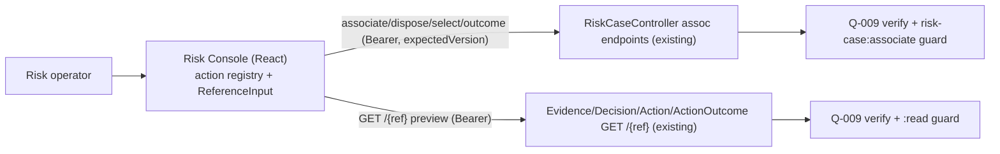

# Q-018 Association Management — Architecture

## Document Status

- Requirement: Q-018 — V1, APPROVED — 2026-09-03 — Product Owner (Group C, all
  six operations; reference sourcing = Option A; grant `risk-case:associate` +
  source-module reads; `source` free-text).
- Architecture submission: **V1 — its live status is §12 (Gate), authoritative if
  this header disagrees** (Execution Protocol §16).
- Prepared by: Claude Code, external Architect role, as the §16.5-B connected
  chain; presented as one bundle at the implementation-authorization gate.
- ADR: **ADR-020 — Accepted — 2026-09-03 — Product Owner**. Builds on ADR-018 (React SPA) + ADR-019 (action
  framework) — no stack change.

## 1. Authority and Fixed Boundary

Fixed by the Requirement gate: thin-client on the Q-016/Q-017 console; V1 = the
**six Group C operations** (evidence associate + disposition; decision associate +
selection; action associate + outcome); **reference sourcing = Option A**
(manual entry + fetch-by-ref preview via existing `GET /{ref}`; Option B new list
endpoints deferred); grant the operator `risk-case:associate` + the source-module
read capabilities; evidence `source` is free text. **No new backend endpoint and
no backend business/aggregate/migration change** — the only backend-adjacent
change is the capability grant.

## 2. Architecture Decision Summary

| Concern | Decision |
| --- | --- |
| Operations | Reuse the **Q-017 action registry + `useCaseAction` runner** for the six association operations (Bearer, `expectedVersion`, `403`/`ResultCode` typed errors, version-conflict reload) |
| On-case references | Selected from the case's **existing detail/history** (association event for disposition; associated decisions for selection; associated actions for an outcome) — no new read |
| External references | A **`ReferenceInput`** control: operator enters a `ev-/dec-/act-/aoc-` ref → console calls the existing `GET /{ref}` → shows a **preview** (validate + confirm) before the association is submitted |
| Association state view | The detail page renders current associations (effective evidence, associated + current decision, associated actions + outcomes) from existing reads, so state is visible before/after |
| Authorization | Server-side, unchanged; operator granted `risk-case:associate` + `evidence:read` + `decision:read` + `action:read` + `action-outcome:read` |

## 3. Context and Boundary Map



Everything the console calls already exists; the only new element is the
operator's expanded capability grant.

## 4. Frontend Application Architecture

Additions under `frontend/src/features/riskcase/`:

```
features/riskcase/
├── actions/
│   ├── actionDescriptors.ts   # + 6 association descriptors (reuse the runner)
│   └── ...
├── api/
│   ├── riskCaseRepository.ts   # + 6 association methods (reuse ApiClient.post)
│   └── referencePreview.ts     # GET /{ref} preview calls for the 4 modules
├── model/
│   └── useReferencePreview.ts   # TanStack Query for fetch-by-ref preview (debounced, typed error)
└── ui/
    ├── ReferenceInput.tsx        # enter ref -> preview card (valid/invalid) -> confirm
    ├── AssociationsPanel.tsx     # renders current evidence/decision/action associations
    └── (RiskCaseDetailPage wires the panel + the 6 actions + on-case pickers)
```

- **`ReferenceInput`**: on entry (debounced), calls the module's `GET /{ref}` and
  renders a preview (key attributes) or a typed "not found / unauthorized / invalid
  format" state; the enclosing action's submit is disabled until a valid ref is
  confirmed (external refs only). Format is client-validated (`ev-/dec-/act-/aoc-`
  UUID) before the call.
- **On-case pickers**: disposition target, current-decision candidates, and the
  action for an outcome are chosen from the case's existing associations
  (detail/history) — no manual UUID.
- **`AssociationsPanel`**: shows effective evidence, associated + current
  decision, associated actions + outcomes, so the operator sees state; refreshed
  after each operation.

## 5. Operation → Endpoint → Reference map (all existing endpoints)

| Op | Endpoint (POST) | Body (+ `expectedVersion`) | Reference source |
| --- | --- | --- | --- |
| Associate evidence | `/{c}/evidence-associations` | evidenceRef, source, reason | evidenceRef = **external** (preview) |
| Evidence disposition | `/{c}/evidence-associations/{eventRef}/dispositions` | disposition, replacementEvidenceRef?, source, reason | eventRef = **on-case**; replacement = external (preview) |
| Associate decision | `/{c}/decision-associations` | decisionRef, reason | decisionRef = **external** (preview) |
| Select current decision | `/{c}/decision-selection` | decisionRef, reason | decisionRef = **on-case** (associated decisions) |
| Associate action | `/{c}/action-associations` | actionRef, reason | actionRef = **external** (preview) |
| Reference action outcome | `/{c}/action-associations/{actionRef}/outcomes` | outcomeRef, reason | actionRef = **on-case**; outcomeRef = external (preview) |

Preview reads (existing): `GET /api/evidence/{ref}`, `/api/decisions/{ref}`,
`/api/actions/{ref}`, `/api/action-outcomes/{ref}`.

## 6. Capability grant (the only backend-adjacent change)

The console-operator role gains, in the security bootstrap:
`risk-case:associate`, `evidence:read`, `decision:read`, `action:read`,
`action-outcome:read` (verified: the six associations require `risk-case:associate`;
each `GET /{ref}` preview requires its module's `:read`). Least privilege: reads
only, scoped to preview. Fallback (if a source read is undesirable): drop that
module's preview and use manual entry — the association operation is unaffected.

## 7. Backend Change: none beyond the grant

No new endpoint (Option A reuses `GET /{ref}`), no aggregate/rule/migration change.
On-case references come from the existing detail/history payloads (**Architecture
verification point:** confirm the detail/history responses already expose the
association event ref, associated decision refs, and associated action refs the
pickers need; if a specific ref is absent, fall back to manual entry for it — still
no new endpoint).

## 8. Security Design

Server-side authorization unchanged (Q-009 + guards). The operator's new grants
are minimal reads + `associate`. Backend remains authoritative — its
`403`/`ResultCode` on any association or preview is surfaced as a typed error. No
identity in request bodies. No tokens/references/entity content in logs.

## 9. Testability

- **Vitest + RTL + MSW:** each of the six operations (success, pending, validation,
  `ResultCode` error, `403`, version-conflict reload); `ReferenceInput` preview
  (valid preview, not-found, invalid-format, unauthorized); on-case pickers.
- **Live Playwright:** on a seeded case, associate a decision → select current →
  associate an action → (then a Q-017 `resolve` becomes reachable) — proving
  AC 4 (lifecycle unblock) against the live stack.
- Typecheck + build clean; backend diff empty (only the bootstrap grant).

## 10. Requirement Traceability

Q018-FR-01→ associate evidence; FR-02→ disposition (on-case target + external
replacement); FR-03→ decision associate + select; FR-04→ action associate +
outcome; FR-05→ `ReferenceInput` preview validation; FR-06→ runner version
conflict; FR-07→ `AssociationsPanel` + typed errors; FR-08→ no identity in body.

## 11. Decisions Deferred to Implementation Design

Exact descriptor/preview types, the `ReferenceInput` composition and debounce,
which detail/history fields feed the on-case pickers, the bootstrap grant file,
and file names.

## 12. Architecture Gate

This Architecture + ADR-020 + the Implementation Design form the §16.5-B bundle
at the Q-018 implementation-authorization gate. Live status: Q-018 Requirement
§17. No implementation begins until the Product Owner accepts the bundle.
