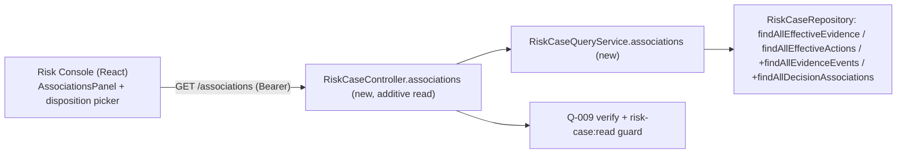

# Q-019 Association Projection — Architecture

## Document Status

- Requirement: Q-019 — V1, APPROVED — 2026-09-03 — Product Owner (single
  projection endpoint; console follow-through in V1; Option B deferred; bounded
  full projection).
- Architecture submission: **V1 — its live status is §11 (Gate), authoritative if
  this header disagrees** (Execution Protocol §16).
- Prepared by: Claude Code, external Architect role, as the §16.5-B connected
  chain; presented as one bundle at the implementation-authorization gate.
- ADR: **ADR-021 — Accepted — 2026-09-03 — Product Owner**. Backend additive read (first since Q-016's list
  endpoint) + a thin console switch (React, ADR-018).

## 1. Authority and Fixed Boundary

Fixed by the Requirement gate: a single additive, bounded, `risk-case:read`-
authorized endpoint `GET /api/risk-cases/{caseNumber}/associations` returning a
case's current-associations projection (evidence associations incl. event ref +
disposition + source + replacement; associated decisions incl. current; effective
actions incl. outcomes); the Q-018 console switched to consume it (authoritative
`AssociationsPanel` + evidence-disposition on-case picker). **No aggregate/
business-rule/migration change, no new capability.** Option B (external-ref
search) is out of scope (Q-020).

## 2. Architecture Decision Summary

| Concern | Decision |
| --- | --- |
| Endpoint | One additive `GET /api/risk-cases/{caseNumber}/associations` on the existing `RiskCaseController`; `ApiResponse<RiskCaseAssociationsResponse>` |
| Authorization | Existing **`risk-case:read`** (mirror `detail`/`history`); no new capability |
| Backing queries | Reuse `findAllEffectiveEvidence`, `findAllEffectiveActions`; **add read-only** queries for the evidence association events (with `eventRef`) and the associated decisions — no schema change |
| Aggregate | **Untouched** — read path only, via the query service/repository, not the aggregate |
| Bounding | Return the case's associations in full (a case is naturally bounded) with a sane server cap; no pagination (Q-016 bounded-projection discipline) |
| Console | `AssociationsPanel` reads the projection (authoritative); evidence-disposition target = on-case picker over it (replaces Q-018 B1 manual fallback) |

## 3. Context and Boundary Map

The aggregate and all write paths are untouched; Q-019 is a read projection over
already-persisted association tables.

## 4. Backend design

- **Endpoint:** `associations(caseNumber)` on `RiskCaseController`, delegating to
  a new `RiskCaseQueryService.associations(actorContext, caseNumber)` guarded by
  `risk-case:read` (same pattern as `detail`/`history`/`listCases`). Missing case →
  the standard not-found `ResultCode`.
- **Projection assembled from:**
  - **Evidence:** the evidence association events for the case — each carrying its
    `eventRef` (`EvidenceAssociationEventRef`), `evidenceRef`, `eventType`
    (ATTACHED / SUPERSEDED / INVALIDATED / WITHDRAWN), `source`, and
    `replacementEvidenceRef` — plus the effective-evidence view
    (`findAllEffectiveEvidence`). A **read-only** `findAllEvidenceEvents(caseId)`
    query is added if not already present (the event rows exist; this only lists
    them with their refs).
  - **Decisions:** all associated decisions (a **read-only**
    `findAllDecisionAssociations(caseId)` query over the existing
    `risk_case_decision_association` table — not currently exposed) with the
    aggregate's `currentDecisionRef` marked as current.
  - **Actions:** `findAllEffectiveActions(caseId)` (each action ref + its
    referenced outcome refs).
- **Response DTO** `RiskCaseAssociationsResponse` (bounded projection): the case
  number + version; `evidenceAssociations[]` (eventRef, evidenceRef, disposition,
  source, replacementEvidenceRef, occurredAt); `decisions[]` (decisionRef,
  isCurrent); `actions[]` (actionRef, outcomeRefs[]). Refs/enums only — no external
  entity content.
- **No aggregate, business-rule, or migration change**; the added queries are
  read-only `SELECT`s over existing tables.

## 5. Frontend design (console follow-through)

- Add `getAssociations(caseNumber)` to the Q-018 repository (typed to the new
  projection) + a TanStack Query hook.
- `AssociationsPanel` consumes the projection as the **authoritative** source
  (replacing the Q-018 history reconstruction and its "reconstructed" caveat).
- The **evidence-disposition** action's target becomes an **on-case picker** over
  `evidenceAssociations[]` (each option = its `eventRef`), replacing the Q-018 B1
  manual-UUID fallback. Decision-selection and action-for-outcome pickers also read
  from the projection (more accurate than history derivation).
- After any Q-018 association write, invalidate/refetch the projection.

## 6. Security Design

Server-side authorization via `risk-case:read` (already held by the operator);
**no new capability**. The projection returns the case's own association refs and
states, not external entity content. Bounded output; no identity in the request
beyond the Bearer JWT.

## 7. Testability

- **Backend (real MySQL):** a test that, on a case with an attached-then-superseded
  evidence association, two associated decisions (one current), and an action with
  an outcome, asserts the projection returns the correct event refs, disposition,
  current-decision marking, and outcomes; plus `risk-case:read` authorization
  (`403` without it) and not-found. The full repository gate stays green.
- **Frontend:** `AssociationsPanel`/picker consume the projection (unit +
  component); a **live slice** (seed decision + action, associate via the console,
  read the projection, then drive Q-017 `resolve`) — the first end-to-end `resolve`.
- Typecheck + build clean; no aggregate/migration diff.

## 8. Requirement Traceability

Q019-FR-01→ §4 endpoint + DTO; FR-02→ `risk-case:read` + envelope + bounded +
not-found; FR-03→ additive read queries, no aggregate/migration; FR-04→ §5 panel +
disposition picker; FR-05→ §7 live resolve slice.

## 9. Decisions Deferred to Implementation Design

Exact DTO field names, the added read-query SQL, the console types/hook, the
server cap value, and file names.

## 10. Decisions Requiring a Future Requirement

Option B (external-ref browse/search across the four modules) — Q-020. Any write
or aggregate change.

## 11. Architecture Gate

This Architecture + ADR-021 + the Implementation Design form the §16.5-B bundle at
the Q-019 implementation-authorization gate. Live status: Q-019 Requirement §17.
No implementation begins until the Product Owner accepts the bundle.
