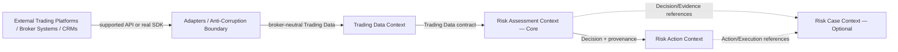

# Q-007 Context Map — Historical V1

## Map

## Relationship Rules

### External systems → adapters

External schemas/protocols remain outside BrokerOS. Adapters translate them;
no core context writes directly to another system's database or invents a
Manager API interface.

### Trading Data → Risk Assessment

Trading Data is upstream factual input. It does not depend on the Evidence,
Rule, Decision, Action, or Risk Case models.

### Risk Assessment → Risk Action

The core context supplies Decisions and provenance. Risk Action cannot call
back to alter the meaning of a Decision based on execution success/failure.

### Risk Assessment / Risk Action → Risk Case

Case association is optional and downstream. Risk Case references upstream
objects; it neither owns nor controls their creation.

## Prohibited Cycles

- Risk Case must not synchronously drive Rule Evaluation or Decision creation.
- Action Execution must not become an implicit evidence source without a future
  approved feedback contract.
- External vendor DTOs must not flow beyond adapters.

Any future feedback loop requires a versioned contract, Requirement,
architecture review, and ADR assessment. None is approved in Design V1.
