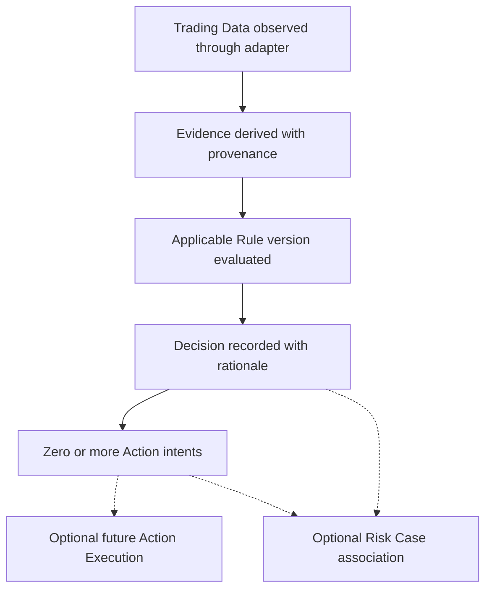

# Q-007 Domain Lifecycle — Historical V1

## Canonical Lifecycle

This is a domain reasoning lifecycle, not a workflow implementation.

## Lifecycle Steps

1. External facts enter through an adapter as broker-neutral Trading Data.
2. Trading Data suitability is assessed before Evidence derivation.
3. Evidence retains subject, observation window, and source provenance.
4. Applicable exact Rule versions are evaluated conceptually.
5. Decision records conclusion, rationale, Evidence Set, Rule evaluations, and
   decision time.
6. Decision may originate zero or more Action intents.
7. A later approved capability may attempt external execution separately.
8. A Risk Case may later associate related Decisions, Actions, and Evidence.

## Invariants

- Invalid or insufficient input never silently becomes an Action.
- A newer Rule version does not rewrite an existing Decision's provenance.
- Execution failure does not erase or mutate the originating Decision.
- Risk Case creation does not transfer upstream ownership.
- Case absence does not invalidate a Decision or Action.
- External calls require later timeout/retry/idempotency/failure design.

## Explicitly Undefined

- statuses and transition enums;
- confidence/severity values;
- Rule activation or approval workflow;
- Decision outcome catalog;
- action authorization/approval;
- retry or compensation;
- case assignment/SLA/escalation/closure;
- audit persistence.

Defining these would exceed Design V1 and require real business Requirements.
