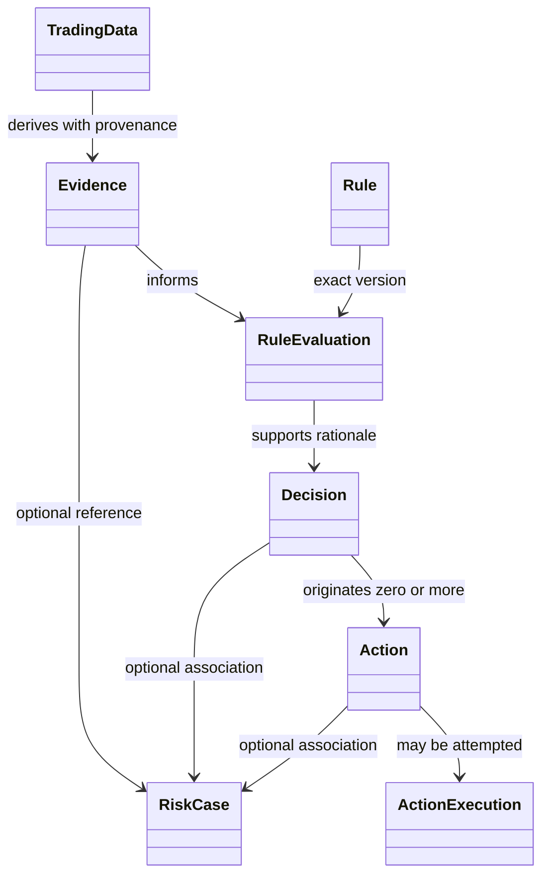

# Q-007 Domain Object Relationship — Historical V1

## Conceptual Model



## Ownership Rules

- Trading Data Context owns factual observations.
- Risk Assessment owns Evidence, Rules, evaluations, and Decisions.
- Risk Action owns Action intent and future execution attempts/outcomes.
- Risk Case owns associations, not the associated objects.

## Provenance Chain

```text
Decision
  ├── exact Rule version(s)
  ├── Rule Evaluation occurrence(s)
  └── Evidence Set
        └── Evidence
              └── source Trading Data reference(s)
```

An Action references its originating Decision. A Risk Case may reference
multiple Decisions/Actions and their Evidence, but the chain remains intact
outside the case.

## Proposed Multiplicity

- Trading Data can contribute to zero or more Evidence items.
- Evidence can participate in zero or more Rule Evaluations.
- One Rule version can have many evaluation occurrences.
- One Decision is supported by one or more applicable evaluations in the
  proposed model.
- One Decision can originate zero or more Actions.
- Risk Case association is optional and can group multiple Decisions/Actions.

These multiplicities are conceptual review proposals, not approved database
cardinality. The Architect may require numeric multiplicity removal until real
use cases exist.

## Prohibited Relationships

- Trading Data → direct Action.
- Risk Case → Rule Evaluation ownership.
- Risk Case → direct external account control.
- Action Execution → mutation of original Decision meaning.
- External vendor entity → direct core-domain ownership.
